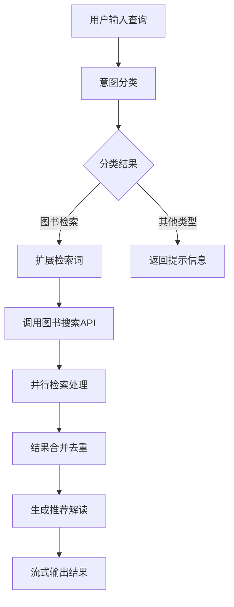
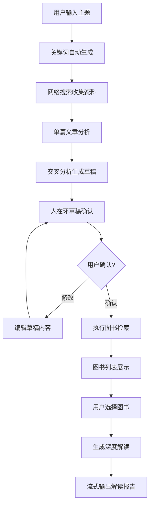
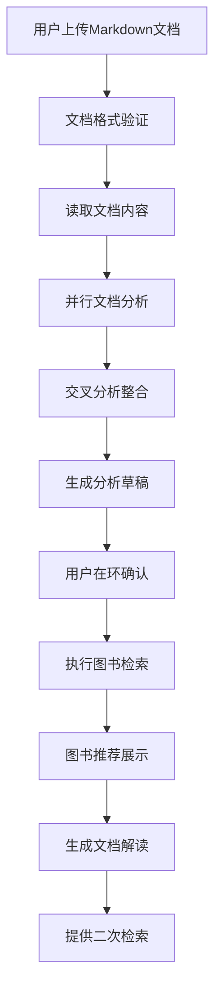
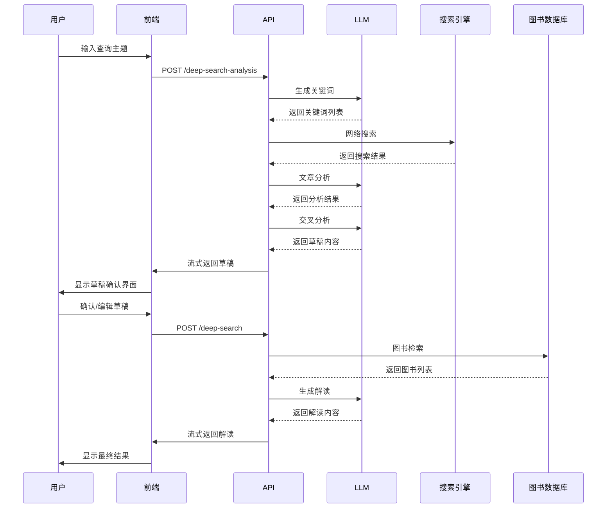
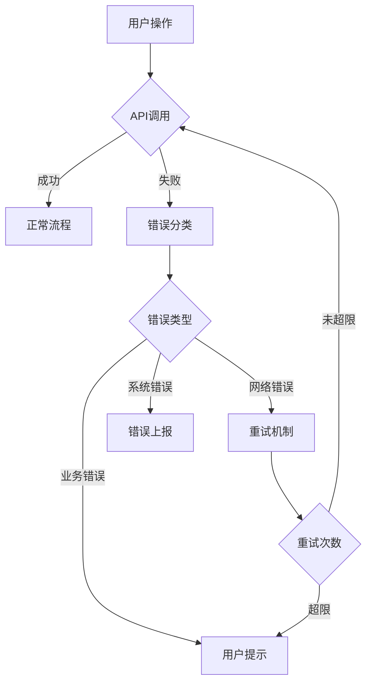

# AIBot 图书智搜系统 - 技术架构分析报告

## 1. 系统概览

### 1.1 项目简介
AIBot 是一个基于 Next.js 的本地图书智搜系统，提供三种不同的检索模式：简单检索、深度检索和文档上传分析。系统集成了大语言模型、外部搜索引擎、图书数据库API，为用户提供智能化的图书推荐和解读服务。

### 1.2 核心特性
- **🤖 智能对话**：基于 Vercel AI SDK 的流式对话体验
- **🔍 多模式检索**：简单检索、深度检索、文档分析三种模式
- **🌐 外部集成**：集成 DuckDuckGo 搜索、Jina 搜索等外部数据源
- **📚 图书数据库**：连接本地图书数据库，提供精准推荐
- **💬 人在环交互**：支持草稿编辑、确认、重新生成等人机协作
- **📄 文档分析**：支持 Markdown 文档上传和智能分析
- **🔄 二次检索**：基于检索结果进行迭代优化

---

## 2. 系统架构设计

### 2.1 整体架构图

```
┌─────────────────────────────────────────────────────────────────┐
│                        AIBot 系统架构                             │
├─────────────────────────────────────────────────────────────────┤
│  前端层 (Next.js + React + TypeScript)                           │
│  ┌─────────────────┐ ┌─────────────────┐ ┌─────────────────┐   │
│  │   简单检索模式   │ │   深度检索模式   │ │   文档上传模式   │   │
│  └─────────────────┘ └─────────────────┘ └─────────────────┘   │
│           │                   │                   │             │
│  ┌─────────────────────────────────────────────────────────┐   │
│  │              AIBotOverlay 主界面组件                     │   │
│  └─────────────────────────────────────────────────────────┘   │
├─────────────────────────────────────────────────────────────────┤
│  API 路由层 (Next.js API Routes)                               │
│  ┌─────────────┐ ┌─────────────┐ ┌─────────────┐ ┌─────────┐ │
│  │  /chat      │ │ /classify   │ │ /deep-*     │ │ /doc-*  │ │
│  └─────────────┘ └─────────────┘ └─────────────┘ └─────────┘ │
├─────────────────────────────────────────────────────────────────┤
│  核心业务逻辑层                                                 │
│  ┌─────────────┐ ┌─────────────┐ ┌─────────────┐ ┌─────────┐ │
│  │ 检索服务    │ │ 工作流管理  │ │ 提示词管理  │ │ 分类器  │ │
│  └─────────────┘ └─────────────┘ └─────────────┘ └─────────┘ │
├─────────────────────────────────────────────────────────────────┤
│  外部服务集成层                                                 │
│  ┌─────────────┐ ┌─────────────┐ ┌─────────────┐ ┌─────────┐ │
│  │ 图书数据库  │ │ LLM服务     │ │ 搜索引擎    │ │ 文件系统│ │
│  └─────────────┘ └─────────────┘ └─────────────┘ └─────────┘ │
└─────────────────────────────────────────────────────────────────┘
```

### 2.2 技术栈

| 层级 | 技术选型 | 用途 |
|------|---------|------|
| 前端框架 | Next.js 14 + React 18 | 应用框架 |
| 开发语言 | TypeScript | 类型安全 |
| 状态管理 | Zustand | 轻量级状态管理 |
| UI组件 | Framer Motion + Tailwind CSS | 动画和样式 |
| 流式处理 | Vercel AI SDK | AI对话和流式输出 |
| 外部搜索 | DuckDuckGo MCP + Jina Search | 网络搜索 |
| 数据库 | 图书数据库API | 图书信息检索 |
| 构建工具 | ESLint + Vitest | 代码质量 |

---

## 3. 三种检索模式详细分析

### 3.1 简单检索模式



**核心特点**：
- 直接基于用户输入进行图书检索
- 使用意图分类器识别查询类型
- 集成查询扩展技术提升检索效果
- 支持流式输出优化用户体验

### 3.2 深度检索模式



**核心特点**：
- 六阶段完整流程：关键词生成 → 网络搜索 → 文章分析 → 交叉分析 → 图书检索 → 解读生成
- 支持人在环交互，用户可编辑确认检索草稿
- 集成外部搜索获取最新信息
- 基于草稿进行精准图书检索
- 生成个性化深度解读报告

### 3.3 文档上传模式



**核心特点**：
- 支持最多5个Markdown文档上传
- 复用深度检索的分析逻辑
- 文档内容直接作为分析素材
- 适合学术研究、主题调研等场景

---

## 4. 核心技术组件分析

### 4.1 API路由架构

```
app/api/local-aibot/
├── chat/                    # 主对话接口
│   └── route.ts            # 统一处理三种模式的对话
├── classify/               # 意图分类
│   └── route.ts            # 用户意图识别
├── clear/                  # 清理会话
│   └── route.ts            # 清空聊天记录
├── deep-search-analysis/   # 深度检索分析
│   └── route.ts            # 关键词生成、网络搜索、分析
├── deep-search/           # 深度检索图书搜索
│   └── route.ts            # 基于草稿的图书检索
├── deep-interpretation/   # 深度解读生成
│   └── route.ts            # 解读报告生成
├── document-analysis/     # 文档分析
│   ├── route.ts           # 文档分析主流程
│   └── book-search/       # 文档分析后的图书检索
├── draft/                # 草稿生成
│   └── route.ts           # 深度检索草稿生成
├── generate-interpretation/ # 解读生成
│   └── route.ts           # 简单检索解读生成
├── generate-keywords/     # 关键词生成
│   └── route.ts           # 检索关键词生成
└── search-only/          # 纯检索接口
    └── route.ts           # 仅执行检索任务
```

### 4.2 前端组件架构

```
components/aibot/
├── AIBotLauncher.tsx          # 启动器按钮
├── AIBotOverlay.tsx          # 主界面覆盖层
├── MessageStream.tsx         # 消息流组件
├── BookItem.tsx              # 图书条目组件
├── DeepSearchBookList.tsx    # 深度检索图书列表
├── DeepSearchDraftMessage.tsx # 深度检索草稿消息
├── DeepSearchProgressMessage.tsx # 进度显示组件
├── DeepSearchWorkflow.tsx    # 深度检索工作流
├── DocumentUploadButton.tsx  # 文档上传按钮
├── DocumentUploadWorkflow.tsx # 文档上传工作流
└── [其他专用组件...]
```

### 4.3 状态管理设计

使用 Zustand 进行集中状态管理，主要状态包括：

```typescript
// 核心状态接口
interface AIBotState {
  // 基础状态
  isOverlayOpen: boolean;
  mode: AIBotMode; // 'text' | 'deep' | 'document'
  messages: UIMessage[];
  
  // 简单检索状态
  retrievalPhase: string;
  currentRetrievalResult: any;
  selectedBookIds: Set<string>;
  
  // 深度检索状态
  deepSearchPhase: string;
  deepSearchDraftContent: string;
  deepSearchBooks: BookInfo[];
  
  // 文档分析状态
  documentAnalysisPhase: string;
  uploadedDocuments: UploadedDocument[];
  documentAnalysisDraftContent: string;
  
  // UI状态
  isStreaming: boolean;
  isSearching: boolean;
  error?: string;
}
```

---

## 5. 数据流分析

### 5.1 流式数据处理架构


### 5.2 深度检索数据流



---

## 6. 关键技术亮点

### 6.1 流式处理技术

**实现方案**：
- 使用 Server-Sent Events (SSE) 实现实时数据推送
- Vercel AI SDK 提供统一的流式接口
- 前端实时更新UI状态，提供流畅用户体验

**技术优势**：
- 减少用户等待时间
- 提供实时处理进度反馈
- 支持长文本内容的分段展示

### 6.2 人在环交互设计

**核心机制**：
```typescript
// 草稿确认流程
const handleDraftConfirm = async () => {
  // 1. 显示可编辑草稿
  // 2. 用户修改确认
  // 3. 执行后续检索流程
};
```

**交互特点**：
- 用户可编辑检索草稿
- 支持重新生成和修改
- 提供源数据查看功能
- 保证检索方向的用户控制权

### 6.3 智能分类系统

**分类器设计**：
```typescript
// 意图分类接口
interface IntentClassificationResult {
  intent: 'simple_search' | 'deep_search' | 'document_analysis' | 'other';
  confidence: number;
  reason: string;
  suggestedQuery?: string;
}
```

**应用场景**：
- 自动识别用户查询类型
- 智能路由到合适的处理流程
- 提供查询建议优化用户体验

### 6.4 模块化架构设计

**设计原则**：
- **单一职责**：每个组件专注于特定功能
- **松耦合**：组件间通过明确定义的接口交互
- **可复用性**：核心逻辑可被不同模式复用
- **可扩展性**：易于添加新的检索模式和处理逻辑

---

## 7. 性能与优化

### 7.1 前端性能优化

| 优化策略 | 实现方式 | 效果 |
|---------|---------|------|
| 组件懒加载 | React.lazy + Suspense | 减少初始加载时间 |
| 状态管理优化 | Zustand轻量级状态 | 减少内存占用 |
| 流式渲染 | 实时UI更新 | 提升用户体验 |
| 动画优化 | Framer Motion硬件加速 | 流畅的交互效果 |

### 7.2 后端性能优化

| 优化策略 | 实现方式 | 效果 |
|---------|---------|------|
| 并行处理 | Promise.all并发执行 | 缩短总处理时间 |
| 缓存机制 | 提示词缓存、结果缓存 | 减少重复计算 |
| 错误处理 | 完善的错误恢复机制 | 提高系统稳定性 |
| 资源管理 | 及时释放流式连接 | 优化服务器资源 |

### 7.3 网络优化

```typescript
// 并行搜索处理
const searchPromises = keywords.map(async (keyword) => {
  const snippets = await performWebSearch(keyword);
  const analysis = await analyzeArticles(snippets);
  return { keyword, snippets, analysis };
});

const results = await Promise.all(searchPromises);
```

---

## 8. 错误处理与容错机制

### 8.1 多层错误处理



### 8.2 容错设计

**降级策略**：
- 外部搜索失败时使用本地检索
- LLM服务不可用时提供基础推荐
- 网络超时采用异步处理
- 用户可主动重试失败操作

**错误恢复**：
- 自动保存草稿内容
- 支持中断恢复
- 详细的错误日志记录
- 用户友好的错误提示

---

## 9. 安全与隐私

### 9.1 数据安全

| 安全措施 | 实现方式 | 保护范围 |
|---------|---------|----------|
| 环境隔离 | 本地模式默认关闭 | 生产环境安全 |
| 输入验证 | 严格的数据格式检查 | 防止注入攻击 |
| 权限控制 | API访问权限管理 | 接口安全 |
| 数据脱敏 | 敏感信息过滤 | 用户隐私保护 |

### 9.2 隐私保护

**本地优先**：
- 仅在本地环境启用AIBot功能
- 不在云端存储用户对话记录
- 文档内容仅在会话期间使用
- 提供完整的数据清除功能

---

## 10. 部署与运维

### 10.1 环境配置

```typescript
// 环境变量配置
const config = {
  // AIBot开关
  AIBOT_LOCAL_ENABLED: process.env.AIBOT_LOCAL_ENABLED,
  NEXT_PUBLIC_ENABLE_AIBOT_LOCAL: process.env.NEXT_PUBLIC_ENABLE_AIBOT_LOCAL,
  
  // LLM配置
  AIBOT_LLM_BASE_URL: process.env.AIBOT_LLM_BASE_URL,
  AIBOT_LLM_API_KEY: process.env.AIBOT_LLM_API_KEY,
  AIBOT_LLM_MODEL: process.env.AIBOT_LLM_MODEL,
  
  // 搜索服务配置
  USE_JINA_SEARCH: process.env.USE_JINA_SEARCH,
};
```

### 10.2 监控与日志

**关键指标**：
- API响应时间
- 检索成功率
- 用户交互完成率
- 错误发生频率

**日志系统**：
```typescript
// 结构化日志记录
const logger = getLogger('aibot.api.deep-search');
logger.info('开始图书检索流程', { 
  draftLength: draftMarkdown.length,
  userInput 
});
```

---

## 11. 总结与展望

### 11.1 技术创新点

1. **多模态检索融合**：首次将简单检索、深度检索、文档分析三种模式统一到一个系统中
2. **人在环AI协作**：创新的草稿编辑确认机制，让用户参与AI决策过程
3. **流式处理架构**：实现了从数据获取到结果展示的全链路流式处理
4. **模块化设计**：高度模块化的架构设计，易于维护和扩展

### 11.2 系统优势

- **用户体验**：流畅的流式交互，实时进度反馈
- **功能完整**：覆盖从基础检索到深度分析的全场景需求
- **技术先进**：采用最新的AI技术和前端框架
- **架构优雅**：清晰的模块划分，良好的可维护性

### 11.3 未来发展方向

1. **智能化提升**：
   - 引入更先进的LLM模型
   - 优化检索算法和排序策略
   - 增加个性化推荐能力

2. **功能扩展**：
   - 支持更多文档格式
   - 增加多媒体内容分析
   - 集成更多外部数据源

3. **性能优化**：
   - 缓存机制完善
   - 并发处理优化
   - 移动端适配改进

4. **生态建设**：
   - 开放API接口
   - 插件系统开发
   - 社区功能增强

---

**报告生成时间**：2025-12-22  
**分析范围**：AIBot核心代码和设计文档  
**技术栈**：Next.js + TypeScript + React + AI SDK  
**架构模式**：分层架构 + 微服务设计模式
