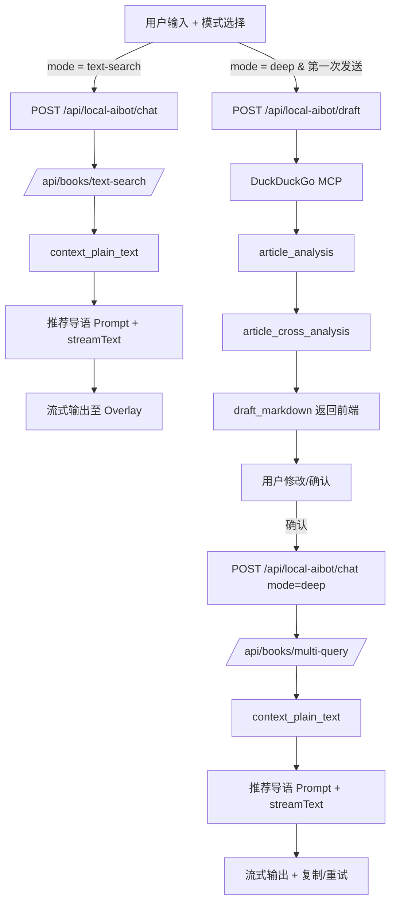

# AIBot本地对话模块 设计文档
- **Status**: Proposal
- **Date**: 2025-12-16

## 1. 目标与背景
- 在 Next.js 首页提供仅限本地环境使用的 `AIBot` 对话窗口，不影响云端部署。
- 复用现有图书检索 API（`/api/books/text-search`、`/api/books/multi-query`），并结合 `aibot/prompts/*` 中的提示词，让用户以“普通检索 / 深度检索”两种模式获取推荐结果。
- 深度检索需串联 `DuckDuckGo MCP` → `article_analysis` → `article_cross_analysis` → 人在环编辑 → `/api/books/multi-query` → `推荐导语`，同时在 UI 中打通“草稿确认、复制、重试、流式展示”等交互；提示词统一存放在 `aibot/prompts` 目录，视为系统配置的一部分。

## 2. 详细设计
### 2.1 模块结构
- `src/core/aibot/constants.ts`：统一维护 prompt 名称、检索模式、流式事件常量。
- `src/core/aibot/types.ts`：服务端与客户端共享的类型定义（`AIBotMode`、`DraftPayload`、`ChatResponseChunk` 等）。
- `src/core/aibot/promptLoader.ts`：懒加载 `aibot/prompts/*.md`，并提供缓存，避免多次 IO。
- `src/core/aibot/retrievalService.ts`：封装对 `/api/books/text-search`、`/api/books/multi-query` 的请求和 plain text 模板配置。
- `src/core/aibot/researchWorkflow.ts`：实现“普通检索”和“深度检索”工作流，负责串联外部检索、LLM 调用以及人机交互边界。
- `src/core/aibot/mcp/duckduckgoResearcher.ts`：通过 `@modelcontextprotocol/sdk` 连接 DuckDuckGo MCP，返回结构化的网页快照，失败时回退到 HTTP GET。
- `src/utils/aibot-env.ts`：暴露 `isLocalAIBotEnabled()`、`getBookApiBase()` 等工具，集中处理环境变量和兜底值。
- `app/api/local-aibot/draft/route.ts`：接收用户原始输入，执行（DuckDuckGo → article_analysis → article_cross_analysis）并返回可编辑 Markdown 草稿。
- `app/api/local-aibot/chat/route.ts`：统一处理普通检索与深度检索确认阶段，使用 Vercel AI SDK 的 `streamText` 输出流式响应。
- `components/aibot/AIBotLauncher.tsx`：包裹悬浮按钮、特性开关和 About 风格一致的入口。
- `components/aibot/AIBotOverlay.tsx`：复用 `AboutOverlay` 的视觉语言，自定义消息列表、人在环卡片、操作区。
- `components/aibot/MessageStream.tsx`：拆分为消息气泡、流式渲染器、复制/重试按钮，保持圈复杂度可控。
- `store/aibot/useAIBotStore.ts`：使用 Zustand 存储聊天记录、模式状态、草稿缓存、loading 状态。
- `tests/aibot/`：覆盖 `isLocalAIBotEnabled`、工作流分支、UI 状态机等关键逻辑。

### 2.2 核心逻辑/接口
#### 2.2.1 环境隔离策略
- 新增 `AIBOT_LOCAL_ENABLED`（服务器端）、`NEXT_PUBLIC_ENABLE_AIBOT_LOCAL`（客户端）两枚环境变量，仅在本地 `.env.local` 配置，默认值为 `'0'`。
- `src/utils/aibot-env.ts` 暴露 `assertAIBotEnabled()`，在 API Route 顶部执行，若为 `false` 返回 `404`；`HomeNavigation` 也通过该函数决定是否渲染按钮。
- 相比把模块放入 `.gitignore`，此策略确保所有开发者共享同一套代码，不会因缺少文件导致 CI 编译失败，同时云端构建因变量未开启而忽略此模块。

#### 2.2.2 服务器端接口
| 路径 | 方法 | 主要输入 | 主要输出 | 说明 |
| --- | --- | --- | --- | --- |
| `/api/local-aibot/draft` | POST | `{ user_input: string }` | `{ draft_markdown, search_snippets, article_analysis, article_cross_analysis }` | 仅深度检索时调用，用于人机协作步骤。 |
| `/api/local-aibot/chat` | POST | `{ mode: 'text-search' \| 'deep', messages, draft_markdown?, deep_metadata? }` | `StreamingTextResponse` | 调用检索 API + `docs/AIBot/prompts/推荐导语.md`，并通过 `ai` SDK 进行流式输出。 |
- `retrievalService` 默认请求 `response_format=plain_text`，模板为 `【{title}】{highlights} - {rating}分`，与 API 文档保持一致，可在请求体扩展字段覆盖。
- LLM 客户端使用 `@ai-sdk/openai` + `streamText`，`baseURL/apiKey/model` 均读自 `.env.local` 中的 `AIBOT_LLM_*`，若书籍 API 返回 `metadata.llm_hint` 则实时覆写。

#### 2.2.3 工作流详情
- **普通检索（默认状态）**
    1. 客户端提交 `messages` 与 `mode='text-search'`。
    2. `retrievalService.textSearch` 直接调用 `/api/books/text-search`，将用户输入放在 `query` 中。
    3. 将返回的 `context_plain_text` 拼接到 `system` 提示词：“你是图书推荐助手...”，并流式返回模型结果。
- **深度检索**
    1. 第一次发送时调用 `/api/local-aibot/draft`：
        - `duckduckgoResearcher` 调用 MCP，返回 `top_k` 条网页快照。
        - 将原始输入与网页结果一起传入 `article_analysis` 提示词（`aibot/prompts/article_analysis.md`），得到结构化摘要。
        - 将摘要作为输入继续调用 `article_cross_analysis`（`aibot/prompts/article_cross_analysis.md`），输出 `draft_markdown`。
        - 响应中包含 `draft_markdown` 与引用素材，前端渲染“草稿确认卡片”，允许用户修改。
    2. 用户点击“确认发送”后，再次调用 `/api/local-aibot/chat`，Body 包含 `mode='deep'`、`draft_markdown`。
    3. 服务端将 `draft_markdown` 传给 `/api/books/multi-query`，生成 `context_plain_text`。
    4. 把 `context_plain_text`、`draft_markdown`、原始消息一起传入 `aibot/prompts/推荐导语.md`，通过 `streamText` 推送最终推荐。
    5. “复制”按钮直接复制最新 LLM 输出，“重试”按钮保留 `draft_markdown`，重新触发步骤 2（可附带 `temperature` 调整）。

#### 2.2.4 前端交互/状态
- 悬浮入口：在 `HomeNavigation` 中新增“本地对话”链接，使用 `NEXT_PUBLIC_ENABLE_AIBOT_LOCAL` 决定是否渲染，并阻止冒泡保持 HomeHero 行为。
- `AIBotOverlay` 继承 `AboutOverlay` 的视觉骨架，主体区域分为：消息流（渲染用户/助手气泡）、草稿确认区、输入栏。
- 输入栏包含文本框 + “深度检索”按钮（`toggle`），还包括“复制”“重试”。复制按钮只在存在最新助手消息时显示；重试按钮会保留当前输入与模式，再次触发 `handleSubmit`。
- 草稿确认区：在深度检索模式且收到 `/draft` 响应后，显示 `textarea` 供用户修改，旁边提供“确认发送”“丢弃草稿”操作。确认后才请求 `/chat`。
- 流式渲染：`MessageStream` 使用 `ai/react` 的 `UseChatHelpers.append` 机制，每次 chunk 到达时更新状态，实现平滑动画。
- 状态管理：`useAIBotStore` 记录消息数组、`isDeepMode`、`pendingDraft`、`isStreaming`。刷新页面后无需恢复，保持轻量。

### 2.3 可视化图表

## 3. 测试策略
1. **特性开关**：`tests/aibot/env.test.ts`，分别在 `AIBOT_LOCAL_ENABLED` 为 `0/1/undefined` 时验证按钮与 API Route 返回值。
2. **工作流编排**：通过 `vi.mock` 模拟图书 API 与 MCP，验证 `researchWorkflow` 根据模式正确调用 `text-search` 或 `multi-query`，以及深度流程在确认前不会触发图书检索。
3. **提示词串联**：快照测试 `promptBuilder`，确保 `systemPrompt` 正确拼接 `context_plain_text`、DuckDuckGo 摘要及用户输入，避免回归。
4. **UI 状态**：利用 React Testing Library 渲染 `AIBotOverlay`，覆盖“草稿确认”“复制/重试”按钮显隐、流式更新渲染等关键路径。
5. **错误处理**：模拟 `DuckDuckGo` 或 `books API` 返回 500，确认 UI 能显示中文错误提示并允许重试，日志通过 `src/utils/logger` 记录。

---
请审核并确认该设计，若无异议将进入【开发专家模式】实施。
