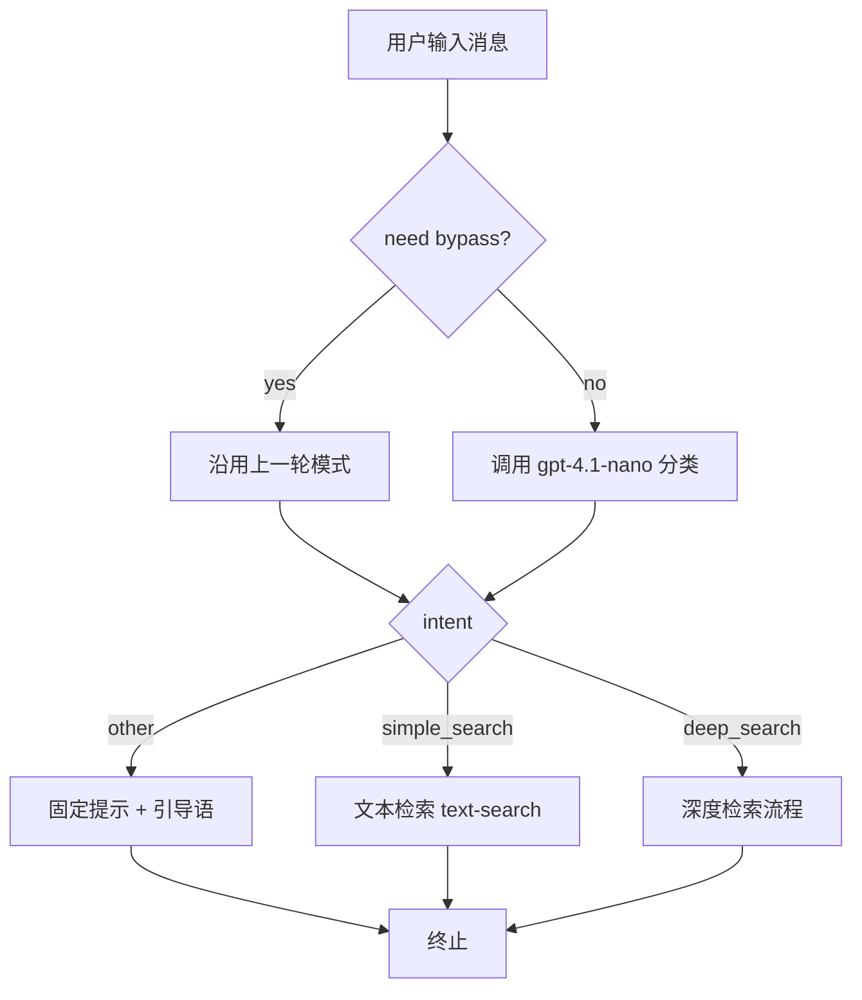

# AIBOT 问题分类前置逻辑 设计文档
- **Status**: Proposal
- **Date**: 2025-12-17

## 1. 目标与背景
- 现有 `/api/local-aibot/chat` 对所有输入直接走图书检索或深度工作流，缺乏“闲聊/恶意指令”拦截。
- 需要新增一个统一的“LLM 问题分类”前置步骤，通过 `gpt-4.1-nano` 将用户输入划分为：
  1. `simple_search`：普通图书检索。
  2. `deep_search`：触发“搜索-分析-草稿-迭代-执行”的深度工作流。
  3. `other`：非图书请求，返回固定回复并引导用户回到检索主题。
- 分类提示词存放在 `public/prompts/aibot_question_classifier.md`，并通过 `promptLoader` 缓存。
- 多轮对话中每条用户消息都需经过分类，若命中“继续/下一步”等安全关键词可沿用上轮意图，以降低延迟；如检测到提示词注入风险则强制 re-check。

## 2. 详细设计
### 2.1 模块结构
- `src/core/aibot/classifier.ts`
  - `classifyUserIntent(input)`：调用 gpt-4.1-nano，输出 JSON（intent/confidence/reason/suggested_query）。
  - `hasPromptInjectionRisk(text)`：浅层关键字检测。
  - `shouldBypassClassifier(text, previousMode)`：命中“继续”等关键词时跳过 LLM。
- `app/api/local-aibot/chat/route.ts`
  - 接入分类逻辑：当结果为 `other` 或检测到注入风险时直接返回固定提示；其余情况根据结果决定 `TEXT` 或 `DEEP` 模式，并写入响应头 `X-AIBot-Intent`。
- `public/prompts/aibot_question_classifier.md`
  - 系统提示词，约束输出 JSON、列举分类口径、安全要求。
- `tests/core/aibot/classifier.spec.ts`
  - 针对 JSON 解析、fallback、注入检测、bypass 关键字的单元测试。

### 2.2 核心逻辑/接口
1. `classifyUserIntent` 流程：
   - 读取提示词 → 组装 `# 当前输入` + 最近 6 条上下文 → 调用 `gpt-4.1-nano`。
   - 解析 JSON，异常时使用 fallback（默认 `simple_search`，confidence=0.5）。
2. `chat` Route：
   - 解析请求后先鉴别 `latestUserMessage`。
   - `shouldBypassClassifier` 命中“继续”“ok”等短语时沿用 `mode`；若检测到注入关键词则强制走 LLM 并直接返回固定提示。
   - 对 `deep_search` 但缺失 `draft_markdown` 的情况，记录日志并降级到 `text-search`。
   - `other` 直接返回固定话术并附加 `suggested_query`。
3. 固定回复：
   ```
   你好，我是 Book Echoes 图书智搜助手，专注解读与推荐书籍内容。
   当前输入暂未匹配到图书检索任务。试着告诉我：你想解决的问题、关注的主题、阅读目标或领域关键词，我就能为你找到书。
   ```
   - 若 LLM 提供 `suggested_query`，则追加“你可以尝试这样问：{suggested_query}”。

### 2.3 可视化图表


## 3. 测试策略
- `tests/core/aibot/classifier.spec.ts`
  - mock `generateText` 以验证 JSON 解析与 fallback。
  - `hasPromptInjectionRisk` 关键字识别。
  - `shouldBypassClassifier` 针对深度模式“继续”与含注入词的差异行为。
- `tests/core/aibot/orchestrator`（如后续新增）可补充分支路由测试。
