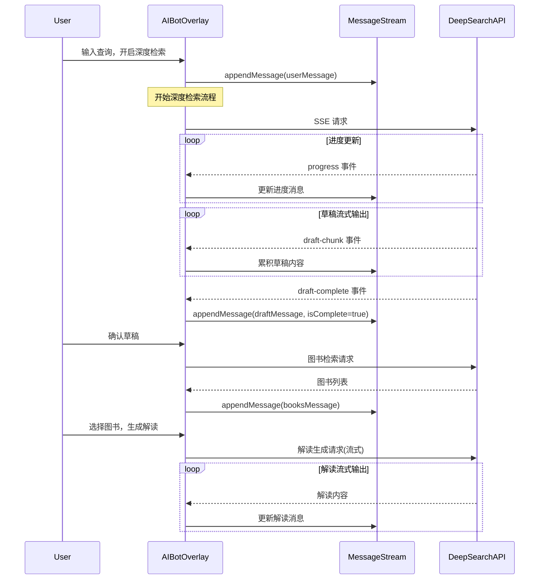

# 深度检索对话式流式重构 设计文档
- **Status**: Proposal
- **Date**: 2024-12-18

## 1. 目标与背景

### 1.1 问题
当前深度检索工作流 (`DeepSearchWorkflow.tsx`) 采用**覆盖式 UI**：
- 每个阶段(analysis → draft → selection → interpretation)会清空前一阶段的界面
- 用户无法回顾之前的进度和内容
- 与简单检索的对话追加式体验不一致

### 1.2 目标
1. 将深度检索改为**对话追加式**，所有阶段内容作为消息追加显示
2. 草稿文档实现**流式输出**（目前是一次性返回）
3. 保持解读报告的流式输出（已实现）
4. 统一深度/简单检索的交互体验

## 2. 详细设计

### 2.1 模块结构变更

```
components/aibot/
├── DeepSearchWorkflow.tsx       # 删除或大幅简化，逻辑移至 AIBotOverlay
├── DeepSearchProgressMessage.tsx # 新增：进度消息组件
├── DeepSearchDraftMessage.tsx    # 新增：草稿消息组件（支持流式+可编辑）
├── DeepSearchBookListMessage.tsx # 新增：图书列表消息组件
├── MessageStream.tsx            # 扩展：支持新消息类型
└── ...

app/api/local-aibot/
├── deep-search-analysis/route.ts # 修改：草稿生成改为流式输出
└── ...
```

### 2.2 消息类型设计

扩展 `UIMessage` 的 content 类型，增加深度检索专用消息：

```typescript
// src/core/aibot/types.ts 扩展

// 深度检索消息类型
type DeepSearchMessageType =
  | 'deep-search-progress'    // 进度日志
  | 'deep-search-draft'       // 草稿文档（流式）
  | 'deep-search-books'       // 图书列表
  | 'deep-search-report';     // 解读报告（流式）

interface DeepSearchProgressContent {
  type: 'deep-search-progress';
  logs: LogEntry[];
  currentPhase: string;
}

interface DeepSearchDraftContent {
  type: 'deep-search-draft';
  draftMarkdown: string;      // 流式累积内容
  isComplete: boolean;        // 是否流式完成
  searchSnippets: DuckDuckGoSnippet[];
  userInput: string;
}

interface DeepSearchBooksContent {
  type: 'deep-search-books';
  books: BookInfo[];
  draftMarkdown: string;
}
```

### 2.3 API 流式输出改造

修改 `deep-search-analysis` API，将草稿生成改为逐字流式输出：

```typescript
// 当前：最终一次性返回
const draftMarkdown = crossAnalysisResult.text.trim();
const finalData = `data: ${JSON.stringify({ draftMarkdown })}\n\n`;

// 改为：使用 streamText 逐字输出
import { streamText } from 'ai';

const crossAnalysisStream = await streamText({
  model,
  system: crossPrompt,
  prompt: `...`
});

for await (const chunk of crossAnalysisStream.textStream) {
  const draftChunk = {
    type: 'draft-chunk',
    content: chunk
  };
  controller.enqueue(encoder.encode(`data: ${JSON.stringify(draftChunk)}\n\n`));
}
```

### 2.4 核心流程图



### 2.5 状态管理变更

在 `useAIBotStore` 中新增深度检索状态：

```typescript
interface AIBotState {
  // 现有状态...

  // 深度检索状态
  deepSearchPhase: 'idle' | 'progress' | 'draft' | 'books' | 'report';
  currentDraftMessageId: string | null;  // 当前草稿消息ID（用于流式更新）
  currentDraftContent: string;           // 草稿累积内容
  isDraftComplete: boolean;              // 草稿是否完成
  pendingSearchSnippets: DuckDuckGoSnippet[]; // 待绑定的检索源
}
```

### 2.6 组件渲染逻辑

在 `MessageStream.tsx` 中扩展消息渲染：

```tsx
{messages.map((message) => (
  <motion.div key={message.id}>
    {message.role === 'assistant' && (
      <>
        {/* 深度检索进度消息 */}
        {isDeepSearchProgress(message) && (
          <DeepSearchProgressMessage
            logs={message.content.logs}
            currentPhase={message.content.currentPhase}
          />
        )}

        {/* 深度检索草稿消息 */}
        {isDeepSearchDraft(message) && (
          <DeepSearchDraftMessage
            draftMarkdown={message.content.draftMarkdown}
            isComplete={message.content.isComplete}
            isStreaming={!message.content.isComplete}
            searchSnippets={message.content.searchSnippets}
            onConfirm={handleDraftConfirm}
            onRegenerate={handleDraftRegenerate}
          />
        )}

        {/* 深度检索图书列表消息 */}
        {isDeepSearchBooks(message) && (
          <DeepSearchBookListMessage
            books={message.content.books}
            onGenerateInterpretation={handleGenerateInterpretation}
          />
        )}

        {/* 普通文本/检索结果... */}
      </>
    )}
  </motion.div>
))}
```

## 3. 实现步骤

### Phase 1: API 层改造
1. 修改 `deep-search-analysis/route.ts`，将 `generateText` 改为 `streamText`
2. 新增 `draft-chunk` 和 `draft-complete` SSE 事件类型

### Phase 2: 状态层扩展
1. 在 `useAIBotStore` 中新增深度检索状态字段
2. 实现草稿消息的流式更新 action

### Phase 3: 组件层重构
1. 创建 `DeepSearchProgressMessage.tsx` 组件
2. 创建 `DeepSearchDraftMessage.tsx` 组件（支持流式渲染+编辑）
3. 创建 `DeepSearchBookListMessage.tsx` 组件
4. 扩展 `MessageStream.tsx` 支持新消息类型

### Phase 4: 流程层整合
1. 重构 `AIBotOverlay.tsx` 中的深度检索处理逻辑
2. 删除或简化 `DeepSearchWorkflow.tsx`
3. 统一消息追加和流式更新逻辑

## 4. 测试策略

### 4.1 单元测试
- [ ] 草稿流式 SSE 解析测试
- [ ] 消息类型判断函数测试
- [ ] 状态更新 action 测试

### 4.2 集成测试
- [ ] 完整深度检索流程 E2E 测试
- [ ] 草稿编辑后确认流程测试
- [ ] 重新生成流程测试

### 4.3 边界测试
- [ ] 网络中断恢复测试
- [ ] 长文本草稿流式渲染性能测试
- [ ] 快速切换检索模式测试

## 5. 风险与注意事项

1. **流式输出 Token 限制**: `streamText` 可能会受到模型 token 限制，需处理长文本截断
2. **SSE 连接稳定性**: 长时间流式连接可能断开，需实现重连机制
3. **草稿编辑状态**: 用户在流式输出过程中编辑草稿的交互需特殊处理
4. **向后兼容**: 确保不影响现有简单检索流程

## 6. 预估改动范围

| 文件 | 改动类型 | 改动量 |
|------|----------|--------|
| `deep-search-analysis/route.ts` | 修改 | 中 |
| `useAIBotStore.ts` | 修改 | 小 |
| `MessageStream.tsx` | 修改 | 中 |
| `AIBotOverlay.tsx` | 修改 | 大 |
| `DeepSearchProgressMessage.tsx` | 新增 | 小 |
| `DeepSearchDraftMessage.tsx` | 新增 | 中 |
| `DeepSearchBookListMessage.tsx` | 新增 | 中 |
| `DeepSearchWorkflow.tsx` | 删除/简化 | - |
| `types.ts` | 修改 | 小 |
