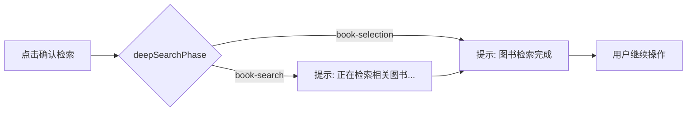

# 深度检索提示一致性 设计文档
- **Status**: Proposal
- **Date**: 2025-12-21

## 1. 目标与背景
深度检索模式在交叉报告区域缺少与文档模式相同的图书检索状态提示，导致用户无法确认“确认检索”后的处理进度。本设计旨在复用 `deepSearchPhase` 状态，在深度检索界面展示 `book-search` 与 `book-selection` 提示，保持交互一致性并提升反馈透明度。

## 2. 详细设计
### 2.1 模块结构
- `components/aibot/DeepSearchDraftMessage.tsx`: 引入 `useAIBotStore` 并在操作区下方渲染状态提示，逻辑与 `DocumentAnalysisDraftMessage` 对齐，但绑定 `deepSearchPhase`。
- `store/aibot/useAIBotStore.ts`: 无需改动，直接使用已存在的 `deepSearchPhase`。

### 2.2 核心逻辑/接口
- 新增本地只读状态：`const { deepSearchPhase } = useAIBotStore();`
- 渲染条件：`deepSearchPhase` 为 `book-search` 或 `book-selection`。
- 展示内容：
  - `book-search`: 显示旋转边框，文案“正在检索相关图书...”
  - `book-selection`: 显示绿色圆点，文案“图书检索完成”
- 插入位置：保持在交叉分析模块底部（即操作按钮区域之后），与文档模式排版一致，避免影响既有布局。
- 样式：复用 `DocumentAnalysisDraftMessage` 中的类名，保证视觉一致。

### 2.3 可视化图表

## 3. 测试策略
- **手动检查**：
  1. 触发深度检索，确认按钮点击后进入 `book-search`，提示动态展示旋转图标与文案。
  2. 完成检索切换 `book-selection`，提示更新为绿色圆点与“图书检索完成”。
  3. 切回非检索阶段时，提示自动隐藏，确保 UI 未受影响。
- **回归确认**：文档模式原有提示仍正常显示。
