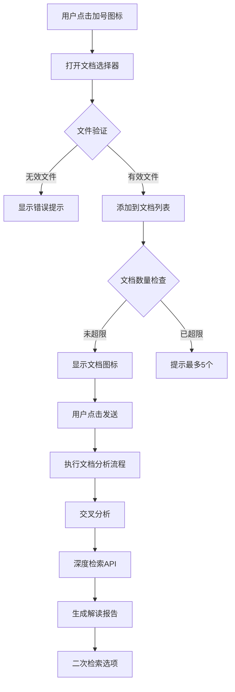

# 文档上传交互模式技术设计文档

## 1. 功能概述

### 1.1 需求描述
在现有的简单检索和深度检索基础上，新增第三种交互模式：**文档上传模式**。用户可以上传本地Markdown文档（最多5个），系统将直接对这些文档执行分析，复用深度检索的交叉分析、深度检索API、生成解读报告和二次检索等逻辑。

### 1.2 核心特性
- **文档上传限制**：仅支持.md格式，最多5个文档
- **友好的交互提示**：格式提示、数量限制提示
- **可视化管理**：文档图标显示、删除功能
- **流程复用**：上传后直接进入深度检索的文档分析流程

## 2. 技术架构设计

### 2.1 整体流程设计



### 2.2 UI组件设计

#### 2.2.1 文档上传区域组件
- **位置**：文本输入框左下角，加号图标
- **组件名**：`DocumentUploadButton`
- **功能**：
  - 文件选择触发
  - 格式验证（.md文件）
  - 数量限制检查

#### 2.2.2 文档列表显示组件
- **位置**：输入框上方
- **组件名**：`DocumentListDisplay`
- **功能**：
  - 显示已上传文档列表
  - 每个文档显示图标和名称
  - 删除功能（右上角X）
  - 文档状态指示

#### 2.2.3 文档上传主组件
- **组件名**：`DocumentUploadWorkflow`
- **功能**：
  - 协调上传子组件
  - 管理文档状态
  - 处理上传逻辑

### 2.3 状态管理设计

#### 2.3.1 新增类型定义

```typescript
// 文档信息接口
interface UploadedDocument {
  id: string;                    // 唯一标识
  name: string;                  // 文件名
  content: string;               // 文件内容
  size: number;                  // 文件大小
  uploadTime: Date;             // 上传时间
  status: 'uploading' | 'ready' | 'error';
}

// 文档上传状态
type DocumentUploadPhase =
  | 'idle'                       // 空闲
  | 'uploading'                  // 上传中
  | 'ready'                      // 准备就绪
  | 'analyzing'                  // 分析中
  | 'error';                     // 错误
```

#### 2.3.2 Store扩展

在 `useAIBotStore.ts` 中新增：

```typescript
// 文档上传状态
uploadedDocuments: UploadedDocument[];
documentUploadPhase: DocumentUploadPhase;
documentUploadError?: string;

// 文档上传相关Actions
setUploadedDocuments: (documents: UploadedDocument[]) => void;
addUploadedDocument: (document: UploadedDocument) => void;
removeUploadedDocument: (documentId: string) => void;
setDocumentUploadPhase: (phase: DocumentUploadPhase) => void;
setDocumentUploadError: (error?: string) => void;
clearUploadedDocuments: () => void;
```

### 2.4 后端API设计

#### 2.4.1 新增API端点

```typescript
// POST /api/local-aibot/document-analysis
interface DocumentAnalysisRequest {
  documents: {
    id: string;
    name: string;
    content: string;
  }[];
}

// 复用现有的深度检索分析逻辑，但跳过关键词生成和网络搜索
// 直接从文档分析开始
```

#### 2.4.2 API处理逻辑

1. **文档验证**：检查文档格式和内容
2. **单篇文档分析**：对每个文档执行分析
3. **交叉分析**：整合所有文档分析结果
4. **后续流程**：复用现有的深度检索逻辑

### 2.5 与现有系统集成

#### 2.5.1 模式管理
将现有的二元模式扩展为三元模式：

```typescript
// 原有：简单检索、深度检索
// 新增：文档上传模式
type AIBotMode = 'simple' | 'deep' | 'document';
```

#### 2.5.2 UI状态切换
在输入框区域添加模式切换：

- 简单检索：默认状态
- 深度检索：现有的深度检索开关
- 文档上传：新增的文档上传模式

#### 2.5.3 复用深度检索流程
文档上传成功后，复用以下现有组件和逻辑：

- `DeepSearchProgressMessage`：进度显示
- `DeepSearchDraftMessage`：草稿显示和编辑
- `DeepSearchBookList`：图书选择
- 深度检索的报告生成和二次检索

## 3. 实现细节

### 3.1 文件处理逻辑

```typescript
const handleFileUpload = async (files: FileList) => {
  const validFiles = Array.from(files).filter(file =>
    file.name.endsWith('.md') && file.size <= MAX_FILE_SIZE
  );

  if (validFiles.length === 0) {
    setError('请选择有效的Markdown文件');
    return;
  }

  if (uploadedDocuments.length + validFiles.length > 5) {
    setError('最多只能上传5个文档');
    return;
  }

  // 处理每个文件
  for (const file of validFiles) {
    const content = await file.text();
    const document: UploadedDocument = {
      id: crypto.randomUUID(),
      name: file.name,
      content,
      size: file.size,
      uploadTime: new Date(),
      status: 'ready'
    };
    addUploadedDocument(document);
  }
};
```

### 3.2 文档分析触发

```typescript
const handleDocumentAnalysisSubmit = async () => {
  if (uploadedDocuments.length === 0) {
    setError('请至少上传一个文档');
    return;
  }

  setDocumentUploadPhase('analyzing');

  try {
    const response = await fetch('/api/local-aibot/document-analysis', {
      method: 'POST',
      headers: { 'Content-Type': 'application/json' },
      body: JSON.stringify({
        documents: uploadedDocuments.map(doc => ({
          id: doc.id,
          name: doc.name,
          content: doc.content
        }))
      })
    });

    // 处理流式响应，复用深度检索的SSE逻辑
    // ...

  } catch (error) {
    setDocumentUploadError(error.message);
  }
};
```

### 3.3 UI样式设计

```css
/* 文档上传按钮样式 */
.upload-button {
  position: absolute;
  left: 16px;
  bottom: 20px;
  width: 32px;
  height: 32px;
  border-radius: 50%;
  background: #C9A063;
  color: black;
  border: none;
  cursor: pointer;
  display: flex;
  align-items: center;
  justify-content: center;
  font-size: 18px;
  transition: all 0.2s;
}

.upload-button:hover {
  background: #B8935A;
  transform: scale(1.05);
}

/* 文档列表样式 */
.document-list {
  position: absolute;
  left: 60px;
  right: 16px;
  bottom: 60px;
  background: #1B1B1B;
  border: 1px solid #3A3A3A;
  border-radius: 12px;
  padding: 12px;
  max-height: 120px;
  overflow-y: auto;
}

.document-item {
  display: inline-flex;
  align-items: center;
  background: #2A2A2A;
  border-radius: 8px;
  padding: 6px 10px;
  margin: 4px;
  position: relative;
}

.document-remove {
  position: absolute;
  top: -6px;
  right: -6px;
  width: 18px;
  height: 18px;
  background: #C76B6B;
  border-radius: 50%;
  cursor: pointer;
  display: flex;
  align-items: center;
  justify-content: center;
  font-size: 12px;
}
```

## 4. 用户体验设计

### 4.1 交互流程

1. **初始状态**：显示加号图标在输入框左下角
2. **悬停提示**：鼠标悬停显示"上传Markdown文档"
3. **点击上传**：打开文件选择器，自动过滤.md文件
4. **实时反馈**：
   - 成功上传：显示文档图标和文件名
   - 格式错误：红色提示"仅支持.md格式"
   - 数量超限：橙色提示"最多5个文档"
5. **文档管理**：
   - 点击X删除单个文档
   - 显示当前数量（如"3/5"）
6. **开始分析**：点击发送按钮开始文档分析流程

### 4.2 视觉设计

- **图标设计**：使用统一的文档图标风格
- **颜色系统**：复用现有的设计色彩
- **动画效果**：平滑的上传和删除动画
- **状态指示**：不同状态使用不同颜色

## 5. 技术风险与解决方案

### 5.1 潜在风险

1. **文件大小限制**：大文件可能导致性能问题
2. **并发处理**：多文档同时上传的复杂性
3. **错误处理**：文件读取失败的处理
4. **内存管理**：文档内容的内存占用

### 5.2 解决方案

1. **文件大小限制**：设置合理的单文件大小上限（如5MB）
2. **并发处理**：使用Promise.all处理多个文件
3. **错误处理**：详细的错误分类和用户友好提示
4. **内存管理**：及时清理未使用的文档内容

## 6. 实施计划

### 6.1 开发阶段

1. **阶段1**：基础UI组件开发
   - DocumentUploadButton组件
   - DocumentListDisplay组件
   - 基础样式实现

2. **阶段2**：状态管理实现
   - Store扩展
   - 类型定义
   - Actions实现

3. **阶段3**：后端API开发
   - document-analysis端点
   - 文档处理逻辑
   - 与深度检索集成

4. **阶段4**：完整流程集成
   - 端到端测试
   - 错误处理完善
   - 用户体验优化

### 6.2 测试计划

1. **单元测试**：组件功能测试
2. **集成测试**：端到端流程测试
3. **用户测试**：交互体验测试
4. **性能测试**：多文档处理性能测试

## 7. 总结

这个文档上传功能设计充分利用了现有的深度检索架构，通过最小化的改动实现了强大的文档分析能力。主要优势包括：

- **架构复用**：最大化复用现有的深度检索逻辑
- **用户体验**：直观的文件管理界面
- **技术可行性**：基于现有技术栈，实现难度适中
- **扩展性**：为未来功能扩展预留空间

通过这个设计，用户可以方便地上传本地文档进行分析，大大扩展了AIBot的应用场景和实用性。

---

✅ 完成的功能
1. 类型定义扩展
添加了 UploadedDocument 接口用于文档信息管理
扩展了 DocumentUploadPhase、DocumentAnalysisPhase 等状态类型
创建了完整的文档分析消息类型系统
2. 状态管理系统
在 useAIBotStore 中添加了文档上传和文档分析的状态管理
实现了文档管理相关的 Actions（增删改查）
添加了文档分析流程的状态追踪
3. UI组件开发
DocumentUploadButton: 文档上传按钮，支持文件格式验证和数量限制
DocumentListDisplay: 文档列表显示组件，包含文档状态和删除功能
DocumentUploadWorkflow: 协调整个文档上传流程的主组件
DocumentAnalysisProgressMessage: 文档分析进度显示
DocumentAnalysisDraftMessage: 文档分析草稿编辑
4. API端点开发
/api/local-aibot/document-analysis: 文档分析API
支持并行处理多个文档
实现了SSE流式输出
复用了深度检索的分析逻辑
5. 主组件集成
在 AIBotOverlay 中完整集成了文档上传功能
实现了三元模式系统（简单检索、深度检索、文档上传）
添加了模式指示器和状态管理
更新了UI以支持文档上传交互
6. 消息系统扩展
扩展了 MessageStream 组件以支持文档分析消息类型
添加了文档分析消息的类型守卫
复用了现有的深度检索组件（图书列表等）
🏗️ 技术架构亮点
模式系统设计: 扩展了现有的二元模式为三元模式，同时保持向后兼容
流程复用: 最大化复用了深度检索的分析逻辑，减少代码重复
状态管理: 使用 Zustand 进行集中状态管理，保持状态一致性
类型安全: 完整的TypeScript类型定义，确保代码安全
用户体验: 直观的文档管理界面，包含文件验证、状态指示等功能
🎯 核心功能特性
✅ 文档上传: 仅支持.md格式，最多5个文档
✅ 文件验证: 格式检查、大小限制、数量限制
✅ 可视化管理: 文档列表显示、删除功能、状态指示
✅ 分析流程: 文档分析 → 交叉分析 → 图书检索 → 解读生成
✅ 流式输出: 实时显示分析进度和结果
✅ 模式切换: 完整的模式管理和状态切换
🔧 与现有系统的兼容性
✅ 保持向后兼容: 不影响原有的简单检索和深度检索模式
✅ 统一状态管理: 复用了现有的状态管理系统
✅ 组件复用: 最大化复用了现有组件和逻辑
✅ API复用: 复用了深度检索的分析和图书检索API