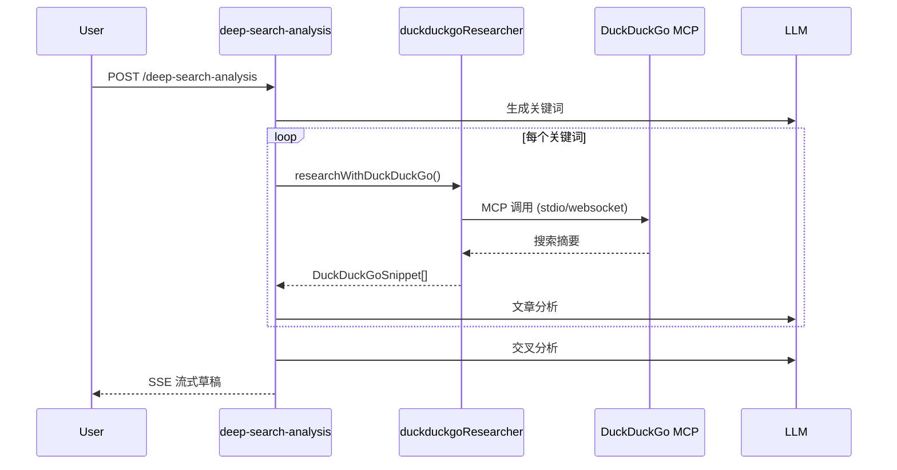
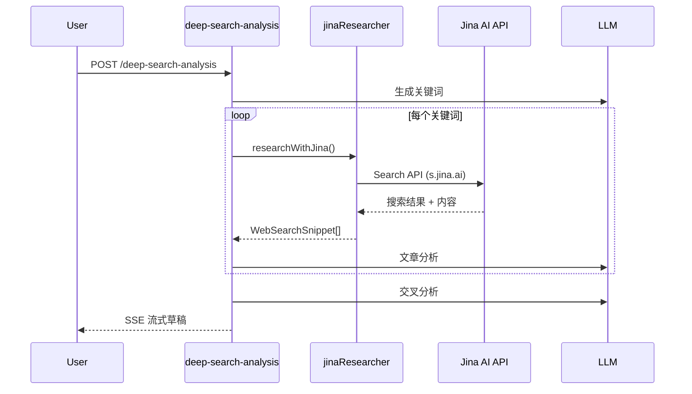

# 深度检索 Jina AI Search API 集成设计文档

- **Status**: Approved
- **Date**: 2025-12-18
- **Approved**: 2025-12-18

## 1. 目标与背景

### 1.1 目标

将深度检索流程中的 DuckDuckGo MCP 搜索服务替换为 Jina AI 的 Search API 和 Reader API，以获得：

1. **更稳定的服务**：Jina AI 提供商业级 API 服务，无需依赖 MCP 服务器
2. **更丰富的内容**：Reader API 可以获取网页全文，而非仅摘要
3. **更灵活的配置**：支持多种搜索参数和返回格式

### 1.2 现有流程分析

当前深度检索流程：

```
用户输入
  → 关键词生成 (LLM)
  → DuckDuckGo MCP 搜索 (每个关键词)
  → 文章分析 (LLM)
  → 交叉分析 (LLM)
  → 草稿输出
```

**涉及的核心文件**：

| 文件路径 | 职责 |
|---------|------|
| `src/core/aibot/mcp/duckduckgoResearcher.ts` | DuckDuckGo 搜索封装（MCP + HTTP 回退） |
| `app/api/local-aibot/deep-search-analysis/route.ts` | 深度检索分析 API（调用搜索和分析） |
| `src/core/aibot/researchWorkflow.ts` | 草稿生成工作流 |
| `src/core/aibot/types.ts` | 类型定义 |
| `src/core/aibot/constants.ts` | 常量配置 |

## 2. 详细设计

### 2.1 模块结构

```
src/core/aibot/
├── jina/
│   └── jinaResearcher.ts        # 新增：Jina AI 搜索封装
├── mcp/
│   └── duckduckgoResearcher.ts  # 保留：作为回退方案
├── types.ts                      # 修改：新增 Jina 相关类型
└── constants.ts                  # 修改：新增 Jina 相关常量
```

### 2.2 核心接口设计

#### 2.2.1 Jina 搜索结果类型（新增于 `types.ts`）

```typescript
// Jina Search API 返回的单条结果
export interface JinaSearchResult {
    title: string;
    url: string;
    description: string;
    content?: string;      // Reader API 获取的全文内容
    favicon?: string;
}

// Jina 搜索选项
export interface JinaSearchOptions {
    topK?: number;         // 返回结果数量，默认 5
    locale?: string;       // 搜索地区，如 'zh-CN'
    site?: string;         // 限定搜索域名
    withContent?: boolean; // 是否获取全文内容
}

// 统一搜索结果类型（兼容 DuckDuckGo）
export interface WebSearchSnippet {
    title: string;
    url: string;
    snippet: string;       // 摘要
    content?: string;      // 全文（可选）
    source: 'jina' | 'duckduckgo';
    raw?: unknown;
}
```

#### 2.2.2 Jina 研究器模块（`src/core/aibot/jina/jinaResearcher.ts`）

```typescript
/**
 * 使用 Jina Search API 进行网络搜索
 */
export async function searchWithJina(
    query: string,
    options?: JinaSearchOptions
): Promise<WebSearchSnippet[]>;

/**
 * 使用 Jina Reader API 获取网页全文
 */
export async function fetchPageContent(
    url: string
): Promise<string | null>;

/**
 * 综合搜索并获取内容（主入口）
 */
export async function researchWithJina(
    query: string,
    options?: JinaSearchOptions
): Promise<WebSearchSnippet[]>;
```

### 2.3 Jina API 调用详情

#### 2.3.1 Search API (s.jina.ai)

```typescript
// 请求
POST https://s.jina.ai/
Headers:
  - Authorization: Bearer ${JINA_API_KEY}
  - Content-Type: application/json
  - Accept: application/json

Body:
{
    "q": "搜索查询",
    "num": 5  // 返回数量
}

// 响应
{
    "code": 200,
    "data": [
        {
            "title": "页面标题",
            "description": "页面描述",
            "url": "https://...",
            "content": "页面内容（Markdown 格式）"
        }
    ]
}
```

#### 2.3.2 Reader API (r.jina.ai)

```typescript
// 请求
POST https://r.jina.ai/
Headers:
  - Authorization: Bearer ${JINA_API_KEY}
  - Content-Type: application/json
  - Accept: application/json

Body:
{
    "url": "https://example.com/page"
}

// 响应
{
    "code": 200,
    "data": {
        "title": "页面标题",
        "content": "Markdown 格式的页面内容",
        "url": "https://..."
    }
}
```

### 2.4 环境变量配置

在 `.env.local` 中添加：

```bash
# Jina AI API 配置
JINA_API_KEY=your_jina_api_key_here

# 可选：使用 Jina 作为主搜索引擎（默认 true）
USE_JINA_SEARCH=true
```

### 2.5 数据流变更

#### 变更前



#### 变更后



### 2.6 向后兼容性设计

为保证平滑迁移和故障回退：

1. **环境变量开关**：`USE_JINA_SEARCH=true|false`
2. **自动回退**：Jina API 失败时自动回退到 DuckDuckGo
3. **统一接口**：新增 `WebSearchSnippet` 类型兼容两种数据源

```typescript
// 统一入口函数
export async function performWebSearch(
    query: string,
    options?: WebSearchOptions
): Promise<WebSearchSnippet[]> {
    const useJina = process.env.USE_JINA_SEARCH !== 'false';

    if (useJina) {
        try {
            return await researchWithJina(query, options);
        } catch (error) {
            logger.warn('Jina 搜索失败，回退到 DuckDuckGo', { error });
        }
    }

    // 回退到 DuckDuckGo
    const ddgResults = await researchWithDuckDuckGo(query, options);
    return ddgResults.map(convertToWebSearchSnippet);
}
```

### 2.7 修改清单

| 文件 | 操作 | 说明 |
|------|------|------|
| `src/core/aibot/jina/jinaResearcher.ts` | 新增 | Jina API 封装模块 |
| `src/core/aibot/types.ts` | 修改 | 新增 Jina 相关类型 |
| `src/core/aibot/constants.ts` | 修改 | 新增 Jina 相关常量 |
| `app/api/local-aibot/deep-search-analysis/route.ts` | 修改 | 切换搜索服务调用 |
| `.env.local` | 修改 | 添加 `JINA_API_KEY` |

## 3. 实现计划

### 3.1 实现步骤

1. **Step 1**: 新增 `src/core/aibot/jina/jinaResearcher.ts`
   - 实现 `searchWithJina()` 函数
   - 实现 `fetchPageContent()` 函数（可选）
   - 实现 `researchWithJina()` 主入口

2. **Step 2**: 更新类型定义
   - 在 `types.ts` 中新增 `JinaSearchResult`, `JinaSearchOptions`, `WebSearchSnippet`

3. **Step 3**: 更新常量配置
   - 在 `constants.ts` 中新增 Jina 相关常量

4. **Step 4**: 修改深度检索分析 API
   - 在 `deep-search-analysis/route.ts` 中替换搜索调用

5. **Step 5**: 配置环境变量
   - 在 `.env.local` 中添加 `JINA_API_KEY`

### 3.2 测试策略

1. **单元测试**：测试 `jinaResearcher.ts` 的各个函数
   - 正常响应解析
   - 错误处理
   - 回退逻辑

2. **集成测试**：测试完整的深度检索流程
   - 关键词生成 → Jina 搜索 → 分析 → 草稿
   - Jina 失败时的 DuckDuckGo 回退

3. **手动测试**：
   - 在开发环境验证搜索结果质量
   - 对比 Jina 与 DuckDuckGo 结果

## 4. 风险与缓解

| 风险 | 缓解措施 |
|------|----------|
| Jina API 限流 | 添加请求限流逻辑，配置合理的 topK |
| API Key 泄露 | 仅存于 `.env.local`，不提交版本控制 |
| 内容格式差异 | 统一转换为 `WebSearchSnippet` 格式 |
| 网络延迟 | 设置合理超时，支持并行请求 |

## 5. 用户确认决策

1. **Reader API 全文获取**：暂不启用，但保留接口，通过配置 `JINA_FETCH_CONTENT=true|false` 控制
2. **搜索结果数量**：每个关键词取 3 条结果（更新 `JINA_SEARCH_PER_KEYWORD = 3`）
3. **DuckDuckGo 保留**：保留作为后备方案

---

**设计方案已通过** ✓
