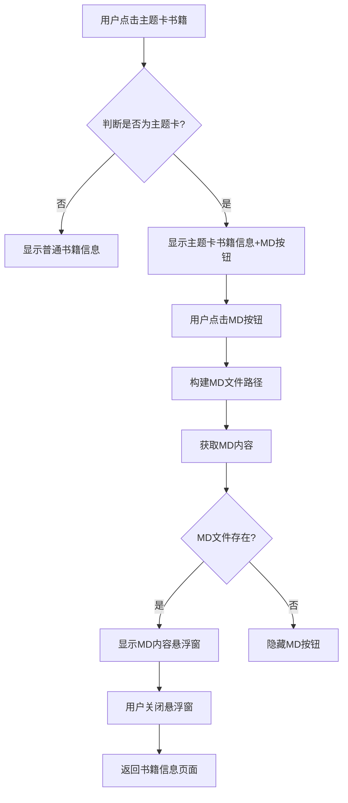

# 主题卡MD内容显示功能设计文档
- **Status**: Proposal
- **Date**: 2023-12-15

## 1. 目标与背景

在图书详情画板页面中为主题卡类型的数据增加一个按钮，用于显示与主题相关的MD格式文档。该功能只在主题卡类型的图书画板中显示，点击按钮后在当前画板页面弹出一个悬浮窗口，显示MD内容。悬浮窗口的样式复用AboutOverlay组件的样式，整体风格与当前页面保持一致。

## 2. 详细设计

### 2.1 模块结构

- `components/InfoPanel.tsx`: 修改现有组件，添加主题卡MD内容显示按钮和状态管理
- `components/SubjectMdOverlay.tsx`: 新建组件，基于AboutOverlay组件，专门用于显示主题MD内容
- `lib/content.ts`: 添加获取主题MD内容的辅助函数

### 2.2 核心逻辑/接口

#### 2.2.1 主题卡识别逻辑
```typescript
// 判断当前书籍是否属于主题卡
const isSubjectCard = book.month.includes('-subject-');
```

#### 2.2.2 MD文件路径构建
```typescript
// 从book.month中解析出年份和主题名称
const [year, subjectName] = book.month.split('-subject-');
const mdFilePath = `/content/${year}/subject/${subjectName}/${subjectName}.md`;
```

#### 2.2.3 数据获取接口
```typescript
// lib/content.ts 中新增函数
export async function getSubjectMdContent(subjectPath: string): Promise<string> {
  try {
    const response = await fetch(subjectPath);
    if (!response.ok) {
      return '';
    }
    return await response.text();
  } catch (error) {
    console.error('Failed to load subject MD content:', error);
    return '';
  }
}
```

#### 2.2.4 组件状态管理
```typescript
// InfoPanel组件中新增状态
const [isMdOverlayOpen, setIsMdOverlayOpen] = useState(false);
const [mdContent, setMdContent] = useState('');
const [subjectName, setSubjectName] = useState('');
```

### 2.3 可视化图表



### 2.4 UI设计

#### 2.4.1 按钮设计
- 位置：网页顶部居中，与现有的几个按钮对齐显示
- 样式：与现有按钮保持一致的设计风格
- 图标：使用文档或阅读相关的图标
- 文本：显示"主题文档"或类似文字

#### 2.4.2 悬浮窗口设计
- 基础样式：复用AboutOverlay组件的样式
- 标题：显示主题名称
- 内容：使用ReactMarkdown渲染MD内容
- 交互：支持关闭按钮和背景点击关闭

## 3. 测试策略

### 3.1 功能测试
- 测试主题卡类型书籍正确显示MD按钮
- 测试非主题卡类型书籍不显示MD按钮
- 测试MD按钮点击后正确加载和显示内容
- 测试悬浮窗口的打开和关闭功能

### 3.2 边界条件测试
- 测试MD文件不存在时按钮隐藏
- 测试MD文件内容为空时的处理
- 测试网络错误时的处理

### 3.3 兼容性测试
- 测试不同主题名称的MD文件加载
- 测试特殊字符在主题名称中的处理
- 测试MD文件中各种格式的渲染效果

## 4. 实现细节

### 4.1 组件修改点

#### 4.1.1 InfoPanel组件修改
1. 导入必要的React hooks和新组件
2. 添加状态管理变量
3. 添加主题卡判断逻辑
4. 在顶部按钮区域添加MD按钮
5. 实现MD内容获取和显示逻辑

#### 4.1.2 SubjectMdOverlay组件创建
1. 基于AboutOverlay组件创建新组件
2. 调整标题显示逻辑，显示主题名称
3. 使用ReactMarkdown渲染MD内容
4. 保持与AboutOverlay一致的样式和交互

### 4.2 性能考虑
- MD内容只在点击按钮时加载，避免不必要的网络请求
- 使用React.memo优化组件渲染性能
- 考虑添加MD内容缓存机制

### 4.3 错误处理
- MD文件加载失败时隐藏按钮
- 网络错误时提供适当的用户反馈
- 添加错误日志记录便于调试