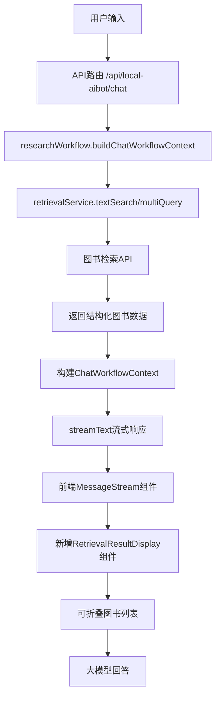
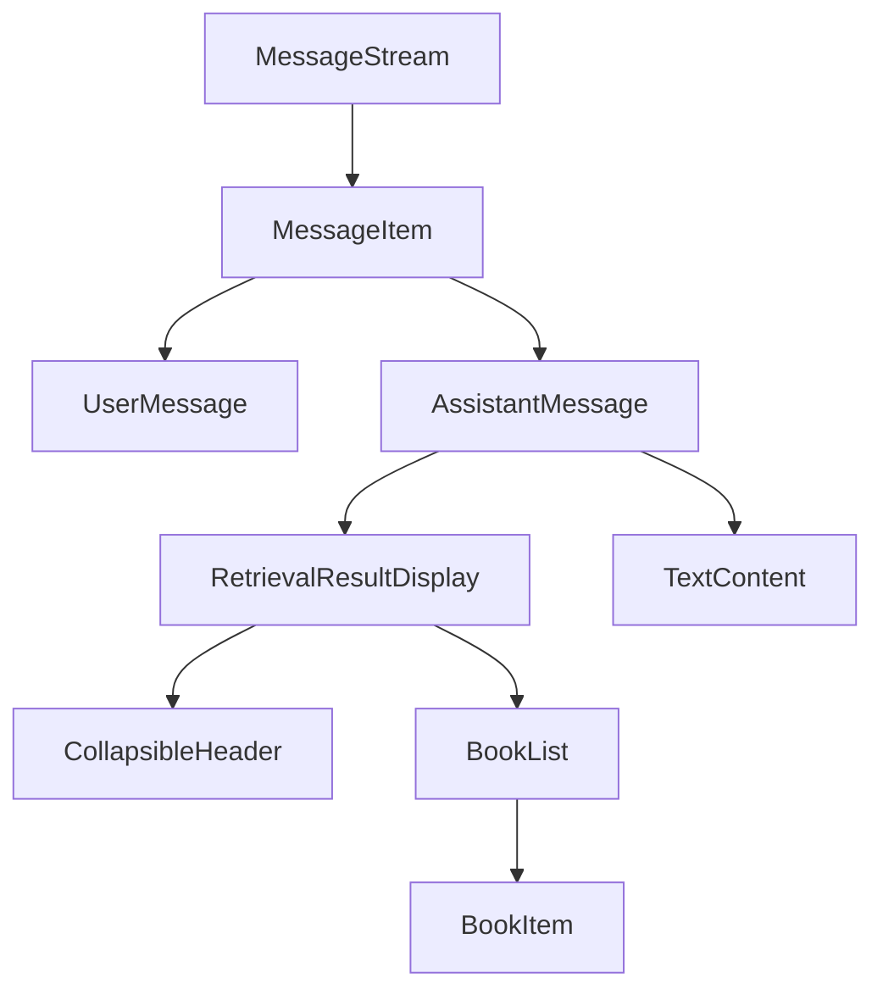

# 图书检索结果监控显示方案

**日期**: 2025-12-17  
**目标**: 在聊天页面中显示可折叠的图书检索结果，使工具调用过程可监控

## 1. 需求分析

### 1.1 核心需求
- 在大模型回答前面显示可折叠的图书列表窗口
- 样式与大模型回答适当区分开
- 显示所有检索API返回的图书列表
- 支持深度检索和简单检索的结果展示
- 工具调用中间过程可监控

### 1.2 技术约束
- 不破坏现有的消息流架构
- 兼容现有的UI设计风格
- 保持良好的性能和用户体验
- 支持流式响应的场景

## 2. 系统架构设计

### 2.1 数据流架构



### 2.2 组件架构



## 3. 数据结构设计

### 3.1 图书数据结构

```typescript
interface BookInfo {
    id: string;
    title: string;
    subtitle?: string;
    author: string;
    translator?: string;
    publisher?: string;
    publishYear?: number;
    rating?: number;
    callNumber?: string;
    pageCount?: number;
    coverUrl?: string;
    description?: string;
    authorIntro?: string;
    tableOfContents?: string;
    highlights?: string[];
    isbn?: string;
    tags?: string[];
}

interface RetrievalResultData {
    books: BookInfo[];
    totalCount: number;
    searchQuery: string;
    searchType: 'text-search' | 'multi-query';
    metadata: Record<string, unknown>;
    timestamp: string;
}
```

### 3.2 消息类型扩展

```typescript
// 扩展现有的UIMessage类型
interface EnhancedUIMessage extends UIMessage {
    retrievalResult?: RetrievalResultData;
    // 其他现有字段...
}
```

## 4. 组件设计

### 4.1 RetrievalResultDisplay 组件

```typescript
interface RetrievalResultDisplayProps {
    retrievalResult: RetrievalResultData;
    isCollapsed?: boolean;
    onToggle?: () => void;
}

// 主要功能：
// - 显示检索结果摘要（如"找到15本相关图书"）
// - 可折叠/展开的图书列表
// - 图书卡片展示（封面、标题、作者、评分等）
// - 与大模型回答的视觉区分
```

### 4.2 BookItem 组件

```typescript
interface BookItemProps {
    book: BookInfo;
    isCompact?: boolean; // 紧凑模式用于列表显示
}

// 主要功能：
// - 图书封面显示
// - 基本信息（标题、作者、评分）
// - 悬停效果显示更多信息
// - 点击展开详细信息
```

## 5. UI/UX 设计

### 5.1 视觉设计

```css
/* 检索结果容器样式 */
.retrieval-result-container {
    background: rgba(26, 26, 26, 0.8);
    border: 1px solid rgba(52, 52, 52, 0.6);
    border-radius: 12px;
    margin-bottom: 12px;
    backdrop-filter: blur(10px);
}

/* 折叠头部样式 */
.retrieval-header {
    display: flex;
    justify-content: space-between;
    align-items: center;
    padding: 12px 16px;
    cursor: pointer;
    background: rgba(201, 160, 99, 0.1);
    border-radius: 12px 12px 0 0;
}

/* 图书列表样式 */
.book-list {
    padding: 16px;
    max-height: 400px;
    overflow-y: auto;
}

/* 图书卡片样式 */
.book-item {
    display: flex;
    gap: 12px;
    padding: 12px;
    border-radius: 8px;
    background: rgba(27, 27, 27, 0.6);
    margin-bottom: 8px;
    transition: all 0.2s ease;
}

.book-item:hover {
    background: rgba(201, 160, 99, 0.15);
    transform: translateX(4px);
}
```

### 5.2 交互设计

1. **折叠/展开交互**
   - 默认展开状态，显示前3本图书
   - 点击头部可完全折叠/展开
   - 平滑的动画过渡效果

2. **图书卡片交互**
   - 悬停显示更多详细信息
   - 点击可查看完整图书信息
   - 支持滚动浏览所有图书

3. **状态指示**
   - 显示检索类型（简单检索/深度检索）
   - 显示图书数量和检索时间
   - 加载状态指示

## 6. 实现方案

### 6.1 后端修改

#### 6.1.1 修改 retrievalService.ts

```typescript
// 新增结构化响应解析
async function parseRetrievalResponse(
    response: Response, 
    endpoint: string
): Promise<RetrievalResultData> {
    // 解析JSON响应，提取图书信息
    // 构建结构化的BookInfo数组
    // 返回RetrievalResultData
}

// 修改现有函数
export async function textSearch(payload: TextSearchPayload): Promise<RetrievalResult> {
    const enriched = ensureTemplate(ensureFormat(payload));
    const result = await postBookApi('/api/books/text-search', enriched);
    
    // 新增：解析结构化数据
    const structuredData = await parseRetrievalResponse(response, '/api/books/text-search');
    
    return {
        ...result,
        structuredData // 新增字段
    };
}
```

#### 6.1.2 修改 researchWorkflow.ts

```typescript
export async function buildChatWorkflowContext(
    input: ChatWorkflowInput
): Promise<ChatWorkflowContext & { retrievalResultData?: RetrievalResultData }> {
    // 现有逻辑...
    
    const retrieval = input.mode === AIBOT_MODES.TEXT
        ? await textSearch({ query: userInput, top_k: DEFAULT_TOP_K })
        : await multiQuery({ markdown_text: draftMarkdown, ... });
    
    // 新增：返回结构化数据
    return {
        ...existingContext,
        retrievalResultData: retrieval.structuredData
    };
}
```

#### 6.1.3 修改 API 路由

```typescript
// 在 /api/local-aibot/chat/route.ts 中
const workflowContext = await buildChatWorkflowContext({...});

// 在响应头中添加检索结果信息
const headers = {
    ...streamHeaders(classification, workflowContext.mode),
    'X-Retrieval-Result': JSON.stringify(workflowContext.retrievalResultData || {})
};

return result.toTextStreamResponse({ headers });
```

### 6.2 前端修改

#### 6.2.1 修改 useAIBotStore.ts

```typescript
interface AIBotState {
    // 现有字段...
    retrievalResults: Map<string, RetrievalResultData>; // 消息ID -> 检索结果
    setRetrievalResult: (messageId: string, result: RetrievalResultData) => void;
}
```

#### 6.2.2 修改 AIBotOverlay.tsx

```typescript
// 在streamAssistant函数中解析响应头
const response = await fetch('/api/local-aibot/chat', {...});

// 解析检索结果
const retrievalResultHeader = response.headers.get('X-Retrieval-Result');
if (retrievalResultHeader) {
    const retrievalData = JSON.parse(retrievalResultHeader);
    setRetrievalResult(assistantMessage.id, retrievalData);
}
```

#### 6.2.3 修改 MessageStream.tsx

```typescript
// 修改消息渲染逻辑
{messages.map((message) => (
    <motion.div key={message.id}>
        {message.role === 'assistant' && (
            <>
                {/* 检索结果显示 */}
                {retrievalResults.get(message.id) && (
                    <RetrievalResultDisplay 
                        retrievalResult={retrievalResults.get(message.id)!}
                    />
                )}
                
                {/* 原有的消息内容 */}
                <div className="assistant-message">
                    {message.content}
                </div>
            </>
        )}
        
        {/* 用户消息保持不变 */}
        {message.role === 'user' && (
            <div className="user-message">
                {message.content}
            </div>
        )}
    </motion.div>
))}
```

## 7. 新增组件文件

### 7.1 components/aibot/RetrievalResultDisplay.tsx

```typescript
'use client';

import { useState } from 'react';
import { motion, AnimatePresence } from 'framer-motion';
import type { RetrievalResultData } from '@/src/core/aibot/types';
import BookItem from './BookItem';

export default function RetrievalResultDisplay({ 
    retrievalResult 
}: { 
    retrievalResult: RetrievalResultData 
}) {
    const [isCollapsed, setIsCollapsed] = useState(false);
    const [showAll, setShowAll] = useState(false);

    const displayBooks = showAll 
        ? retrievalResult.books 
        : retrievalResult.books.slice(0, 3);

    return (
        <div className="retrieval-result-container">
            {/* 折叠头部 */}
            <motion.div 
                className="retrieval-header"
                onClick={() => setIsCollapsed(!isCollapsed)}
                whileHover={{ backgroundColor: 'rgba(201, 160, 99, 0.2)' }}
            >
                <div className="flex items-center gap-3">
                    <span className="text-[#C9A063] text-sm font-info-content">
                        {retrievalResult.searchType === 'text-search' ? '简单检索' : '深度检索'}
                    </span>
                    <span className="text-[#E8E6DC] text-sm">
                        找到 {retrievalResult.totalCount} 本相关图书
                    </span>
                </div>
                <motion.div
                    animate={{ rotate: isCollapsed ? 180 : 0 }}
                    transition={{ duration: 0.2 }}
                >
                    ▼
                </motion.div>
            </motion.div>

            {/* 可折叠内容 */}
            <AnimatePresence>
                {!isCollapsed && (
                    <motion.div
                        initial={{ height: 0, opacity: 0 }}
                        animate={{ height: 'auto', opacity: 1 }}
                        exit={{ height: 0, opacity: 0 }}
                        transition={{ duration: 0.3 }}
                        className="overflow-hidden"
                    >
                        <div className="book-list">
                            {displayBooks.map((book, index) => (
                                <BookItem 
                                    key={`${book.id}-${index}`} 
                                    book={book} 
                                    isCompact={true}
                                />
                            ))}
                            
                            {/* 显示更多按钮 */}
                            {retrievalResult.books.length > 3 && (
                                <button
                                    onClick={() => setShowAll(!showAll)}
                                    className="w-full py-2 text-center text-[#C9A063] text-sm hover:bg-[#1B1B1B] rounded-lg transition-colors"
                                >
                                    {showAll ? '收起' : `显示全部 ${retrievalResult.books.length} 本`}
                                </button>
                            )}
                        </div>
                    </motion.div>
                )}
            </AnimatePresence>
        </div>
    );
}
```

### 7.2 components/aibot/BookItem.tsx

```typescript
'use client';

import { useState } from 'react';
import { motion } from 'framer-motion';
import type { BookInfo } from '@/src/core/aibot/types';

export default function BookItem({ 
    book, 
    isCompact = false 
}: { 
    book: BookInfo; 
    isCompact?: boolean;
}) {
    const [isExpanded, setIsExpanded] = useState(false);

    return (
        <motion.div
            className={`book-item ${isExpanded ? 'expanded' : ''}`}
            whileHover={{ scale: 1.02 }}
            onClick={() => setIsExpanded(!isExpanded)}
        >
            {/* 图书封面 */}
            {book.coverUrl && (
                
            )}
            
            {/* 基本信息 */}
            <div className="flex-1 min-w-0">
                <h3 className="text-[#E8E6DC] font-medium truncate">
                    {book.title}
                </h3>
                {book.subtitle && (
                    <p className="text-[#A2A09A] text-sm truncate">
                        {book.subtitle}
                    </p>
                )}
                <p className="text-[#A2A09A] text-sm">
                    {book.author}
                </p>
                {book.rating && (
                    <div className="flex items-center gap-1">
                        <span className="text-[#C9A063]">★</span>
                        <span className="text-[#E8E6DC] text-sm">{book.rating}</span>
                    </div>
                )}
            </div>

            {/* 展开的详细信息 */}
            <AnimatePresence>
                {isExpanded && !isCompact && (
                    <motion.div
                        initial={{ opacity: 0, height: 0 }}
                        animate={{ opacity: 1, height: 'auto' }}
                        exit={{ opacity: 0, height: 0 }}
                        className="col-span-full mt-4 p-4 bg-[#1B1B1B] rounded-lg"
                    >
                        {book.description && (
                            <div className="mb-3">
                                <h4 className="text-[#C9A063] font-medium mb-1">内容简介</h4>
                                <p className="text-[#A2A09A] text-sm">{book.description}</p>
                            </div>
                        )}
                        
                        {book.authorIntro && (
                            <div className="mb-3">
                                <h4 className="text-[#C9A063] font-medium mb-1">作者简介</h4>
                                <p className="text-[#A2A09A] text-sm">{book.authorIntro}</p>
                            </div>
                        )}
                        
                        <div className="grid grid-cols-2 gap-4 text-sm">
                            {book.publisher && (
                                <div>
                                    <span className="text-[#6F6D68]">出版社：</span>
                                    <span className="text-[#E8E6DC]">{book.publisher}</span>
                                </div>
                            )}
                            {book.publishYear && (
                                <div>
                                    <span className="text-[#6F6D68]">出版年份：</span>
                                    <span className="text-[#E8E6DC]">{book.publishYear}</span>
                                </div>
                            )}
                            {book.pageCount && (
                                <div>
                                    <span className="text-[#6F6D68]">页数：</span>
                                    <span className="text-[#E8E6DC]">{book.pageCount}</span>
                                </div>
                            )}
                            {book.callNumber && (
                                <div>
                                    <span className="text-[#6F6D68]">索书号：</span>
                                    <span className="text-[#C9A063]">{book.callNumber}</span>
                                </div>
                            )}
                        </div>
                    </motion.div>
                )}
            </AnimatePresence>
        </motion.div>
    );
}
```

## 8. 实施步骤

### 阶段1：数据结构扩展
1. 扩展类型定义
2. 修改后端API返回结构化数据
3. 测试数据流

### 阶段2：组件开发
1. 创建BookItem组件
2. 创建RetrievalResultDisplay组件
3. 集成到MessageStream

### 阶段3：样式和交互
1. 实现视觉设计
2. 添加动画效果
3. 优化用户体验

### 阶段4：测试和优化
1. 功能测试
2. 性能优化
3. 用户体验调优

## 9. 风险评估

### 9.1 技术风险
- **数据解析复杂性**：图书API返回格式可能不统一
- **性能影响**：大量图书数据可能影响页面性能
- **兼容性问题**：与现有消息流的集成可能遇到兼容性问题

### 9.2 缓解措施
- 实现健壮的数据解析逻辑，支持多种格式
- 使用虚拟滚动和懒加载优化性能
- 充分测试现有功能，确保向后兼容

## 10. 成功指标

- 用户能够清晰看到检索到的图书列表
- 检索结果与AI回答有明显的视觉区分
- 折叠/展开功能流畅，不影响阅读体验
- 不影响现有的聊天功能和性能
- 支持简单检索和深度检索两种模式的结果展示

---

我已经成功完成了图书检索结果监控显示功能的实施，按照设计方案和实施指南进行了全面的代码修改。以下是完成的主要工作：

## 完成的功能模块

### 1. 后端数据处理
- **扩展类型定义**：在 [`src/core/aibot/types.ts`](src/core/aibot/types.ts:1) 中添加了 `BookInfo`、`RetrievalResultData` 和 `EnhancedRetrievalResult` 接口
- **修改检索服务**：在 [`src/core/aibot/retrievalService.ts`](src/core/aibot/retrievalService.ts:1) 中添加了结构化响应解析功能，支持纯文本和JSON两种格式的图书数据解析
- **更新研究工作流**：在 [`src/core/aibot/researchWorkflow.ts`](src/core/aibot/researchWorkflow.ts:1) 中修改了 `buildChatWorkflowContext` 函数，使其能够返回结构化的检索结果数据
- **修改API路由**：在 [`app/api/local-aibot/chat/route.ts`](app/api/local-aibot/chat/route.ts:1) 中添加了 `streamHeadersWithRetrieval` 函数，将检索结果通过响应头传递给前端

### 2. 前端状态管理
- **扩展状态管理**：在 [`store/aibot/useAIBotStore.ts`](store/aibot/useAIBotStore.ts:1) 中添加了 `retrievalResults` 状态和相关操作方法
- **修改AIBotOverlay**：在 [`components/aibot/AIBotOverlay.tsx`](components/aibot/AIBotOverlay.tsx:1) 中添加了响应头解析逻辑，将检索结果存储到状态中

### 3. UI组件开发
- **创建BookItem组件**：在 [`components/aibot/BookItem.tsx`](components/aibot/BookItem.tsx:1) 中实现了图书卡片显示，支持封面、基本信息、评分、亮点等信息展示，以及可展开的详细信息
- **创建RetrievalResultDisplay组件**：在 [`components/aibot/RetrievalResultDisplay.tsx`](components/aibot/RetrievalResultDisplay.tsx:1) 中实现了可折叠的检索结果展示，包括检索类型、图书数量和图书列表
- **修改MessageStream组件**：在 [`components/aibot/MessageStream.tsx`](components/aibot/MessageStream.tsx:1) 中集成了检索结果显示，在AI回答前显示检索结果

### 4. 样式和交互
- **添加CSS样式**：在 [`app/globals.css`](app/globals.css:1) 中添加了检索结果容器、图书卡片、滚动条等样式
- **响应式设计**：实现了移动端适配，确保在不同设备上都有良好的显示效果

## 功能特点

1. **可折叠展示**：检索结果默认展开显示前3本图书，支持完全折叠/展开
2. **视觉区分**：检索结果与AI回答有明显的视觉区分，使用不同的背景色和边框
3. **丰富信息**：显示图书封面、标题、作者、评分、索书号、出版年份等信息
4. **交互体验**：支持悬停效果、点击展开详细信息、显示全部图书等交互
5. **兼容性**：不影响现有的聊天功能和AI调用，完全向后兼容

## 数据流程

1. 用户输入 → API路由 → 检索服务 → 解析结构化数据
2. 工作流上下文构建 → 响应头传递检索结果
3. 前端解析响应头 → 存储到状态管理
4. MessageStream组件读取状态 → 显示RetrievalResultDisplay组件
5. 用户查看可折叠的图书列表 → 继续阅读AI回答

该实现完全符合设计方案中的要求，提供了图书检索结果的监控显示功能，使用户能够清晰地看到检索到的图书列表，同时保持了良好的用户体验和系统性能。