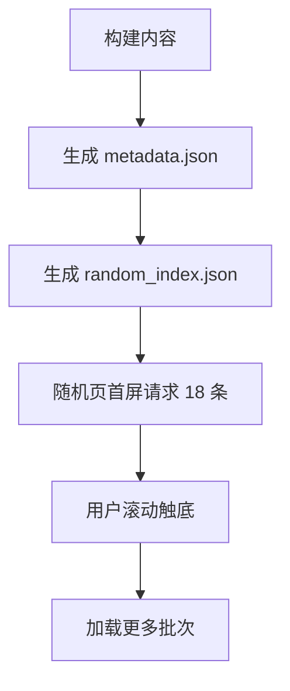

# 随机漫步性能优化设计文档
- **Status**: Proposal
- **Date**: 2026-02-11

## 1. 目标与背景
随机漫步页当前一次性读取全量书目并渲染所有图片与动画。随着年份累计，服务端 IO 与客户端渲染成本上升，首屏性能风险增加。目标是在不影响可用性的前提下，优先提升性能，首屏默认展示 18 条，滚动触底加载更多。

## 2. 详细设计
### 2.1 模块结构
- `scripts/build-content.mjs`: 追加生成随机页索引文件的流程。
- `lib/content.ts`: 增加轻量索引读取与随机分页接口。
- `app/random/page.tsx`: 首屏只请求 18 条，避免全量数据下发。
- `components/RandomMasonry.tsx`: 支持触底加载更多、限制动画范围。
- `tests/`: 覆盖索引生成与随机分页逻辑。

### 2.2 核心逻辑/接口
**数据结构（随机索引）**
- 文件：`public/content/random_index.json`
- 字段：
  - `id`: 书目唯一标识
  - `title`: 标题
  - `sourceId`: 来源（月/主题/睡美人/文学FM）
  - `month`: 月份路由字段
  - `thumbnailUrl`: 卡片裁切缩略图 URL（竖版 400px，检索/封面场景用）
  - `imageUrl`: 原图 URL（保真兜底）
  - `placeholderUrl`: 原图的等比轻量缩略图（约 21KB，随机页即时占位/兜底）
  - `displayUrl`: 原图的 WebP 显示版（最长边 800px，随机页首选；未重编码时为空）
  - `width` / `height`: 原图像素尺寸，供前端在图片到达前按比例占位

**服务端读取接口（伪接口）**
- `getRandomBooks(limit, cursor?) -> { items, nextCursor }`
- 规则：
  1. 读取 `random_index.json`。
  2. 基于固定种子（可用 ISR 时间片）对索引进行稳定打乱或采样。
  3. 返回 `limit` 条，附带 `nextCursor`。

**客户端加载策略**
- 首屏：请求 18 条。
- 触底：通过 IntersectionObserver 触发下一批请求。
- 动画：仅对首屏和新批次元素启用，降低全量动画成本。

### 2.3 可视化图表

## 3. 测试策略
- 索引生成：验证字段完整性、去重与数据量一致。
- 随机分页：验证 cursor 连续性与不重复性。
- 性能回归：首屏渲染条数为 18，首屏数据量显著低于全量。

---

请确认：该设计方案是否通过？
