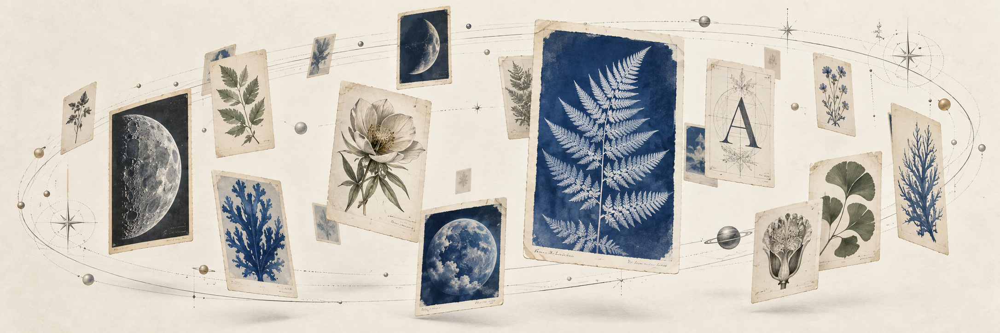

# RefGarden

A space to find your next visual.

Find **images and short video references from one prompt**. Explore artwork from **The Met**, space and science images from **NASA**, design references from **Cosmos**, and short films from **Internet Archive's Prelinger Archives** in a dark, three-dimensional gallery.

[Run locally](#run-locally) · [Try a prompt](#try-a-prompt) · [Short videos](docs/SHORT_VIDEOS.md) · [How Jev works](docs/HOW_IT_WORKS.md) · [FAQ](#faq) · [Contribute](CONTRIBUTING.md)

**Local Explore uses Jev.** It chooses search phrases and highlights image references from their titles and descriptions. It receives no image pixels, video frames or audio. The [hosted preview](https://jev-curator.vercel.app) uses keyword retrieval without Jev. This README describes the current repository; the preview is deployed separately.

## What's new

| Update | What you can do |
| --- | --- |
| Short video references | Choose Images, Short videos, or both. Eligible archive clips autoplay muted and loop inside the cards. |
| Black-hole dark theme | Explore a near-black space with a faint ring, soft card arrivals and gentle floating motion. Reduced-motion preferences are respected. |
| One search control | Press Explore and the prompt/settings collapse to Stop. They return when discovery ends. The timer and source counts stay visible. |
| Source balance | Image collection targets roughly a third each from The Met, NASA and Cosmos. Cosmos is capped at a third of fresh image results; archive clips have a separate count. |
| Duplicate filtering | Repeated IDs, known image URL variants and matching named Met artwork are filtered across discovery rounds and when reopening saved searches. |
| More than 100 references | The first 100 thumbnails get loading priority. Later cards appear progressively without moving earlier ones. |
| Video inspection | Small video markers stay small as you zoom. Hover or focus to see duration; click for a larger player with sound controls and the original source link. |

## Try a prompt

Start with a short description:

- `Vintage toy commercials`
- `Vintage coffee commercials`
- `Vintage cars and chrome engines`
- `Soft goddess, silk and pearls`
- `Flowers and spinning gears`
- `A botanical observatory on the Moon`

Coffee and toy commercials returned playable clips in local testing. Other prompts are directions to try; source coverage and results vary.

1. Write your prompt and select **Images**, **Short videos**, or both. Combine Cinematic, Typography, Chrome, Botanical, Analog, Minimal, Surreal and Scientific styles.
2. Press **Explore**. Drag to orbit and scroll to zoom while references arrive. Discovery continues until **Stop**, three empty rounds, or an error ends the run.
3. After stopping, click a card to inspect it, follow its source, or **Keep** it. You can pin up to six references, revisit saved searches, and export the search record as JSON.

Stopping discovery keeps the collected references and their video playback. The prompt stays editable between runs, so you can change the direction or styles and explore again.

## Video sources and playback

The video source is **Prelinger Archives on Internet Archive**, covering historical advertising, animation and short films. There is no TikTok integration or Instagram feed scraping.

Clips must have MP4 metadata reporting a duration of **up to three minutes** and a file size of **at most 80 MB**. Each batch examines up to 36 items and can add up to 12 eligible clips. Missing duration, restricted items and unsupported files are skipped.

Up to **eight visible previews** play at once. If more are visible, they take turns every 12 seconds. Offscreen players release their media; hidden tabs and the detail player pause background previews. Footage streams from the archive. The repository does not include downloaded videos.

See [video filtering, playback limits and source details](docs/SHORT_VIDEOS.md).

## Collection, balance and speed

The first image batch requests up to **100 images**; later batches request up to 30. Videos are collected separately when enabled. A request is a target, and sources may return fewer matches. The gallery can grow beyond 100 cards: later thumbnails wait for the first 100 and then load two at a time near the viewport.

Met, NASA and Cosmos percentages describe **collected images**, with archive clips counted separately. Faster image sources wait for slower ones. NASA and The Met can try shorter search phrases if a query yields too little. Missing matches can leave unequal shares; the app reports those gaps and holds excess Cosmos results. Percentages round together to 100% when images are present.

Duplicate filtering uses file identity and catalog metadata. It groups known size/format variants of the same image and Met records with matching detailed titles, artists and dates. Generic titles such as “Dress” remain distinct. Cropped copies or reposts with unrelated metadata can still slip through; this filter does not compare pixels.

The fixed timer shows elapsed search time, **collected references** and **loaded thumbnails**. A loaded poster does not mean its video is fully buffered. Timing includes source retrieval, model requests and waits; it is not a standalone Jev benchmark. Browser/CDN caching can speed up repeated thumbnail display. **Explore makes fresh source requests; saved searches replay recorded results and timings.**

## Run locally

Install [Node.js](https://nodejs.org/) 22 or newer, then:

```sh
git clone https://github.com/AlbionaHoti/refgarden.git
cd refgarden
npm ci
npm run build
npm start
```

Open **http://127.0.0.1:4318**. Expand **Connections**, paste your [TypeSafe API key](https://console.typesafe.ai/) and choose **Connect Jev**. Then enter a prompt and press **Explore**.

The project installs its own pinned Bun runtime. A global Bun installation is optional. Connecting the key makes a small verification request and saves it in the local, ignored `.env` file. Jev runs through TypeSafe's API and uses your provider allowance. The maintainer's server is not involved in local Jev requests.

For environment-based setup, copy `.env.example` to `.env` and fill in `TYPESAFE_AI_API_KEY` before starting. If port 4318 is occupied, set `PORT` in that file. Stop the server with Ctrl+C; rebuild and restart after editing source code.

## What the model does

```text
Your prompt + styles
        ↓
Jev chooses phrases for enabled image/video collections
        ↓
Source requests run together → image and clip cards arrive
        ↓
Jev reads image metadata → up to one highlight per image source
        ↓
Next batch, until Stop
```

Search phrases come from bounded options built from the brief; image options also incorporate style presets. Exact image sample prompts can use prepared queries for their first batch. Jev can choose that no image reference fits. For videos, it chooses a query from prompt terms; file eligibility and playback are handled by code. A failed video query choice can fall back to a prompt-derived phrase, with a notice in the run.

References appear before the final image highlights. Jev does not watch clips, transcribe speech, identify sound hooks or visually review the images.

The fast Explore path uses source APIs and public page responses. It does not operate a browser or require Astra. The optional OpenAI review and older browser/Codex experiments are documented in [How it works](docs/HOW_IT_WORKS.md).

## Local and hosted keys

| | Local app | Hosted build |
| --- | --- | --- |
| Query selection | Jev chooses bounded phrases, with the sample/fallback behavior above | Code chooses phrases from the prompt and styles |
| Image and video retrieval | Source collectors on your local server | Source collectors on the hosted backend |
| Jev key | Your local `.env`; requests go from your local backend to TypeSafe | No Jev key is accepted or used |
| Optional OpenAI review | Direct browser-to-OpenAI request | Direct browser-to-OpenAI request |

The OpenAI key stays in tab memory and goes directly to OpenAI, bypassing the RefGarden server. Refreshing or clearing tab keys removes it. API access and billing belong to the person supplying the key; a ChatGPT/Codex subscription does not supply an API key. Sharing the site link does not share your tab's key or your local `.env`.

Saved searches and exported records contain prompts, references, decisions and timings. They exclude provider keys. The hosted build does not inherit the maintainer's local Jev key or Codex login.

## FAQ

**Can I use this?** Yes. MIT code. Run locally with a TypeSafe API key, or open the [hosted preview](https://jev-curator.vercel.app).

**Does the hosted site use Jev?** No. The [hosted preview](https://jev-curator.vercel.app) is gallery + retrieval only.

**Does Jev receive images or videos?** No. It chooses search phrases and reads image titles and descriptions. Code retrieves references; the browser displays images and streams clips.

**How is Jev prompted?** Brief + styles go in state. The code supplies candidate phrases. Jev picks one per source. Results and timings vary.

**Why fewer than 100 results?** Source availability, the prompt, duplicate filtering and image-source balance all affect the count. Clips also need an eligible MP4 with a known short duration.

**Are the results prefetched?** Explore sends fresh source requests. Saved searches replay their recorded references. Thumbnail caching can make an already-seen image load faster.

**Can I use the media in my own work?** Check each original item's rights and credits. The MIT license covers RefGarden's code, not every image or clip it finds.

## Sources and rights

| Source | How references arrive | Reuse |
| --- | --- | --- |
| The Met | Open Access collection API | The adapter requests public-domain objects with images. Check the object's record. |
| NASA | Image and Video Library API | Check the item's credits and NASA's media-use rules, including third-party material. |
| Cosmos | Public search-page response | Experimental adapter. Cosmos restricts automated access; use requires appropriate permission. |
| Internet Archive / Prelinger | Search and item metadata APIs; eligible MP4s stream from the archive | Check each item's rights and attribution. Being in the archive does not grant blanket reuse permission. |

Referenced images, clips, descriptions and third-party marks retain their own rights. See [source policies and attribution](NOTICE.md) and the [video source notes](docs/SHORT_VIDEOS.md).

## Development

```sh
npm run check
```

This runs the tests, TypeScript checks and production build. Tests cover source balance, duplicate identity, video eligibility, playback budgets, cancellation and key isolation. Fixtures and mocked provider calls require no API keys. For frontend development, run `npm start` in one terminal and `npm run dev` in another. The Vite server proxies API calls to the local backend on port 4318.

The Vercel configuration builds the source-search demo. It does not deploy the local Jev backend or a shared provider key. See [deployment boundaries](docs/HOW_IT_WORKS.md#local-and-hosted).

## Where this can grow

RefGarden starts with reference discovery. The next work is better evidence of relevance, permitted source integrations, and an opt-in way to explore your own image folders. Hosted accounts and paid convenience remain a possible later direction. These are plans, not shipped features; [the roadmap](ROADMAP.md) records the order and acceptance criteria.

## Credits

Built by [AlbionaHoti](https://github.com/AlbionaHoti). Inspired by [Jev Ultrafast](https://github.com/browser-use/jev-ultrafast) and [Jev Trader](https://github.com/jarrodwatts/jev-trader). Independent project; no affiliation with TypeSafe, NASA, The Met, Cosmos or Internet Archive.

The update launch video was made with [Diffusion Studio](https://github.com/diffusionstudio/editor), an open-source video editor, including the edit and background music.

[MIT licensed](LICENSE). README cover generated for this project; [art direction and provenance](docs/ART.md).
