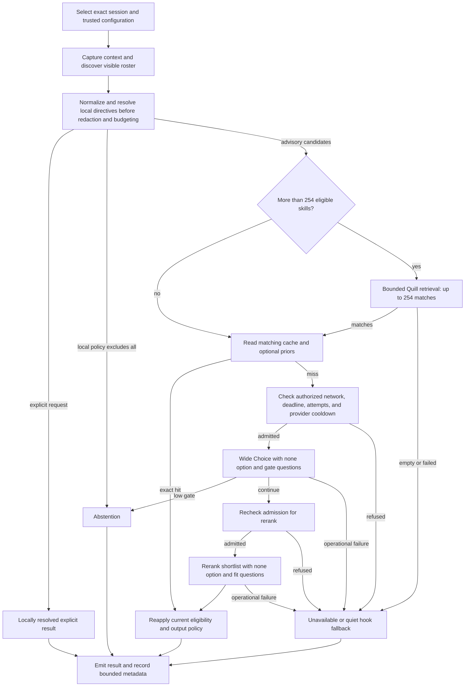

# SkillRanker (sr) — Design and Implementation Plan

2026-09-17 · Revised after source and contract review

## Purpose and scope

SkillRanker (`sr`) is a standalone Rust CLI that recommends skills for the next step of an agent session. It captures bounded context, resolves the skills the harness can actually load, and uses TypeSafe's Jev for a broad selection followed by a more detailed rerank. Interactive output shows up to five eligible candidates; the default hook suggests at most one. Abstention is a normal result.

**TypeSafe.ai's Jev is the ranking engine, and fresh evaluations require a TypeSafe API key and authorized network access.** Local retrieval, explicit resolution, inspection, and cached results do not constitute an alternative inference backend.

The useful product is a fast, advisory selector with inspectable evidence. It does not load or execute skills, override user instructions, grant tool permissions, or decide whether an agent may continue. A failed recommendation service must not prevent the agent from working.

The initial release targets local Linux and macOS, Claude Code's `UserPromptSubmit` hook, explicit transcript input, and a versioned normalized-context format. Other harnesses can use that format immediately through an integration they control; native Codex, omp/pi, and Grok adapters require their own verified contracts before they are advertised.

**No `ms` dependency:** reuse selected code and tests from `meta_skill` inside this project. Do not invoke its CLI, link its application crate, read its private database, inherit its configuration, or write outcomes into it. Discovery, parsing, redaction, retrieval, statistics, and feedback belong to `sr`.

**Quill is the lexical search engine throughout SkillRanker.** Use `frankensearch-quill` from the user's FrankenSearch project. Do not use Tantivy for runtime search, fallback, testing, benchmarking, reference implementations, or copied code. Quill's optional upstream oracle is not enabled by this project.

Keep README.md and AGENTS.md aligned with this plan as part of P0 and whenever a public contract changes. Their main architecture has been reconciled with the standalone design; examples and detailed schemas must track subsequent corrections too. Preserve their unrelated repository, licensing, coordination, and release rules. README uses the requested finished-product voice. Source, the capability contract, live Beads and revision-bound verification establish which interfaces have passed their gates; command examples alone do not.

### Evidence and limits of the starting recipe

The [TypeSafe skill-suggestion cookbook](https://docs.typesafe.ai/cookbooks/skill_suggestion) reports wrong-load rates falling from 16.8% to 7.3% on 315 covered requests, and needless-load rates falling from 9.8% to 4.0% on 173 uncovered requests. Its experiment used 182 Hermes skills, a three-skill shortlist, one injected suggestion, and `claude-haiku-4-5-20251001`. These are separate denominators and a particular evaluation setup, not measured results for SkillRanker.

Live multi-turn context, an eight-skill shortlist, new gate questions, personalization, and other harnesses are hypotheses to evaluate. The cookbook motivates the architecture; it does not establish our latency, cost, calibration, or effect on task success.

### Core invariants

1. Context, roster visibility, loaded-state evidence, cache entries, and feedback are bound to a workspace **and a specific session/agent branch**.
2. Explicit user skill requests and harness requirements cannot be vetoed by a probability threshold, prior, or cache. User exclusions take precedence over advisory suggestions.
3. Only locally resolved, currently loadable candidates can appear in actionable output. Provider answers cannot introduce names, paths, or commands.
4. `abstain`, `unavailable`, `explicit`, and `ranked` are different decisions. A timeout is never evidence that no skill fits.
5. Provider probabilities, local ranking scores, observed loads, and independently judged usefulness remain separate quantities.
6. Every input, subprocess, request, retry, persistence operation, and output has a bound. An HTTP-only timeout is insufficient.
7. No raw transcript or request body is persisted by default. Redaction covers all outgoing fields, including roster excerpts.
8. No skill is executed, edited, installed, or created by ranking, diagnostics, or feedback.

## Product improvements selected with idea-wizard

The first correctness review established what a recommendation may safely claim. This pass asks what makes the product worth using every day: finding a useful procedure, understanding a miss, controlling interruptions and expense, and fixing the underlying library or policy. The following are design priorities, not implemented features or measured improvements.

The idea-wizard pass considered 30 candidates against robustness, reliability, performance, intuitiveness, usability, ergonomics, usefulness, appeal, added value, and implementation practicality. Usefulness and practicality received the greatest weight. The top five improve the core experience without another inference provider or extra routine Jev calls. Ten supporting ideas extend existing boundaries; experiments remain gated and do not delay the core CLI.

### The five highest-value improvements

#### I01 — Explain where a candidate was lost and what the user can do

**User value:** “Why didn't you suggest the skill I expected?” should have a precise, inexpensive answer. A ranking score alone cannot distinguish an invisible skill, a lexical miss, a low fit, a none-option loss, and a presentation limit. Making those differences visible improves trust and directs fixes to the right component.

Extend the existing `--explain` result with a bounded stage trace: discovery → visibility/restrictions → local policy → Quill admission → wide shortlist → fit/none eligibility → final ordering → publication. `sr rank ... --why-not SKILL_ID --explain` reports the first decisive exclusion and any later stages actually evaluated. It never inserts that skill into a candidate set or causes an additional provider request. A candidate not evaluated at a stage has `not-evaluated`, not zero fit or a fabricated reason. An unknown ID is `not-in-snapshot`; the explanation must not broaden discovery roots.

Include exact threshold operands, tie handling, content/policy versions, and a small allowlisted recovery hint, such as inspecting roster precedence or repairing missing context. Hints never automatically enable networking, lift exclusions, lower quality gates, or execute a command. Return structured action identifiers/arguments rather than shell strings assembled from untrusted text. Normal output remains short; traces use the existing size and pagination limits.

**Delivery and proof:** P2 supplies reason codes; P4 renders them. Table-driven fixtures cover every exclusion with an honest success counterpart, an omitted target, and identical final decisions with different causes. Changing `--explain`/`--why-not` must not change the ranked result, provider request bytes, or request count. This is high-confidence value because the pipeline already computes most of the required evidence.

#### I02 — Turn a surprising result into an offline replay and policy comparison

**User value:** a bad suggestion should become a reproducible example, not a request to rerun a private conversation or spend more on inference. This also shortens the feedback loop for thresholds, caching bugs, and scoring regressions.

Add an explicit CLI-only `--save-case FILE` capture option and `sr replay FILE [--policy FILE] [--compare-policy FILE]`. A case contains a versioned manifest, the bounded redacted request inputs actually used, exact option maps/content digests, validated recorded responses, local policy/eligibility evidence, and model/adapter provenance. Label synthetic fixtures and recorded provider answers distinctly. Capture is opt-in because redacted prose can remain confidential; hooks never capture case bodies by default. Do not reconstruct an absent context from ordinary metadata-only ledger rows.

Replay performs no network access, transcript discovery, skill execution, or writes. It reads only the explicitly selected case and optional local policy files, not ambient user/project policy or credentials. Embedded paths are inert data; no case can authorize a live load or mutate a native session. Its envelope is `kind: replay` with `actionable: false`, containing the historical/recomputed decision separately. Comparing local thresholds/weights uses compatible complete responses. A changed prompt, model, retrieval strategy, excerpt, or shortlist needs new consented evaluation; a missing required stage reports `not-replayable`, not an invented response. Explain which eligibility/score/output changed without presenting the comparison as causal task improvement.

Freeze the decision's `as_of` time, active snoozes, loaded-state/visibility evidence, complete ordered candidate sets, numeric prior/phase inputs actually used, and scoring/canonicalization versions. Replay uses that captured evaluation state, never today's clock, current user/project configuration, or current ledger priors. A policy override may change only the declared local fields for which captured inputs are sufficient; turning on an uncaptured prior is not replayable. Do not require or export the original keyed cache secret: case integrity uses separate artifact digests and never authorizes importing a result into the live cache. Exact parity covers the decision and numeric outputs under the same tested computation/numeric profile, not invocation UUIDs, wall-clock timings, or new usage. A different floating-point backend/build profile must use declared comparison tolerances or report incompatible exact replay; matching a schema version alone does not prove bit-identical logarithms and softmax values across platforms.

Record a completeness manifest for each stage and input group. A low-gate case can replay its original abstention without a rerank; it cannot evaluate a lower gate requiring the missing rerank. An unavailable case can reproduce its sanitized terminal failure metadata without pretending to reproduce an unobserved provider response. Extra privacy transformations of retained data are declared and remove any affected exact-input replay claim. If an export failure occurs after inference, preserve the already-incurred attempt/usage metadata in the CLI failure; failing to save a case does not make the requests free.

Initial capture/import cap: 16 MiB, JSON nesting ≤64, with per-field limits still enforced. Larger cases fail explicitly rather than silently dropping replay-critical data. Redact all retained prose and exclude credentials, hash keys, secret-bearing configuration, and response error bodies. Files are owner-only, created exclusively without overwriting existing targets, and published only after a complete bounded write; capture consumes the invocation deadline. A requested capture that cannot be written is a storage/timeout failure, not an unnoticed success. Reject `--save-case` with `--dry-run`, `--no-persist`, or hook mode. Digests detect internal inconsistency, not trusted authorship; imported labels/responses remain untrusted evaluation data.

Use a tested atomic **no-clobber publication** operation for case/snapshot exports, not an existence check followed by an overwriting rename. Validate the destination directory and reject an existing target or symlink, including one raced into place. Durability requires the documented file/directory flush policy. A crash or late output failure may leave a complete export with delivery unknown; never retry by overwriting it or imply atomicity between the filesystem and stdout. Unpublished partial files remain private, bounded, and identifiable for explicit cleanup.

**Delivery and proof:** P4 defines a pure replay contract; P5 adds capture/import and comparison. Round-trip fixtures must reproduce decisions exactly, reject tampered option maps and incompatible policies, and prove zero sockets, child processes, source-path reads, and native-state changes during replay. Missing responses, excessive sizes, private text, and partial output writes get explicit cases. This reuses the planned evaluator instead of creating a second ranking implementation.

#### I03 — Bound repeated expense and recover calmly from provider outages

**User value:** four attempts per invocation is not a useful spending bound when many sessions or hooks run at once. Repeated outages should produce quick quiet fallback rather than repeated long waits and retry storms.

Extend the existing coordinator with a trusted, optional shared HTTP-attempt allowance over an explicitly named time window, plus a provider circuit breaker. The allowance applies across local `sr` processes in the configured user/endpoint scope, includes retries and live evaluation, and intersects each invocation/batch cap. It is a request allowance, not a hard monetary or cross-machine billing cap. Preflight the maximum attempts and disclose unknown usage; prices remain separately versioned estimates. No allowance is enabled silently with an arbitrary promise about monthly cost.

`sr budget` displays the local allowance and accounting health without network access. `sr budget --max-attempts N --window 1h` previews setup/change, and `--apply` writes trusted configuration and initializes compatible accounting. Initially accept `1 <= N <= 10,000` and one-hour fixed UTC windows only. The preview names the user/endpoint scope, exact boundaries, current charged attempts, and remaining allowance: this is not a rolling-hour cap, and adjacent windows can each consume their allowance near a boundary. Policy edits cannot erase still-applicable charges. Initialization, configuration publication, and recovery must be crash-safe; a partially completed setup admits no provider calls until reconciled. Project configuration cannot enable, raise, or disable this trusted guard. Accounting shares the bounded 64 MiB cache/coordinator allocation, but its unexpired charges are protected from eviction; exhausted storage withholds new requests.

There is no atomic transaction across configuration and the accounting database. Under the trusted configuration lock, first durably publish an activation intent with a new guard generation, then initialize/migrate accounting while preserving charges, and finally publish the matching ready generation. After the intent is visible, missing or mismatched state blocks new admission; before that point, the old policy remains in force and setup has not taken effect. Retries of `--apply` resume the same intent without resetting counts. Every provider attempt checks the active guard generation at its admission point, including processes started under an older configuration. Already admitted requests cannot be recalled: the preview and completion report disclose this boundary rather than promising instantaneous cancellation. Unsupported concurrent external config edits retain the existing conflict limitation.

Persistent admission uses the same bounded cooperating lock as guard setup: re-read trusted guard configuration, check the ready/accounting generation, and commit the debit while holding that lock, then release it before HTTP. Reading the old configuration outside the lock and later debiting the old database generation could otherwise admit a request after a new activation intent became visible. Contention/setup that exceeds the remaining lock budget withholds the request. With persistence disabled, no shared lock is created: the final trusted-config read is the local admission boundary only when the guard is disabled; an intent or enabled guard refuses the request. A later activation cannot revoke that already admitted stateless request. Do not reuse a startup-time guard snapshot for retries.

Reserve/debit each attempt atomically **before** sending and never refund a possibly sent request after timeout or crash. Finish reservations without holding a database transaction across HTTP. This accounting is enforcement state: ordinary cache eviction, history pruning, and process restart cannot reset it. Initialize a new allowance explicitly; missing/corrupt/busy state for an enabled allowance withholds new requests, while local explicit resolution and valid cache hits still work. Clock anomalies retain charges conservatively and require reconciliation instead of granting a fresh allowance. With `--no-persist`, an enabled cross-process allowance cannot be enforced, so no provider attempt is admitted; local explicit resolution remains usable. Ordinary ranking without this optional enforcement retains its existing storage-degradation behavior. Budget refusals use `unavailable / request-budget`, breaker refusals `unavailable / provider-cooldown`, and unusable enforcement state `unavailable / budget-state`, all mapped to CLI exit 4 and quiet hook fallback.

The count measures **admissions charged to a UTC window**, not the instant bytes reach the provider or its billing timestamp. Each permit binds a unique attempt ID, request/endpoint identity, guard generation, window, and remaining monotonic deadline, and is consumed at most once. Do not pre-allocate a batch of permits for later windows. A permit found expired or in the wrong window before send is discarded without refund; any retry needs a new admission. A scheduling pause can still separate the final check from network I/O, so do not claim an exact wire-time or billing-hour ceiling. Disable retries hidden inside the HTTP client. If only the wide request fits the remaining allowance and rerank is denied, retain the partial evidence/usage and return unavailable, never promote the wide winner.

Enforced accounting requires a durable commit before send, not merely a successful SQL transaction. For the initial SQLite backend, explicitly set and read back WAL mode and `synchronous=FULL` on every writer to the accounting database, using a tested local-filesystem/VFS sync policy. If coordination rows share that database, their writers use the same durability policy; weaker disposable caches must be separate stores. `NORMAL` can lose committed transactions after power loss and cannot uphold the claimed charge persistence. Include sync latency in admission's deadline; insufficient time withholds the request rather than deferring the debit flush. Cache/optional-ledger durability may be weaker only when reported separately. [SQLite durability modes](https://www.sqlite.org/pragma.html#pragma_synchronous)

Use a bounded closed/open/half-open breaker for classified endpoint failures, with one fenced probe owner; successful valid responses restore service. Start evaluation with three consecutive transient failures opening a 30-second cooldown and failed half-open probes doubling it to a five-minute cap. Honor a valid longer provider `Retry-After` by refusing early attempts, not by blocking a hook until it expires. Reset the local failure streak after a valid response. Authentication/configuration failures require an explicit retry or relevant configuration change, not blind retries. Gate abstention, lexical misses, user exclusions, and unavailable input are not provider failures. Circuit state is best-effort when persistence is unavailable; report process-local protection rather than a global guarantee. A half-open probe is the next permitted real request, not an additional health call; it requires the same network authorization, deadlines, and attempt debit. Never create a background probe, substitute an old recommendation, or switch engines.

Tag breaker observations with their generation and classify retryable failures at the attempt boundary. A late response from an obsolete generation cannot close a newer open circuit or release a successor's probe lease. Authentication pauses must be isolated to a verified credential profile/generation; a bad key must not block another profile's valid key. If no safe shared credential identity exists, keep authentication errors invocation-local with no automatic retry, and disclose that persistent auth suppression is unavailable. Never put a raw key or reversible credential value in coordination state or diagnostics. Credential rotation cannot reset the separate user/endpoint request allowance. Configuration/input errors detected before HTTP are local failures, not evidence about endpoint health.

**Delivery and proof:** P4 owns the per-attempt admission seam; P6 enables the shared guard only after proving concurrent-process admission, cancellation before/after send, restart, quota exhaustion, clock changes, and single half-open probing. Report budget/circuit refusals separately from provider outages and relevance abstentions. This adds durable accounting only when a user requests the stronger guard.

#### I04 — Make silence useful and let users say “not now”

**User value:** a selector earns its place by adding useful advice, not by commenting on every turn. Users also need a temporary way to quiet an otherwise valid suggestion without teaching the system that the skill is bad.

Default advisory hooks emit nothing for ordinary abstentions. Keep the existing optional abstention-message experiment explicitly opt-in and evaluated separately. Add `sr snooze EVENT --skill ID --for 30m` and `sr snooze EVENT --all --for 30m`, with preview followed by `--apply`, plus `sr snooze EVENT --clear --apply` to clear that scope's snoozes. Resolve the event's verified workspace/session/agent-branch identity; unknown or missing attribution cannot create a broadly scoped mute. Snoozes are bounded trusted-user configuration entries, not usefulness judgments, and apply only to advisory selection. Explicit skill requirements still resolve normally. The preview states scope, expiry, and the effect on advisory requests.

Store at most 128 entries with durations from one minute to 24 hours, use the configuration backup/conflict rules, and show active entries in doctor. Reading these explicit controls is ordinary configuration access even with `--no-ledger` or `--no-persist`; ranking never writes expiry cleanup. Apply them before retrieval and include the effective controls in decision provenance. A snoozed skill is not eligible advice, but remains visible in explanations. If all advisory candidates are snoozed, skip Jev. Do not infer a snooze from ignored suggestions or change a usefulness prior. Expiry/clock anomalies are visible; uncertain expiry remains muted until resolved or explicitly cleared.

Repeated-advice suppression across distinct user turns is a later opt-in experiment, not a heuristic default. It requires unchanged task/evidence, skill version, and policy, a bounded interval, and proof that renewed instructions or relevant tool changes restore advice. Publication suppression is recorded separately from ranking and exposure. Missing publication history cannot establish that an earlier suggestion was delivered.

**Delivery and proof:** P6 tests empty abstention output, precise snooze scope, expiry, explicit-request precedence, no-ledger/no-persist behavior, and zero provider calls when all candidates are muted. P7 compares useful suggestions and interruption frequency; reduced output is not automatically improved task success.

#### I05 — Provide a useful first result before connecting a private session

**User value:** installation, credentials, permissions, rosters, and session adapters are several independent failure points. A newcomer needs to understand the product and locate the first missing prerequisite without exporting a real conversation just to see what it does.

Add `sr demo --case useful|none|explicit|unavailable`, using bundled synthetic contexts/rosters and clearly labeled synthetic or recorded response fixtures. It exercises normalization, validation, decisions, and rendering offline without touching user configuration/state. It does not simulate a live provider call or prove that today's Jev would return the fixture. Fresh ranking remains powered by Jev and requires the user's own authorized key. Demo output is non-actionable, like replay.

Extend doctor into a bounded readiness report with separate states for local input/roster readiness, credential presence, network authorization, transport untested/previously verified, ledger readiness, and hook shadow/advisory mode. A previous live check carries its time, scope, and runtime/endpoint/configuration identity; incompatible changes invalidate it, and no stored result establishes current provider availability. Presence of a key is never reported as authenticated service health. Each failed check names one concrete next step and which useful local commands remain available. Doctor remains local by default and never installs, migrates, changes configuration, or sends a test request implicitly.

The onboarding path is demo → doctor/roster → exact session selection → redacted dry-run → explicitly authorized rank → recorded shadow trial → evaluated advisory opt-in. A missing optional ledger must not prevent the first rank. Before claiming a recorded shadow trial, explicitly initialize the ledger and verify recording; before fresh hook evaluations, configure trusted network consent separately from a one-shot CLI `--allow-network`. The installer reports both prerequisites without silently enabling either. Preserve a separately authorized/budgeted live contract check for actual transport readiness. Preserve the README's requested finished-product voice; record current implementation and verification status in the engineering assessment, capability registry and release evidence. P4 CLI availability must not imply that P6 hooks or P9 features already ship.

**Delivery and proof:** P4 ships the fixture demonstration and readiness schema; P6 checks the full setup flow in an isolated home directory with missing key, denied network, empty roster, and absent ledger. Count successful completion and actionable failure diagnoses in usability trials; do not declare a time-to-value improvement without observations.

### The next ten, in priority order

#### I06 — Show a disclosure receipt and offer a minimal context profile

Extend dry-run/explain with an allowlisted field receipt: source category, included/omitted counts, truncation, and redaction counts, never matched secret fragments. Add `--context-profile standard|minimal`; standard preserves the current design. Minimal sends the current request, indispensable bounded task anchor, explicit constraints, and candidate material required by each ranking stage, omitting tool bodies, dirty paths, and optional history. If an omitted attachment/tool result is essential, return unavailable rather than pretending the smaller payload is adequate. Local load observations remain separate. Profiles are chosen by trusted user configuration/CLI; a project cannot widen a trusted minimal profile, and `--no-tools` further restricts either profile. The profile and receipt schema enter request provenance; an online evaluation compares disclosure volume and positive-case coverage before advertising a quality-equivalent smaller profile. P3/P4 tests inspect actual serialized fields and secret-boundary cases.

#### I07 — Find relevant skill passages instead of always using the opening excerpt

P9 may compare the fixed lead excerpt against bounded Quill retrieval over heading-delimited passages **within each already selected skill**. Build a small local passage index from already authorized, bounded file bytes, preserve heading/position/version, and include a short purpose/restriction prefix plus selected passages within the existing 700-character body budget. No referenced files, scripts, dynamic substitutions, or new candidates are loaded. Scan full bounded fields for secrets before excerpting. A successful query with no passage match uses the declared lead excerpt; index/fuel/parser errors follow typed Quill failure rules, not a hidden alternate engine. Deterministic passage order and strategy version enter the request fingerprint. Promote only if held-out relevance improves without breaching the same request, disclosure, and latency budgets; misleading headings and injection passages are required tests.

#### I08 — Test multiple Quill query views for overflow recall

P9 may compare the current combined query with up to three Quill views: current request, active task anchor, and recent error. Keep eligibility and the ≤254 full-roster path unchanged. Each view returns at most 254 matches; merge/deduplicate locally and retain at most 254 using a pinned reciprocal-rank rule, for example `sum_v 1/(60 + rank_v)` with ranks starting at one, absent hits contributing zero, equal view weights, and stable skill-ID ties. Fusion ranks are retrieval heuristics, not Jev probabilities. Deduplicate identical normalized views so repetition cannot create extra votes. All views share the current aggregate query-term/character, fuel, memory, and deadline budgets; omit only views declared empty before search. An attempted view failure invalidates the experiment's result. Zero union matches remain `retrieval-empty`; no fabricated padding or non-Quill fallback. Promote on held-out overflow coverage and equal-budget comparisons, including terse continuation, multilingual, and adversarial error text.

#### I09 — Make skill-library drift visible

Extend `sr roster` with `--snapshot FILE` export and `--diff FILE`: stable additions/removals, content/restriction changes, shadowing changes, and invocation-name changes. A saved manifest is evidence, not permission to read its embedded paths or restore a removed skill. Compare against fresh authorized discovery in the same workspace/adapter/source namespace, identify incompatible manifests and unknown source coverage, and never call an incomplete scan a confirmed deletion. Snapshot files obey the 32 MiB/10,000-record roster bounds, are owner-only, opt-in, never implicitly overwrite a file, and may contain private names. Changes invalidate the relevant cache/evaluation identities as already required. P2/P5 fixtures cover renames, same-name replacements, permission changes, and interrupted discovery. This gives maintainers a concrete explanation when a previously useful library behaves differently.

#### I10 — Evaluate description changes against examples before editing skills

Extend the existing P9 description doctor with user-supplied positive and near-miss examples plus a **local evaluation-only description overlay** keyed to a source content digest. Compare the original and proposed description against the same consented cases, using compatible recorded responses or separately budgeted live evaluation. Modified descriptions require new request fingerprints and responses. Report coverage/false suggestions, excerpt truncation, unknown cases, and attempts; an improved textual rubric score alone is insufficient. Keep untouched families for final validation and do not tune against them. Export a reviewable suggestion; never rewrite a skill, change live loadability, or make the overlay available to hooks. A stale source digest or ambiguous identity rejects the overlay.

#### I11 — Explain effective configuration and make policy rollback explicit

Add `sr doctor --config` with each non-secret effective value, winning source, blocked disallowed overrides, and a policy fingerprint only when the configuration is valid. Credential values and secret-bearing endpoint components are never printed; presence/source is enough. Extend calibration's existing preview/apply/backup flow with `sr calibrate --rollback REVISION`, preview by default, then explicit `--apply`. Rollback restores only managed ranking-policy fields after digest/conflict checks, not networking authorization, credentials, hook installation, feedback, or an entire old config file. Refuse an incompatible policy/schema revision and preserve unrelated current settings. P4/P8 tests cover competing precedence layers, invalid project overrides, rollback conflicts, and changed schemas. This makes customization understandable without weakening the trust boundary.

#### I12 — Test susceptibility to names, ordering, decoys, and hostile descriptions

Extend P5 evaluation with prespecified perturbations: option-order permutations, opaque option-ID renaming, equivalent whitespace, duplicate-looking descriptions, irrelevant added candidates, long distracting text, and adversarial ranking instructions. Pure local parsing/scoring must satisfy exact invariants where semantics are unchanged. Jev behavior is stochastic and candidate-set dependent: report decision/coverage changes with independent-family grouping, not an invalid demand for identical probabilities. New provider inputs need new responses and count against the live budget. Keep tested variants within their original family/split; never enlarge the independent denominator. This turns robustness claims into measured failure modes without confusing lexical or model sensitivity with a serialization bug.

#### I13 — Make adapter support an executable compatibility contract

Package P3/P6 adapter fixtures as a versioned conformance suite covering prompt timing, branch identity, visibility, restrictions, compaction, load evidence, and hook output. `capabilities --json` distinguishes implemented adapters, tested harness versions/features, and unverified versions; a fixture digest alone is not proof that a user's installed version works. Reuse synthetic fixtures and actual sanitized protocol samples plus real supported-harness smoke tests. Unknown optional fields may be tolerated under a declared schema rule; incompatible identity or visibility semantics disable advice rather than guessing. This extends the already required adapter gates and creates no new native adapter promise.

#### I14 — Report usefulness, interruption, and cost together

Extend `sr stats` with a compact value report: evaluated turns, emitted suggestions, valid abstentions, muted/suppressed output, operational failures, observed loads, independently judged useful suggestions, latency, attempts, known tokens, and unknown usage. Preserve distinct denominators and label coverage. Cost per judged-useful suggestion applies only to the disclosed judged cohort and its matched attempts, not to unlabeled traffic; zero useful labels makes that ratio not estimable. Unknown usage or absent/inapplicable pricing also prevents an exact monetary ratio; show the known attempt/token counts instead. Never translate saved tokens into saved labor or treat adoption as task success. Reports are local, contain no raw examples by default, and do not enable adaptation or advisory mode. P5/P7 tests use mixed labeled/unlabeled/cached/shadow cohorts to catch misleading aggregation. Users should be able to decide whether the tool earns its overhead.

#### I15 — Accept a better alternative without manufacturing a complete label

Extend explicit feedback with `--instead SKILL_ID` and an optional bounded reason code. Resolve both the original candidate and proposed alternative against the recorded event/roster version; never silently substitute today's bytes for history. An alternative absent from that historical roster is prospective library feedback, not proof that the original selector should have returned it. A valid correction records that the original was judged unsuitable and the alternative useful, with assessor/provenance and revision handling. It is **partial, unblinded feedback**: other skills remain unjudged, the full acceptable set is unknown, and the event cannot become an independent blinded holdout case. “Not now” routes to snooze, not a negative usefulness label. P5 tests cover revision conflicts, absent alternatives, multiple acceptable alternatives, and label leakage. This captures useful user knowledge in one action while preserving the existing separation of adoption and correctness.

Require distinct original/alternative IDs, historical advisory eligibility for the alternative, and persist both labels plus their correction-group identity atomically, with expected-revision conflict checks. A manual-only, explicitly excluded, or otherwise ineligible historical alternative cannot become a missed eligible-suggestion label. A failed alternative lookup must not leave a negative label committed alone. Known absent alternatives can be recorded as a separate prospective proposal, never as historical positive judgments. Missing historical membership/version evidence is `unknown`, not proof of absence. Partial assessor conflicts remain unknown; revising one side invalidates dependent priors and the group's derived interpretation. Ordinary single-skill feedback remains available when a paired correction cannot be established.

### Full candidate disposition and overlap check

The first fifteen rows above are ranked I01–I15; the remaining candidates were considered and deliberately not added as new delivery requirements:

| Candidate | Disposition and reason |
| --- | --- |
| I16 Persistent background roster/connection service | Defer until cold-start and rehash measurements justify lifecycle, invalidation, and security costs |
| I17 General chunked tournament retrieval | Already specified as the P9 chunk experiment; preserve its existing gates rather than duplicate it |
| I18 MCP ranking server | Defer another long-lived protocol boundary until the normalized-input/CLI contract has users and measured demand |
| I19 Browser dashboard | Defer; JSON/table and the planned TUI cover inspection without a local web service |
| I20 Team policy sharing and central registry | Defer consent, authority, versioning, and multi-user storage work; local export/review is sufficient initially |
| I21 Multi-skill plans and automatic chaining | Defer until single-step advice demonstrates benefit; combinations need separate compatibility and harm evaluation |
| I22 Additional semantic embedding retrieval | Exclude from this design's dependency/latency scope; improve and measure Quill first |
| I23 A third model call for prose explanations | Cut: adds disclosure, cost, and unsupported reasoning when observable stage traces answer the practical question |
| I24 Learn ranking directly from suggestion adoption | Cut: exposure creates its own labels; preserve independently judged usefulness and controlled evaluation |
| I25 Automatically submit description edits upstream | Defer source-owner/review workflows; the description experiment exports a local proposed change |
| I26 Generate new skills from gap clusters | Defer; a gap can be a retrieval/context failure, and generating procedures is a separate product |
| I27 Per-skill/per-project learned policies immediately | Already an evidence-gated P8 possibility; sparse data does not justify a new default |
| I28 An alternative offline inference engine | Outside the product contract: Jev remains the ranking engine; offline demo/replay are explicitly historical/synthetic |
| I29 Cross-session response deduplication | Cut: violates the established namespace/privacy contract and can import unrelated session evidence |
| I30 Native integrations for every harness in v1 | Defer to individual verified adapter contracts; normalized input already supplies the general integration boundary |

The original overlap review preceded project-local tracker initialization: its read-only `br list` resolved to `/data/projects/.beads` and failed with schema 13 versus required 19. That historical parent export was not a verified SkillRanker backlog. The project now has its own `.beads` tracker rooted at `sr-roadmap-l1i`; consult live `br` records and dependencies for implementation ownership, and use only `br` for tracker changes. Do not migrate the shared parent tracker. The phase assignments and acceptance cases here remain the product contract; [the reality check](docs/reality-check-bridge-plan.md) reconciles them with source and evidence.

### Delivery discipline for these additions

I01/I05/I06/I11 build on P2–P4; I02/I09/I12/I14/I15 complete through P5; I03/I04/I13 reach hook acceptance in P6; I14 is evaluated during P7; I11's learned-policy rollback completes in P8. I07/I08/I10 remain P9 experiments. This mapping refines the existing P0–P9 dependencies rather than creating fifteen independent feature silos.

Each delivered improvement includes focused unit/property fixtures and a real CLI integration path with bounded, sanitized structured logs containing case ID, stage, policy/source versions, timings, counts, outcome, and failure kind. Never log secret matches, raw private case bodies, or credentials. Test both a successful user journey and its most consequential failure; do not settle for a help-text snapshot. Live Jev checks and real-harness checks remain distinct from offline fixture proof.

This revision was checked in five passes: overlap/user value; authority/privacy; identity/concurrency/failure; budget/statistical validity; and dependency/test completeness. The resulting corrections distinguish protected allowance state from disposable cache, trusted snoozes from learned feedback, historical alternatives from prospective library changes, and fixture results from live advice. Retain the existing core contracts and acceptance gates. A feature that increases requests, disclosure, or latency needs an explicit measured benefit at the declared budget before it can replace a default.

## Architecture and latency



Capture and discovery may overlap after the workspace/session identity is established. Wide and rerank calls are dependent; each HTTP retry repeats its stage's admission check and debit. Optional ledger reads do not authorize using another session's state. Persistence never holds a transaction across a network call.

Design targets, to be measured on named hardware, roster size, network region, and provider model:

| Path | Initial target | Meaning |
| --- | --- | --- |
| Exact cache hit | p95 ≤100 ms | Includes validation, context tail, discovery validation, and process startup |
| Warm hook, network required | p50 ≤600 ms; p95 ≤1,500 ms | Aspirational end-to-end targets, not provider guarantees |
| Hook deadline | 3,000 ms total | Starts at process entry; reserve the final 200 ms for output/cleanup |
| Cold CLI/cass | Same configurable deadline; report stage timings | Never silently extend the timeout because discovery was slow |

The installer sets the harness timeout above `sr`'s deadline (initially 4 seconds for a 3-second run). Scheduler pauses and uninterruptible OS I/O prevent a mathematical wall-clock guarantee; slow-path tests must demonstrate bounded behavior under the supported operating conditions. If cancellation cannot bound a leaf operation, redesign that leaf before enabling it in hooks.

This deadline applies to a one-shot rank/hook invocation. A TUI/watch process has a user-controlled lifetime and starts a new bounded evaluation for each accepted refresh; it does not expire three seconds after opening. Batch evaluation has a separate overall deadline/request budget plus the per-case ranking deadline. Local maintenance commands use their own bounded batch/transaction policies, not the inference timeout.

A process launched per prompt does not inherit an earlier process's connection pool, DNS cache, or in-memory roster. Measure cold TLS and process startup separately. A persistent service is deferred until measurements justify its lifecycle and security costs.

Default installation runs once per submitted user prompt, not once per tool call. Watch mode and future tool-event hooks have separate rate limits; a forty-tool burst is not assumed to cost one request.

## Context capture and session identity

### Source selection

Source flags are mutually exclusive. An explicitly selected source that fails must report its failure; it must not fall through to a different conversation.

| Mode | Selection and behavior |
| --- | --- |
| `sr hook claude` | Read bounded hook JSON from stdin; use its session identity, transcript path, cwd, event, and current prompt |
| `sr rank --context FILE` | Read versioned normalized context; `-` means stdin |
| `sr rank --transcript FILE --harness NAME` | Read a supported native format; unsupported formats produce a typed error |
| `sr rank --session PATH` | Use the optional cass adapter for this exact session, preserving its source identity |
| `sr rank` | Discover local sessions for the resolved workspace; select only an unambiguous candidate or ask for explicit selection in a TTY |

Non-TTY input does not automatically mean hook JSON, and piped content is not silently consumed as a transcript. Require an explicit stdin mode. The hook never guesses a session from “latest in this workspace.”

The optional cass adapter uses capability/version checks, then `cass sessions --workspace <cwd> --json` and `cass export <path> --format json --include-tools`. Preserve `source_id` when supplied, reject remote-source records by default, and paginate or report incomplete discovery. Listing recent sessions alone does not establish which one is live. If recency is offered as a convenience, require `--latest` and disclose that selection.

Installed cass 0.8.0 supports these commands, but its export JSON can retain native message shapes. It also strips skill injections by default. Normalize exported records explicitly and represent missing skill-load evidence as unknown. Apply our own tool-content filtering: the inspected JSON export branch serializes messages directly and must not be treated as enforcing `--no-tools`. The cass daemon is described as a semantic-model daemon, not a general guarantee of warm session export.

Cass is optional and used for archive access and broader format coverage. It is not on the default Claude hook path and is never auto-indexed or started as a daemon by `sr`.

### Hook-specific correctness

For Claude `UserPromptSubmit`, the stdin `prompt` is authoritative for the new request; it may not yet appear in the transcript. Overlay it once and deduplicate only with an event/message identity or a proven adapter rule, not text equality alone. Repeated identical user messages can be distinct turns.

Validate the event name, payload types, session identifier, and transcript association before reading. Use the harness's agent/branch identifier when present; parent and subagent sessions must not share cursors or demotions. When identifiers are missing, use a documented adapter-specific fallback and mark attribution quality.

A transcript path grants read access to that session file, not to arbitrary referenced paths. Reject directories, devices, FIFOs, and unexpected symlink targets; permitted transcript roots come from the adapter or explicit user input. Do not recursively read paths mentioned in a message.

The first prompt can be ranked with the hook prompt and an empty transcript when the transcript file does not yet exist. Record `context_quality: prompt_only`; malformed existing transcripts are a different case and must not silently become an empty history.

### Normalized input is not provider state

`--context` accepts a versioned **local envelope** containing `schema_version`, `harness`, `workspace_root`, `session_id`, `agent_id`, `branch_id`, `context_epoch`, `current_request`, and `events`. `current_request` contains an event ID when available, its text, and any attachment/omission indicators. Missing agent/branch IDs use explicit nulls with unknown attribution, not a shared empty-string identity. A standalone input without durable session identity gets an invocation-local namespace and cannot update persistent session observations.

The envelope may carry source provenance and explicit skill references, but cannot grant networking, filesystem roots, credentials, tool permissions, or successful delivery. Caller-supplied loaded-state claims are labeled `supplied`, not independently observed. Validate the envelope before converting it into the separate allowlisted provider schema below; never serialize it wholesale to Jev. Reject duplicate object keys and duplicate record IDs within their schema-defined collection/namespace in normalized input, rosters, replay/evaluation artifacts, and policies, as well as in provider responses. Referencing the same skill across wide/rerank stages is valid and must not be mistaken for a duplicate definition. Do not let a last-key-wins parser choose identity, restrictions, or labels. Apply equivalent duplicate-key rejection to configuration and frontmatter; ambiguous metadata is excluded with partial-coverage diagnostics.

Local session identity includes the source adapter and producer provenance. A normalized import cannot update a native hook session's cursor or loaded-state record merely by repeating its session ID. Unknown attribution disables durable session updates, not just a confidence badge.

Resolve explicit requests and exclusions from the full bounded local user input **before** redaction, windowing, or prompt truncation. Keep their local IDs outside model interpretation. If a request is too large to inspect safely, report unavailable rather than resolving only its prefix. Resolve contradictory positive/negative references as `conflicting-directives`; do not guess which directive overrides the other.

A terse continuation needs an active task anchor. Retain the most recent usable user instruction and its source event within the bounded history; accept a supplied summary only with its provenance. Do not invent a summary using an unspecified LLM. If a new message such as “continue” has no recoverable antecedent, use `unavailable / missing-task-context`. Ordinary windowing is distinct from losing an essential instruction.

### Normalized event model and incremental reads

Normalize into records with `event_id`, `parent_id` where available, `role`, `kind`, `turn_id`, timestamp, text, and structured tool identity/result status. Preserve task boundaries, tool-call/result associations, and evidence provenance even when rendering compact summaries.

Native events form a branch-aware history, not necessarily a chronological list. Follow documented parent links and compaction/resume markers before choosing the active branch. Timestamp ordering alone cannot identify a fork. If the adapter cannot resolve the active branch, withhold session-specific filtering and hook advice rather than merging sibling histories.

For native JSONL, take a file-length snapshot, process complete records up to that point, and defer an incomplete final line. Persisted cursors include file identity, generation, byte offset, last complete-event identity, and parser version. Detect replacement, truncation, branch changes, and compaction; rebuild bounded state instead of continuing from an invalid offset. Corruption in a completed record is surfaced with a sanitized diagnostic.

Initial reads scan backwards to a complete-record boundary under a byte cap; if the needed user turn or tool counterpart lies outside it, mark context incomplete. Never fabricate the missing association. Preserve the full local transcript in place; `sr` does not rewrite it.

Ranking context and observation ingestion have different cursors. A two-megabyte tail is sufficient for some rankings but does not prove all events since the previous suggestion were seen. Read observation deltas from their own committed watermark under a separate cap (initially 8 MiB per invocation). Never advance that watermark across unprocessed bytes. Report backlog/gaps and censor affected windows; a later `sr observe` may catch up in bounded batches.

Use these initial resource limits, all validated before allocation:

| Input | Default bound | On overflow |
| --- | --- | --- |
| Hook stdin | 1 MiB | Invalid input; quiet hook fallback |
| Normalized context JSON | 1 MiB, nesting ≤64 | Invalid input; no implicit fallback |
| Explicit roster JSON | 32 MiB, ≤10,000 records, nesting ≤64 | Invalid roster; no partial manifest accepted |
| Each user/project/policy configuration file | 256 KiB, nesting ≤32; no recursive includes or interpolation execution | Configuration error before discovery/network/mutation |
| Replay case / local replay policy | 16 MiB / 64 KiB, nesting ≤64 / ≤32 | Input/configuration error; never follow embedded paths |
| Streamed evaluation dataset or report | 256 MiB / 10,000 case records, nesting ≤64, with per-case bounds | Explicit input-limit failure; bounded streaming, no unbounded object graph |
| Live decision or demo/replay/report summary | 2 MiB, nesting ≤64 | Output-limit failure; larger evaluation artifacts do not enlarge this envelope |
| Native transcript tail | 2 MiB / 2,000 records | Bounded context with incompleteness metadata |
| One transcript record | 256 KiB | Skip with diagnostic or reject if it is essential |
| cass subprocess stdout | 8 MiB | Cancel, reap, and report input-limit failure |
| Recent normalized messages | 12 logical messages | Keep latest user request and relevant recent evidence |
| Rendered context | 12,000 Unicode scalar values | Deterministic truncation with provenance |

### Windowing and privacy before serialization

Drop reasoning/thinking blocks, embedded binary/media data, and prior `sr` advisory blocks. Keep ordinary assistant conclusions when relevant. The latest request appears once in `latest_user_request`; older context goes in `recent_messages`.

Strip prior advisory blocks only when their harness provenance identifies them as `sr` output; a user quoting the same marker is ordinary user content. Preserve omission markers for images, files, and other nontext inputs. A request whose meaning depends on an omitted attachment is `unavailable / unsupported-context`, not an empty or conversational request.

The context budget includes the latest request. Reserve room for it first, but do not promise to retain an arbitrarily long request whole: use deterministic head/tail truncation with explicit omitted counts. If omitted content could determine eligibility or explicit requests, avoid definitive negative claims and expose incomplete context.

Tools become structured summaries: tool name, allowlisted argument fields, exit/error status, and a redacted head/tail excerpt (default 200 characters total). Keep error lines and the association with their invocation. A `--no-tools` flag removes both tool arguments and results. Observe loads locally before removing their content from remote context.

Redact complete bounded fields before truncation, then scan the assembled payload again. This avoids exposing a secret fragment because a token was cut before matching. Do not retain redactor match text in diagnostics. Secret patterns reduce exposure but do not detect arbitrary confidential prose; users can choose minimal context or disable network transmission.

### Project signals

Use language/framework filenames, sanitized repository-relative dirty paths from `git status --porcelain=v1 -z`, and an allowlisted set of executable names found on a **trusted** PATH. Do not execute project binaries just to discover their presence. Do not read manifest scripts, environment files, or arbitrary repository contents.

Git status itself can execute a configured filesystem-monitor hook. On a verified modern Git (≥2.36), invoke a trusted executable with `--no-optional-locks`, `-c core.fsmonitor=false`, `-c core.untrackedCache=false`, and status options `--no-renames --untracked-files=no --ignore-submodules=all --porcelain=v1 -z`. Scrub inherited Git routing/configuration variables, bound both pipes, and omit this optional signal when the safe invocation is unsupported or exceeds its small stage budget. Do not retry with an unsafe command. Parse NUL-delimited paths as bytes; omit non-UTF-8 paths from provider text with a count rather than corrupting local identities. [Git status](https://git-scm.com/docs/git-status), [Git configuration](https://git-scm.com/docs/git-config)

Git status does not report when a file changed. Call the field `dirty_paths`, cap it (initially 100), and record truncation. Omit branch names and absolute workspace paths from provider state by default; they add disclosure and cache churn without always improving selection. Branch identity and canonical worktree identity remain local cache/attribution inputs. Handle non-Git workspaces, detached HEAD, and linked worktrees.

### State sent to Jev

The following is the internal payload shape, not a claim that a native harness emits this schema:

```json
{
  "schema_version": 1,
  "harness": "claude_code",
  "context_quality": "complete",
  "project_signals": {
    "languages": ["rust", "lean"],
    "tools_on_path": ["cargo", "lake", "rch"],
    "dirty_paths": ["src/kernel/typeck.rs"],
    "dirty_paths_truncated": false
  },
  "session_state": {
    "loaded_references": [
      {"name": "rust-cargo-basics", "summary": "Cargo commands and common build errors"}
    ],
    "loaded_state": "observed",
    "explicit_exclusions": []
  },
  "recent_messages": [
    {"role": "tool", "tool": "shell", "status": "failed",
     "summary": "cargo test: 3 failures in typeck::universe"}
  ],
  "latest_user_request": "Investigate the failing universe tests."
}
```

Local session keys, absolute paths, ledger row identifiers, credentials, and raw transcript offsets stay out of provider state. “Observed loaded” means evidence was seen, not that every load was observable or that the content remains present after compaction.

Loaded references carry bounded, redacted descriptions rather than opaque IDs with no definition in the question. Only include entries supported by the local evidence rules; these summaries do not establish that an operational skill's next invocation is unnecessary.

## Roster discovery and loadability

### Authority and source precedence

The roster is the set the selected harness can load at this moment, not the union of every skill directory on the machine.

1. `--roster FILE` replaces discovery completely. This makes tests, CI, and harness-provided inventories reproducible.
2. A harness-supplied inventory, if available, is authoritative for names, overrides, visibility, and load targets.
3. A versioned harness adapter discovers documented project, user, plugin, and managed roots using that harness's precedence.
4. Generic file mode searches only explicitly configured roots. It marks visibility as unverified unless the caller supplies a load contract.

An explicit roster replaces candidate enumeration, not permissions or path validation. Manifest IDs, digests, paths, and eligibility claims are untrusted until validated against the selected adapter and authorized roots. Static text-only fixtures may be ranked for evaluation, but cannot produce actionable hook paths. Recognize legacy commands, plugins, bundled skills, and other sources only through verified adapter support; disclose unsupported sources instead of calling the filesystem roster complete.

Do not assume Claude loads `.codex/skills`, Codex loads `.claude/skills`, or either loads `./skills` and `/mnt/skills` automatically. Ancestor traversal stops at the adapter's documented boundary; without a repository it does not walk to the filesystem root.

A missing optional root is normal. A configured unreadable root is reported. Malformed or oversized skills are excluded with counts and reasons, and the roster becomes partial. A partial roster cannot support a global claim that no skill exists.

### Identity and collisions

Maintain separate fields:

- `skill_id`: stable opaque local identity, derived from source identity and logical skill key.
- `invocation_name`: the exact identifier the harness accepts.
- `display_name`: a sanitized human-readable name.
- `content_hash`: the bytes of the resolved skill version.
- `source_id`, `source_priority`, `canonical_path` or opaque load target, and `visibility`.
- `agent_invocable`, `user_invocable`, `usage_kind` (`reference`, `workflow`, or `unknown`), effective restrictions, and visibility provenance.
- `description_full`, bounded `description_short`, `body_excerpt`, optional tags/phases, and parse warnings.

Distinct skills with the same display name remain distinct records. If the harness shadows one, only its winner is eligible. If precedence is unknown, flag ambiguity and exclude that name from hook suggestions. Inventing `source/name` is valid only as an internal identity; it is not automatically a valid invocation command.

Deduplicate the same canonical file reached through multiple roots while preserving source aliases. Names are never used as filesystem paths. Provider criteria use short deterministic option IDs, with readable names included in descriptions; maintain an explicit ID-to-record map per request.

Explicit requests come from structured harness invocation metadata, `--require-skill ID`, or a narrow tested parser for directives in the current user message. Quoted examples, code blocks, tool output, and “do not use X” are not positive requests. Ambiguous name mentions remain advisory retrieval hints. Preserve the original user instruction for the agent; local heuristics cannot conclusively interpret every natural-language requirement. Explicit resolution uses the complete visible roster before prefiltering and reports unavailable or ambiguous targets by exact name.

Respect effective invocation restrictions before retrieval. In Claude, `disable-model-invocation: true` and user-only overrides exclude a skill from automatic advice, whereas `user-invocable: false` alone does not. A user request can resolve a manual-only skill to a `manual_only` reference, but must not tell the agent to bypass the restriction by reading its file. Invocation names follow the adapter's rules; frontmatter display names are not universally callable names. [Claude skill contract](https://code.claude.com/docs/en/skills)

If any explicit reference is missing, ambiguous, forbidden, or conflicting, the CLI returns `unavailable / explicit-resolution` with all resolution records separate from `skills`, and exit 5; it performs no advisory API request. The hook stays quiet and leaves the original request intact. If all resolve, return `explicit` with the appropriate invocation kind. Do not silently discard unresolved references or cap a successful explicit list at K; reject over-limit input instead (initial maximum 32 explicit references).

### Parsing, safety, and snapshots

Parse YAML frontmatter with a bounded parser that supports folded/multiline descriptions, BOM, and CRLF. Bound alias expansion, nesting, and frontmatter size. Distinguish missing frontmatter (allow title/first-paragraph fallback) from malformed frontmatter (exclude with diagnostic). Ignore headings inside fenced code blocks.

Generic parsing must not silently change the harness's interpretation. Pin frontmatter boundary/boolean/name rules per adapter and test BOM, leading whitespace, and legacy aliases against the supported harness. Syntax that cannot be safely parsed within our limits is excluded with a discrepancy report. Treat dynamic command substitutions and argument placeholders as inert text: discovery and reranking never expand them or run helper scripts.

Initial per-file limit: 256 KiB; frontmatter: 16 KiB; discovery: 10,000 files and 32 MiB total parsed bytes. The full description field is the parsed value; request excerpts have their own limits (wide description 160 characters, rerank description up to 1,000 plus body excerpt 700). Mark every truncation. These are budgets to evaluate, not claims that the opening 700 characters encode the complete skill.

Follow skill symlinks only to explicitly allowed roots, detect cycles, and reject special files. Validate the object actually opened using descriptor-based traversal/identity checks; `canonicalize` followed by an unprotected open is vulnerable to replacement. Read at most the byte cap plus one, and derive hashes/excerpts from the same bytes. Preserve native path bytes locally. Before publishing a live advisory decision or no-match claim, revalidate the roster dependencies of the decision: membership/precedence and indexed/wide content within the admitted discovery scope, plus the entire shortlist's content and effective restrictions, including candidates removed by scoring. A changed wide candidate outside M, a new overflow match, or a new shadowing source can invalidate the decision even if every returned skill is unchanged. Explicit resolution revalidates every resolved target and the precedence/restrictions needed to resolve its name.

Use a trusted adapter generation only when its tested contract covers all those dependencies; otherwise perform bounded re-enumeration/content validation. Size/mtime alone cannot establish an unchanged dependency. A detected change is `unavailable / roster-changed`; incomplete required revalidation is unavailable, and deadline exhaustion remains exit 6. Do not promote a runner-up or silently extend the deadline. Initial partial discovery remains explicitly scoped; it does not license skipping revalidation of the evidence actually used. Record the capture and last-validation boundaries: filesystem scans are observations, not an atomic freeze of a mutable tree. The harness must still validate its later load; `sr` cannot freeze files after exit.

Use content hashes for cache validity. Metadata can accelerate discovery, but size/mtime alone are insufficient. Do not promise full-roster rehashing meets the latency goal until it is benchmarked.

`sr roster --json` includes eligible, shadowed, excluded, ambiguous, and partial-source records, with stable ordering and reasons. It never requires a network key. Neither do capabilities, local doctor/stats, dry-run, explicit skill resolution, or valid offline cache reads.

## Reusing code from meta_skill

Copy narrow, independently testable components, then maintain them here. Pin the source revision and preserve applicable copyright/license notices, including the actual license text and any rider; do not label the source as unqualified MIT. Record imported paths, source hashes, local changes, and accompanying test provenance in `THIRD_PARTY_NOTICES.md`.

Inspected source revision: `c9a616bcb29c89e640a95f2bca344c3053fdf7d0`.

| Source | Useful part | Adaptation boundary |
| --- | --- | --- |
| `src/security/secret_scanner.rs` | Secret patterns, overlap handling, regression fixtures | Remove application coupling and secret previews; add whole-payload and truncation-boundary tests |
| `src/core/spec_lens.rs` | Frontmatter/body parsing behavior and fence-related regressions | Extract read-only metadata parsing; reject malformed YAML without printing its raw contents |
| `src/search/embeddings.rs` | Deterministic tokenization and hash-feature ideas | Optional lexical clustering only; copy no API embedding backend or configuration |
| `src/suggestions/bandit/types.rs` | Examples of reward bookkeeping | Do not reuse its signal-arm model as if it were a per-skill usefulness prior |

Keep tests for copied edge cases and add tests for our narrower contracts. Copying code is not proof that it is correct, that it has no dependencies, or that its errors are safe to log. In particular, the inspected parser can print raw YAML on a parse error; that behavior must not enter a privacy-sensitive hook.

The inspected bandit learns weights for signals such as BM25, embeddings, and project match. It does not supply the per-skill/phase probability model proposed below. No compatibility bridge is needed.

## Candidate retrieval and overflow

A TypeSafe Choice supports at most 255 options. Reserve one option, `__none__`, for abstention, leaving **254 real skills** per Choice. The roster itself can be larger. The sentinel has a separate type and cannot collide with a skill ID. [Choice contract](https://docs.typesafe.ai/primitives/choice)

### Default: bounded Quill prefilter

When more than 254 eligible skills remain, use Quill's native BM25 retrieval over names, aliases, descriptions, and tags. With 254 or fewer, admit the full eligible roster without a lexical filter. Query with the latest request plus bounded active-task and recent-error context; a terse “continue” must not discard useful earlier evidence. Pin Quill revision, schema/analyzer, query construction, field boosts, BM25 contract, and deterministic tie-breaking. Do not implement a second BM25 engine or copy a search backend from `meta_skill`.

Use the narrow `frankensearch-quill` crate with default features disabled, plus its necessary `frankensearch-core` document types. Do not use the hybrid facade, `frankensearch-lexical`, the Quill gauntlet, or the `tantivy-oracle`/`lexical-tantivy`/`cass-compat` features. Inspect the resolved normal/build/dev feature graph for every SkillRanker feature combination; an upstream optional dependency must never become an active Tantivy dependency here. Verification uses native Quill tests and independent small expected-result fixtures, with no Tantivy comparator.

The inspected shipping API supports `QuillIndex::in_memory(QuillConfig)`, `index_documents(&Cx, &[IndexableDocument]).await`, `commit(&Cx).await`, and `search_paginated(&Cx, query, limit, offset, exact_count)`. Construct a roster snapshot locally, ingest documents in stable skill-ID order, commit it before querying, and request at most 254 hits with offset zero and no exact-count work. Quill orders equal scores by global document ID; pin and test the mapping and the cutoff tie behavior rather than assuming re-sorting an already-truncated result repairs it. Resolve returned document IDs only through that snapshot's skill map. There is no `fsfs` subprocess, embedding model, persistent search service, or foreign index import.

For Quill's default schema, map `skill_id` to document ID, invocation name and aliases to `title`, and bounded description/tags to `content`; metadata is stored-only, so putting tags solely in metadata would make them unsearchable. Pin the supported field boost behavior rather than assuming arbitrary custom fields. Compile a bounded disjunction of deduplicated analyzed **literal terms**, not an all-terms conjunction or a phrase formed from the entire prompt. Use explicit adapter-generated OR separators and tested escaping of each term; provider/user text never supplies the operators. The initial cap is 128 distinct terms and 4,096 Unicode scalar values **after** escaping/separators, within Quill's inspected 10,000-character parser ceiling. Bound original input and analyzer work as well; no terms after analysis means `retrieval-empty`. Raw conversational text must not become Boolean, wildcard, range, or field-selection syntax. Record parser diagnostics/truncation and fail unavailable if the adapter cannot preserve the intended query. Custom-schema and preparsed-query helpers in the inspected index are feature-gated for benchmarks; do not enable those features to implement a production adapter.

Use explicit `QuillConfig` budgets, deterministic single-shard ingest, query fuel, and the invocation's `Cx`; measure index construction and search separately. An in-memory index satisfies `--no-persist`, and its build/commit/query consume the same overall deadline. Quill's logical allocation budgets are not hard RSS caps. Benchmark the bounded roster sizes before claiming the cache-hit latency target. A long-lived TUI may retain an index only while its roster/content/analyzer fingerprint still matches; a one-shot hook cannot assume that index survives process exit.

Exact explicit skill references bypass probabilistic retrieval and go through local resolution. For advisory overflow, admit up to 254 actual Quill matches and expose roster count, eligible count, admitted count, `retrieval: quill-bm25`, engine/schema version, and truncation. Fewer matches reduce the effective M/K. Zero matches mean `unavailable / retrieval-empty` (exit 5), not proof that no skill fits. Query fuel exhaustion, cancellation, and index failure are operational failures with quiet hook fallback; never silently switch engines or turn a partial result into a complete candidate set. A lexical miss remains possible. Measure candidate coverage separately from rerank quality, including paraphrases and multilingual cases.

Do not special-case overflow based on whether `ms` is installed. A single local implementation supplies the same behavior everywhere.

### Optional later mode: chunked selection

`--overflow chunk` is an explicit experiment for larger rosters, not part of the first hook release:

- Split deterministic eligible records into chunks of at most 254 plus `__none__`.
- Evaluate chunks with a concurrency cap (initially 2), request/token caps, and the same overall deadline.
- Preserve up to `M` real candidates per chunk; never compare raw Choice probabilities from different chunks as global probabilities.
- If the union is too large, run bounded reduction rounds with new common candidate sets until the final rerank fits.
- Mark missing chunks or exhausted rounds as partial and withhold actionable hook output.

Chunking avoids the initial lexical filter but can still discard a correct candidate within a chunk or reduction round. It does not guarantee recall. Record the candidate sets at each stage. Measure extra requests, partial-result frequency, and recall before considering it a default.

## TypeSafe request and response contract

Use the HTTP API directly behind a small transport interface. The documented endpoint is `POST https://api.typesafe.ai/v1/systemone`, authenticated with a bearer token. Requests contain `model`, `state`, and named typed questions; responses contain typed answers and usage. Start with string-valued Choice descriptions, the conservative common shape in the documentation. [API reference](https://docs.typesafe.ai/api)

`TYPESAFE_ENDPOINT` is a trusted **base origin**, as in `.env.example`, not a complete API URL. Accept HTTPS scheme/host/optional port with an empty or `/` path, canonicalize the origin, and append `/v1/systemone` exactly once. Reject userinfo, query strings, fragments, and other paths as configuration errors; credentials never belong in the URL. The separate loopback-only development exception remains credential-free. Pin this joining behavior in transport fixtures, cache identity, and budget scope so differently spelled equivalent origins cannot create extra allowance buckets.

Default model: `jev-latest`. Record the requested alias and returned model identifier separately. If the service does not expose an immutable revision, cached responses and evaluations under that alias are time-bounded observations, not reproducible model pins.

Independent questions share the same state but cannot read one another's answers. Include the skill name and relevant description inside each fit question; an opaque question key alone conveys no meaning. Do not send ledger guesses as facts about task correctness.

Bound the complete serialized request, not just conversation characters: initial application cap 96 KiB, lowered if the verified provider contract requires it. Track a conservative token estimate and record exact returned usage. No byte-to-token conversion is exact without the provider tokenizer. Verify model context, criteria length, question count, and response limits in the transport spike; do not infer them from the 255-option limit.

On budget pressure, trim older context and excerpts using a fixed order while retaining all admitted candidates and sentinel descriptions. If a valid request still cannot fit, return `unavailable / request-too-large`; do not misclassify a size failure as relevance abstention. Explicit references are resolved locally before this stage. `--dry-run` reports the final serialized size and every truncation.

### Call 1: wide selection

One request over the admitted roster contains:

| Key | Type | Question/purpose |
| --- | --- | --- |
| `which` | Choice | Which available skill would most help the next step? Include `__none__`: no listed skill adds useful guidance |
| `gate::specialized_method` | Noul | Would the next step benefit from a specialized method, reference, or procedure? |
| `gate::material_help` | Noul | Would consulting a relevant skill materially improve correctness or execution here? |
| `gate::context_suffices` | Noul, inverted | Is the existing context sufficient without consulting any additional skill? |
| `phase` | Choice | planning, implementing, debugging, testing, reviewing, releasing, conversing, or other |
| `stuck` | Optional Noul | Is there evidence of repeated failure? Diagnostic initially |

`needs_skill = mean(specialized_method, material_help, 1 - context_suffices)`.

This is a heuristic gate score, not a calibrated probability. The questions are correlated; three answers do not constitute three independent pieces of evidence. The wording deliberately includes planning, writing, analysis, and explanation skills; “acts on a system” is not a prerequisite for a useful skill.

Start with `gate = 0.30` as an experimental setting, not a learned optimum. Below it, emit `abstain / low-need` and skip the rerank unless an explicit local request already took precedence. An incomplete input cannot yield a definitive “nothing applies” hook message.

If the gate passes, retain the best `M` real candidates from the wide distribution, ignoring the sentinel for shortlist size. Keep the wide sentinel probability as evidence. Do not early-exit solely because the short-description sentinel wins: the detailed pass can rescue a lookalike or poorly described skill.

Default configured `M = 8`, `K = 5`; validate `1 ≤ K ≤ M ≤ 32` **before** adapting to candidate counts. Then use `M_effective = min(M, admitted_wide_count)` and `K_effective = min(K, M_effective)`. A singleton roster or single Quill match is not a configuration error, and its Choice contains that skill plus the sentinel. Fewer than five candidates is normal.

### Call 2: detailed rerank

One Choice compares the shortlist plus `__none__` using bounded full descriptions and body excerpts. Its instructions allow all candidates to be unsuitable; remove the original “Exactly one ... is the right skill” assertion.

Ask one `fits::<option_id>` Noul for each real candidate: whether this described skill helps the specific next step, given the user's constraints. The Choice compares alternatives; the fit answers provide additional suitability estimates. Neither is independent ground truth.

Each question's untrusted material is encoded as data. Skill bodies, tool results, and user text cannot change the fixed evaluator instructions, authorize tools, choose endpoints, or alter the roster map. Include injection examples in evaluation; fixed output types alone do not prevent recommendation manipulation.

### Validate before scoring

The client must parse structured JSON; “no generated prose” does not mean “nothing to parse.”

- Require one answer of the expected type for every requested question. Reject duplicate JSON keys, missing/foreign option IDs, and mismatched answer maps.
- Require finite probabilities, Nouls, and confidence in `[0,1]`. Missing values are errors, not zero.
- Choice distributions must contain exactly the requested options, have a positive total, and sum to one within the maintainer-approved absolute tolerance of `0.1`. Renormalize accepted distributions, retain the raw values, and reject larger deviations. This accommodates observed live totals such as `0.99`; do not revert to the superseded `1e-4` rounding bound.
- Validate the chosen option against an argmax, allowing exact ties. Apply local deterministic tie-breaking by stable skill ID.
- Cap response bodies (initially 2 MiB, including decoded/decompressed size), validate usage integers, and reject malformed JSON. Sanitize error bodies before logging.
- Unknown additive metadata can be ignored; incompatible required fields produce `provider-contract` failure.

These are SkillRanker's validation requirements, to be tested against recorded successful responses and adverse fixtures before freezing the contract.

### Ranking and abstention policy

Keep raw wide/rerank probabilities and fit answers unchanged in diagnostics. They are conditional on their respective candidate sets and cannot be compared as probabilities over the full roster.

First decide whether any advisory output is eligible:

1. Apply invocation restrictions, explicit exclusions, and the reusable-reference loaded-state rule below. A changed shortlist snapshot invalidates the result before scoring.
2. Remove candidates with `fits < FITS_THRESHOLD` (initially 0.30).
3. If none remain, use `abstain / low-fit` when fit filtering removed the last candidates. Use `abstain / already-loaded` or `abstain / excluded` for known policy exclusions, and `unavailable / roster-changed` for candidates that disappeared or changed during the request.
4. Remove **each** surviving candidate whose raw rerank probability is less than or equal to `p(__none__)`. If none remain, emit `abstain / no-shortlist-match`. Ties favor abstention; priors, phase, or fit blending cannot re-admit a removed candidate.
5. Otherwise rank eligible candidates and return up to `K`; the hook takes the first one.

Apply known local exclusions before the wide call as well. If a valid roster has no candidates left because all are proven available reusable references or explicitly excluded, return the corresponding abstention without a provider request. An initially empty or unreadable roster is an operational roster failure.

For example, rerank probabilities A=0.70, B=0.10, none=0.20 with fits A=0.10 and B=0.80 must abstain: removing A leaves none ahead of B. Checking the sentinel only before fit filtering would incorrectly suggest B.

A second case catches a subtler error: keep the same probabilities but set fits A=0.31 and B=0.999. A global “some skill beats none” check passes, yet the fit blend gives B about 99.69% of the local score. B must still be excluded because its own Choice probability is below none; A is the only eligible suggestion. This per-candidate condition applies to every returned recommendation, not just the hook winner.

This does not establish that the entire unsearched roster lacks a match. Low-fit candidates remain available under `--explain`, not in the actionable list. Priors cannot turn a sentinel winner or a failed fit threshold into a suggestion.

For each eligible candidate:

```text
eps = 1e-6
clip(x) = min(1 - eps, max(eps, x))
log_odds(x) = ln(clip(x) / (1 - clip(x)))

utility_i = ln(clip(p_rerank_i))
          + w_fit   * log_odds(fits_i)
          + w_prior * prior_delta_i
          + w_phase * phase_match_i

rank_score_i = exp(utility_i - max_utility)
             / sum_j exp(utility_j - max_utility)
```

Normalization is over **all eligible shortlist candidates before top-K truncation**. Returned scores may sum to less than one; report omitted mass. A lone candidate has score 1 without thereby becoming certainly useful.

Defaults: `w_fit = 1.0`, `w_prior = 0.0`, `w_phase = 0.0`. Fit and Choice estimates may double-count related evidence, so compare this blend against Choice-only and fit-only baselines. Experimental phase matching is the sum of the phase distribution over a skill's declared phases, not a hard argmax bonus. Validate thresholds in `[0,1]` and weights as finite with `0 ≤ w_fit ≤ 4`, `0 ≤ w_prior ≤ 0.5`, and `0 ≤ w_phase ≤ 1`.

Loaded-state filtering suppresses only a **reusable reference** whose complete relevant content is proven available in the current context epoch, with a matching version. Workflows and unknown usage kinds remain eligible: prior loading does not prove that a new invocation is unnecessary. Arguments, dynamic content, forked execution, and turn-scoped behavior invalidate that inference. Treat usage kind as unknown unless a verified adapter or explicit metadata supports the reference classification.

Claude's documented lifecycle distinguishes retained skill content from turn-scoped permissions and re-renders content when invocation inputs change. Therefore source-file equality alone is not a rendered-invocation fingerprint. Record source version, invocation arguments fingerprint, and rendered-content evidence separately when available; do not calculate a historical version by hashing whatever file exists on the next turn. [Skill lifecycle](https://code.claude.com/docs/en/skills#skill-content-lifecycle)

After compaction or uncertain observation, content availability becomes unknown unless the adapter proves the relevant content survived completely. “Not loaded” is not an explicit dismissal. Do not demote a skill merely because the agent ignored a prior suggestion, and never infer that a permission grant survived from content presence.

[TypeSafe confidence](https://docs.typesafe.ai/confidence) describes distribution concentration. Label it `choice_confidence`, attach it to the rerank distribution, and never describe it as the confidence of the final blended winner. Fit values are model estimates of suitability, not validated per-skill certainty.

## Cache and repeated events

Use two distinct notions:

- **Request fingerprint:** a keyed BLAKE3 hash of canonical serialized redacted state, ordered candidate IDs/content hashes/excerpts, questions, endpoint identity, requested model, prompt version, adapter version, and privacy policy version.
- **Decision fingerprint:** request fingerprint plus workspace/session/agent branch, current loaded/exclusion state, ranking policy/configuration, prior snapshot, and output-relevant visibility metadata.

Both fingerprints live inside a workspace/session/agent-branch **cache namespace**, not a global response table. Include context epoch, selected adapter/schema, harness visibility policy, and key-generation identity. Context profile, excerpt/query strategy, and effective snoozes enter the appropriate request/decision fingerprints. Re-enumerate/retrieve from the current full roster before lookup; a new prefilter winner must change the actual request. Different sessions must not share a response solely because their redacted text happens to match.

A local random key makes stored context hashes less useful for guessing low-entropy prompts. Hashes remain linkable local metadata and receive the same access protections as the ledger.

Cache validated provider responses separately from rendered output so local thresholds can be reapplied without an API request. Key stage 2 by its actual shortlist and state, not just stage 1's hash. Hook response reuse requires the same session and exact effective input. The default maximum TTL is 10 minutes, shortened or invalidated by model-policy changes. An unversioned model alias prevents stronger freshness claims.

Track cache provenance per stage. A cached wide answer with no matching rerank answer is a partial hit, not a complete offline result. Lowering a gate can require a previously unexecuted rerank; changing M can require a new shortlist request. If networking is disabled, report `unavailable / cache-miss` rather than reusing a different stage-2 candidate set. With an unversioned model alias, do not combine a cached wide stage with a fresh rerank: refresh the pair when allowed, or remain unavailable. A wholly cached pair retains its original provenance and freshness ceiling.

TTL starts when the provider response was received, never when an entry is read or copied. Reject negative ages and unreasonable future timestamps after wall-clock rollback; monotonic time governs live deadlines. Evict corrupt/version-incompatible entries as cache misses without silently repairing the ledger. A key rotation invalidates its namespace.

Ingest newly observed transcript events and resolve eligibility **before** looking up the final decision. An unchanged latest request does not prove unchanged context: failures, skill loads, branch changes, compaction, user constraints, and roster changes can invalidate the answer.

Do not add operational counters such as invocation number or emitted-suggestion history to model state just to make every call unique. Conversely, do not omit meaningful tool events merely to improve hit rate. Repeated identical prompts at different event IDs can reuse an exact response while remaining distinct ledger observations.

Only exact, unexpired, revalidated entries may drive hook output. A previous task's ranking is never a timeout fallback. Interactive inspection may display an expired result only with `stale: true` and no actionable suggestion. A cache-served run reports zero new requests/tokens; original evaluation usage belongs to separately named provenance fields and is not billed again in statistics. An exact cache lookup happens before networking; “race against any cached answer” is not allowed.

Duplicate hook delivery uses a separate event key. When the harness supplies no unique delivery ID, derive a best-effort key from session/branch, event type, transcript generation/cursor, and current prompt fingerprint; expose ambiguity. Identical prompt text alone is never sufficient. If two deliveries cannot be distinguished reliably, mark attribution ambiguous and exclude them from exposure-based training; do not permanently suppress a potentially new user turn.

Use single-flight coordination keyed by namespace **and exact request fingerprint** to share only a validated provider response. Distinct turns with identical effective requests can reuse that response, but never share a decision, invocation/event identity, exposure, or feedback record. Each consumer reapplies its own current eligibility, deadline, and active branch generation before publication. A follower waits only within its remaining deadline, then returns quiet fallback. Lease ownership uses a unique owner token and fencing generation; an expired owner cannot publish after a successor acquires the lease. A superseded result is quiet fallback. Do not use a long SQLite write lock for the whole request.

Cross-process result coalescing requires an enabled response cache; `--no-cache` must not create a second hidden response store in coordination state. With cache disabled, use only process-local in-flight sharing, plus whatever shared admission/cooldown policy is enabled. `--no-persist` likewise has no cross-process result sharing. The request owner alone records newly incurred provider attempts/usage, identified by unique attempt IDs; cache consumers and followers retain provenance but add zero new usage for the shared response. Absent owner accounting remains unknown, not reconstructed as new follower cost.

Persistence controls have explicit independent effects:

| Mode | Response cache | Ledger and transcript/observation cursors | Coordination/key state |
| --- | --- | --- | --- |
| Default | Read/write | Read/write when initialized | Bounded local leases/cooldowns and owner-only hash key |
| `--no-cache` | Disabled | Unchanged | Unchanged; coordination stores no response bodies |
| `--no-ledger` | Unchanged | All reads/writes disabled; reconstruct bounded transient evidence | Unchanged |
| `--no-persist` | No disk reads/writes | No disk reads/writes | Memory only; no persistent key/lease/cooldown access |
| `--dry-run` | No disk reads/writes | No disk reads/writes | Stateless preview; implies `--no-persist` |

Flags combine by taking the more restrictive behavior. Offline mode controls network access independently; it does not imply no persistence. Missing persistence removes historical evidence rather than fabricating empty negative observations. A stateless preview is the exact payload for the corresponding `rank --no-persist` invocation; print that effective mode so it is not mistaken for a preview of hidden learned/session state.

“No disk reads/writes” in this table concerns `sr`'s persistent state stores; configured inputs and ordinary configuration files still have to be read. `--no-persist` cannot provide cross-process leases or cooldowns, and must not claim that it does.

## Local ledger and feedback

### What is observable

On each ranking attempt, record bounded metadata: session/agent/event identity, input quality, roster fingerprint, candidate sets, raw estimates, policy/model versions, decision, eligibility exclusions, cache origin, timings, usage, and persistence status. Cached reads do not count as new provider evaluations.

Observe subsequent loads through structured tool events with successful results and a resolved target/content version. Tool invocation without success is a load attempt. A skill name appearing in prose, an opaque shell command, or a read of an arbitrary file is not proof of loading a skill.

For known-version attribution, the event must identify the bytes/rendered content actually consumed. A successful read with only a path can establish a load with `version: unknown`, but cannot authorize version-specific suppression or feedback. Keep source-skill identity, rendered invocation, and current file version distinct. A skill invoked in a fork belongs to the receiving agent's context, not automatically to its parent.

Keep states such as `attempted`, `observed_loaded`, `not_observed`, `unobservable`, and `censored`. Do not turn the latter three into negative correctness labels. Local file reads can be evidence only when the adapter reliably associates a successful read with a known skill.

Default attribution window: after emission through the next submitted user prompt, explicit task boundary, session end, or 30-minute cap, whichever comes first. Missing tail events yield censored observations. Post-tool/session-end integration or explicit `sr observe` can finalize the last turn; waiting for a nonexistent next turn cannot.

`sr observe` requires an explicit source and uses the same source dispatch as ranking: `--transcript FILE --harness NAME` for native events, `--session PATH` for cass, or `--context FILE` for a normalized producer. For a native Claude hook, use `sr observe --transcript FILE --harness claude_code`. Cass and normalized inputs retain their own adapter/producer namespaces and cannot advance a native hook cursor merely because paths or session IDs match. Unknown durable identity is a session error; observation never guesses the newest session or invokes Jev. Since this command promises a committed observation/cursor update, reject `--no-ledger`/`--no-persist` as incompatible and report required-storage failure when the ledger is unavailable. Rank may still use transient observations under those flags.

One observed load is attributed to the latest preceding emitted recommendation in the same agent/turn whose boundary is known. Earlier overlapping suggestions are superseded/censored rather than all credited. Use transcript event order and the recorded emission boundary, not timestamps alone. If a concurrent load straddles an unprovable emission boundary, leave attribution unknown. Multiple loads are retained as a set and an ordered first-load event. Idempotent event IDs prevent double counting across repeated hook deliveries.

Commit observations, reconstructed loaded-state evidence, and their cursor advance in the same transaction, using the expected cursor generation as a compare-and-swap condition. A crash or competing observer must cause replay/deduplication, not a skipped event or duplicated reward. Ranking-window cursors are not substitutes for the observation watermark.

### Exposure, delivery, and crash ambiguity

Distinguish generated ranking, hook emission attempt, successful stdout write, and delivery acknowledged by a harness. A successful write is not proof that the model consumed it. JSON `persistence: recorded` describes the committed ranking metadata before emission, not a delivery acknowledgment. Current Claude hook output is not necessarily visible as a transcript entry. [Claude hook reference](https://code.claude.com/docs/en/hooks)

Before output, best-effort commit a short `prepared` event; after a successful write, append `emitted`. There is no atomic transaction spanning SQLite and stdout. A crash between these effects leaves delivery unknown; do not manufacture exactly-once exposure or reward. Ranking still works when the ledger is busy, full, or disabled, with degraded observability.

A cached ranking may generate a new exposure for a new turn. A duplicate delivery of the same event must not generate another training example. Interactive display and TUI selection are not equivalent to injection into an agent.

Record `mode` and `channel` explicitly (`shadow`, `advisory-hook`, `cli`, or `tui`). Shadow evaluations are predictions without exposure: never set `emitted` merely because the wrapper successfully wrote zero bytes. Advice-relative adoption denominators use actual advisory emissions and report unacknowledged delivery separately. CLI/TUI results and shadow matches have their own observational denominators.

### Separate adoption from correctness

`sr stats` reports observation coverage, censoring, attempts, observed loads, suggestion adoption, first-load agreement, latency, error/abstention rates, cache hit rate, and actual provider usage. Every rate states its numerator, denominator, and unknown/excluded count.

Do not label adoption as precision, hit@K, usefulness, wrong-load rate, or task success. A recommendation can cause its own observed load. The same transcript cannot reveal whether the agent would have done better without the recommendation.

Use `sr feedback <event-id> --skill <id> --verdict useful|not-useful|unknown` for explicit assessments, and `sr eval --dataset FILE` for independently adjudicated examples. Store label provenance, assessor, label version, task/roster snapshot, and whether the label was blinded to the suggestion. Use one current adjudicated label per event/skill version for training; revisions replace its contribution, and unresolved assessor conflicts are unknown. Missing labels remain missing.

A relevance dataset contains a set of acceptable skills (possibly multiple) or none, plus labeling notes and input completeness. It supports retrieval recall, top-K relevance, wrong suggestions, false abstention, and fit Brier score `mean((fits - relevance_label)^2)` over clearly defined judged pairs. It does not by itself establish end-to-end task success.

Claims that suggestions “fixed” or “broke” agent behavior require controlled baseline/suggestion runs with independent outcomes. A quiet turn followed by a load is not a counterfactual experiment.

### Threshold calibration

`sr calibrate` consumes an explicit labeled evaluation artifact, emits a report/candidate configuration, and never silently rewrites project settings. `--apply` atomically installs the selected configuration with provenance and rollback data.

Split by session/task family (and project where feasible), with a held-out temporal slice, to avoid near-duplicate leakage. Fix the loss and tolerances before sweeping. Include costs for wrong suggestions, needless suggestions on no-match tasks, **and missed useful suggestions**; a loss containing only wrong/needless loads is minimized by always staying silent.

The initial per-case tuning loss is 0 for a correct recommendation or correct no-match abstention, 1 for abstaining on a positive case, and 2 for an incorrect recommendation (including no-match cases) or an operationally unavailable result on an actually attempted case. These classes are mutually exclusive. Failures retain their `unavailable` status and separate operational counts; a loss penalty is not an abstention label. Compare all policies on the same predeclared judged cohort and denominator, never only their successful cases. Equal loss prefers fewer operational failures, then the frozen baseline. Changing costs or the tie policy is an explicit versioned policy choice. For bounded-loss sampling, use `y = loss / 2` and disclose that normalization.

Absent replay responses are missing evidence, not an observed operational failure. A policy requiring those responses is not estimable on the declared cohort, even if a favorable subset can be replayed. Likewise, cases never started because the batch cap/deadline stopped scheduling remain unfinished; a partial report cannot promote a policy. Do not impute provider scores, relabel unknown outcomes, or drop inconvenient cases to complete a comparison. For example, 90 correct and 10 incorrect results have mean loss 0.2; replacing the 10 incorrect results with timeouts must not reduce the objective to zero by removing them from the denominator.

Use separate training, validation, and final-test partitions: fit priors on training only, choose thresholds on validation, then evaluate the frozen policy once on the final holdout. A prior snapshot must predate each scored case; future feedback and final-test labels cannot leak into it. Repeatedly selecting a policy against the same “held-out” set turns that set into validation data.

Require a configurable minimum judged sample size and representation of positive, no-match, and near-miss cases; “200 turns” is not sufficient by itself. Report uncertainty and subgroup counts. Do not fit per-project or per-skill thresholds from sparse cells.

Production logs that skipped stage 2 lack the fit values needed to evaluate lower gate thresholds. Create complete stage responses on a fixed consented benchmark, running its rerank independently of the production gate, or use explicitly budgeted shadow runs. Mark unevaluated policies as not estimable; do not fill in missing scores as zeros or pretend they were observed. Changing retrieval, M, prompt content, or model requires new compatible stage responses, not just reweighting old numbers.

### Optional empirical priors

Priors are disabled initially. Enable only after a held-out evaluation demonstrates benefit beyond the base policy. Use independently judged usefulness labels; do not train on implicit load frequency as if it were correctness.

For an experimental Beta(1,4) prior:

```text
q_i = (useful_i + 1) / (judged_i + 5)
shrink_i = judged_i / (judged_i + 20)
prior_delta_i = shrink_i * clamp(log_odds(q_i) - log_odds(0.2), -1, 1)
```

This centers an unseen skill at zero contribution instead of calling a 0.2 prior “neutral” without defining neutrality. Bound `w_prior ≤ 0.5`; it only reorders candidates that already passed eligibility, sentinel, and fit checks.

Key labels by skill content revision, workspace scope, evaluator/policy version, and broad task phase when supported. Changed skill content does not silently inherit old evidence. Start with pooled statistics; phase cells require both enough observations and usable class coverage, not an arbitrary ten-event switch. Unknown or sparse cells back off to an eligible pooled estimate, or zero contribution when no such estimate exists.

If adoption-based personalization is offered later, name it as such and evaluate exposure/position bias separately. Do not describe the fixed coefficients as “no learned model”: enabling learned priors or thresholds creates adaptive behavior.

### Storage contract

Use `rusqlite` with bundled SQLite for the initial implementation. Keep repository methods narrow enough to evaluate FrankenSQLite later under the same migration, crash, locking, and durability tests; do not make the storage engine an unresolved choice during hook implementation.

Require SQLite **3.51.3 or later** for v1's concurrent WAL stores, and record the actual linked SQLite version/source ID as well as the Rust dependency version. SQLite documents a rare concurrent write/checkpoint corruption bug fixed in 3.51.3; selecting a `rusqlite` version or the `bundled` feature alone does not establish which engine is compiled. Every phase introducing a writable runtime store must verify the selected bundle and reject an older engine before opening it, including a P4 cache using SQLite. This is a minimum known-fix requirement, not a claim that any future release is automatically qualified. [SQLite WAL-reset fix](https://www.sqlite.org/wal.html#walresetbug)

Use platform data/cache directories via a standard directory helper; on Linux the ledger is under `$XDG_DATA_HOME/sr` (fallback `~/.local/share/sr`). Local database/WAL/SHM files and cache content have owner-only permissions; refuse unsafe pre-existing symlink targets. Do not place the ledger on a network filesystem.

Minimum logical tables:

| Table | Main key/contents |
| --- | --- |
| `schema_migrations` | Monotonic schema version and migration checksum |
| `session_cursors` | Workspace/session/agent/cursor-kind key, transcript generation, last complete event; distinct ranking and observation watermarks |
| `ranking_events` | Invocation UUID, nullable verified delivery key, mode/channel, versions, decision, exposure state, timings, usage |
| `roster_snapshots` | Deduplicated workspace/adapter/source-scoped membership and content versions, including records outside the shortlist; no skill bodies/descriptions |
| `ranking_candidates` | Event/stage/skill-version key, distributions, fits, exclusions, ranks |
| `provider_attempts` | Unique attempt ID and owner invocation, stage/request provenance, admitted/sent/completed-or-unknown state, known usage; followers only reference it |
| `observations` | Unique source event key, attempted/loaded/censored evidence, attribution |
| `judgments` | Versioned explicit labels with provenance; no implicit correctness labels |
| `feedback_proposals` | Unresolved or historically absent alternatives kept separate from historical usefulness judgments |
| `calibrations` | Dataset fingerprint, split, objective, coefficients, evaluation report identity |

Use short transactions, foreign keys, WAL, a bounded busy timeout (initially ≤25 ms and remaining deadline), and uniqueness constraints for idempotency. Cache state is disposable and separate from the ledger. Derived priors can be recomputed. Every mutation checks the expected store incarnation and schema/data generation inside its transaction. Migrate/clear coordinate with writers; clear advances the data generation so a ranking/observer started before it cannot repopulate cleared history from stale in-memory work. Optional old-generation recording is skipped with a diagnostic; required feedback/admin writes fail rather than resurrect removed evidence. Clear does not disable future recording or reset the separate request allowance. Do not unlink or replace a live SQLite database underneath open connections.

When retained, an event references the full bounded roster membership snapshot plus its local eligibility evidence, not just the ≤254 admitted candidates. This allows later correction to identify a retrieval miss and the actual historical content version without rereading today's skill. Deduplicate unchanged snapshots and include them in the 256 MiB ledger quota/retention graph. If a complete snapshot cannot be stored, mark membership coverage unknown and disable unsupported historical correction claims; ordinary ranking still works. A referenced digest without available members is not proof that an alternative was absent. Paired correction labels and their revision/group metadata commit atomically; prospective proposals never increment judged-usefulness counts.

Only a verified delivery identity gets a uniqueness constraint for deduplication. Best-effort prompt/cursor fingerprints cannot collapse distinct turns: retain separate invocation UUIDs with ambiguous attribution. Persist cursor and observation changes atomically as specified above. Best-effort cooldown/lease state is separate from the ledger. I03's optional enforced attempt allowance uses protected accounting state, not disposable cache rows; preserve charges through cache eviction and ledger pruning. Neither store is an implicit ledger read when `--no-ledger` is set.

Never claim runtime “reserve/write/commit” automatically makes database and stdout effects atomic. SQLite transactions protect database rows; cancellation and process death are separate test cases. Disk-full/locked/corrupt storage disables learning for that invocation and reports a warning without destroying the database.

An unsupported newer schema is opened read-only where safe; no automatic downgrade or destructive repair. Hooks do not initialize or migrate the ledger or enabled budget accounting. `sr ledger init` creates a current schema only when absent; repeating it on a compatible store reports ready and never empties history, resets cursors, or replaces an incompatible store. `sr ledger migrate` previews required changes and `--apply` performs supported upgrades with a recoverable SQLite-aware backup. Copying only a live main database file while WAL holds transactions is not a valid backup. The installer reports missing initialization, and ranking without an initialized ledger remains usable with `persistence: unavailable`. An explicitly enabled shared request allowance is a separate admission constraint: unavailable enforcement state prevents provider calls, not local resolution or valid cache use.

Default logical retention is 30 days of event metadata and 10 minutes of response-cache validity. Expired rows are excluded from ordinary statistics and priors; use a versioned `as_of` snapshot for an evaluation. Labels cannot dangle after their parent evidence is removed: prune related derived records together, or retain an explicitly exported evaluation bundle outside routine history with its own retention choice. Removing/revising labels invalidates derived priors and dependent decisions.

Expiry does not physically erase database pages or backups. `sr ledger prune --before ... --apply` and `sr ledger clear --apply` perform explicit local removal; checkpoint/VACUUM and backup cleanup run outside hooks. Doctor reports cleanup debt. Raw contexts and skill bodies are not stored by default. Initial caps are 256 MiB for ledger plus sidecars/backups and 64 MiB for cache/coordinator data. Stop optional recording/caching at quota and report degradation; bound temporary files as well. Never advertise secure erasure or automatic physical deletion after 30 days.

Reserve maintenance headroom before admitting optional writes rather than filling the entire hard quota. The storage implementation must bound WAL growth/checkpoint work, account for backups and temporary copies, and expose usable recording capacity separately from the total cap. Before migration, pruning, or compaction, preflight the operation's worst-case additional bytes against both quota and free space; VACUUM or a backup can need space even when the purpose is to reclaim it. If the reserve was consumed by external disk pressure, fail before mutation with the required-space figure and a recovery step; never silently exceed quota, remove the only recoverable copy, or advertise guaranteed recovery at zero free space. P5 must test reaching the recording ceiling followed by successful planned maintenance within the reserved budget. [SQLite VACUUM space requirements](https://www.sqlite.org/lang_vacuum.html#how_vacuum_works)

## Description diagnostics and coverage analysis

These are later local analysis features, not dependencies of core ranking.

`sr doctor --descriptions` starts with deterministic checks: missing/truncated descriptions, duplicate names, indistinguishable visible prefixes, malformed metadata, and wide/rerank disagreement counts. A disagreement is a **rerank correction candidate**, not a proven model confusion or defective description.

An optional `--online` description audit can send bounded, redacted pairs to Jev with a four-level Score rubric. Present scores with examples and source excerpts; do not invent prose explanations from a numeric response. No network calls in the default doctor command. Show the actual harness index excerpt where known; the cookbook's 60-character Hermes limit is not universal.

`sr gaps` reports **suspected** coverage gaps only. High need plus low shortlist fits can mean missing skills, bad retrieval, ambiguous context, stale visibility, truncation, or model error. Show retrieval/context quality and evidence before proposing a new skill.

Gap text requires optional, explicitly enabled retention of redacted request excerpts with a short expiry; metadata-only history cannot reconstruct requests for clustering. Use Quill for lexical lookup of retained examples and candidate neighbors. Optional local token/TF-IDF clustering is an analysis transform over those examples, not another search engine; hash-feature cosine is lexical similarity with collisions, not semantic embedding. Show nearest examples and allow unclustered cases. No new embedding API or model is required.

Export a local review report. Do not invoke `ms build`, mutate descriptions, or create skills automatically.

## Runtime, transport, and failure behavior

Use asupersync for owned task lifetimes, cancellation, HTTP/TLS, and deterministic lab tests. Pin the chosen version/revision and Cargo features. The inspected source has a high-level `http::Client`, explicit `Cx` on send, runtime entry macros, and `Scope::timeout`; this is source evidence, not a compiled SkillRanker integration.

Start with a small transport spike that proves DNS, public-root TLS, authenticated JSON POST, bounded response reads, timeout, cancellation, and process exit using the exact selected features. Plain TLS support alone does not imply a trust-root store is configured. Never use an accept-all certificate workaround.

### Task ownership and deadlines

One invocation owns a root scope and all subprocesses/tasks. After selecting context and configuration, overlap only independent work. Keep synchronous filesystem, regex, and SQLite work bounded; move potentially blocking work to an explicit bounded executor where appropriate.

A blocking closure does not become cancellable because it runs in a task or under a timeout. Cancellation requests can wait for cleanup, so reserve a cleanup margin and test stalled operations. Inspect completion timestamps: a late result returned during cancellation is not a timely hook result.

- Start the monotonic deadline at process entry, before stdin/config/discovery.
- Propagate remaining time into subprocesses, HTTP, retry delays, locks, and persistence.
- Stop starting new work when the output/cleanup reserve would be consumed.
- Subprocesses use argv arrays, trusted resolved executables, bounded stdin/stdout/stderr, and explicit environments. Never interpolate transcript text into a shell command.
- Child environments omit the TypeSafe credential and unrelated provider tokens. Read-only/offline behavior is capability-tested per child version; a subprocess boundary is not a privacy boundary by itself.
- Drain pipes without deadlock; on timeout terminate and reap the owned process tree under a platform-specific tested policy.
- Handle SIGINT/SIGTERM, broken pipes, and early consumer exit without detached workers or repeated writes.

Remove the proposed transparent `ureq` fallback from the first release. It would introduce a second transport and blocking cancellation semantics that the current design does not prove equivalent. If asupersync cannot meet the contract, keep the transport spike blocked or design a separately tested alternative; do not silently switch at runtime.

### Retries and cost

Retry only explicitly classified transient failures (including documented 429/529 responses and selected transport/5xx failures). Honor `Retry-After` when valid and within the remaining deadline; add bounded jitter. Do not retry authentication, request-validation, or malformed-answer errors by default.

Initial budget: two logical requests, at most four HTTP attempts total, with no retry that cannot fit the remaining budget. I03's optional shared allowance can further restrict these caps; every attempt, including half-open probes and evaluation, is charged before send. Budget/circuit refusals remain operational statuses, not relevance abstentions. A timeout after sending the request can still incur provider cost. Record known usage and an unknown-usage marker for attempts without a response; never count unknown cost as zero.

Maintain one invocation-wide attempt counter and disable automatic retries inside the HTTP client; the explicit retry loop obtains fresh admission and updates accounting for every attempt. Track requested/returned model identity per stage. Different immutable returned revisions invalidate the pair; two returns of an unversioned alias provide no proof of an atomic model snapshot, so preserve their times and that limitation.

`sr eval` defaults to replay with zero network access. Live evaluation requires `--online`, trusted network authorization, and an explicit `--max-requests N` cap that counts HTTP attempts across the entire batch. It also has `--max-runtime-ms` (initial default 600000) and the per-case deadline. Preflight estimated bytes/tokens and consented input scope, stop scheduling when any cap is reached, and report all unfinished cases. Neither a dataset file nor retries can silently expand the authorized batch budget.

An optional chunk experiment declares a larger explicit request/token budget before starting. Concurrency caps are independent of the number of chunks. Rate-limit failures trigger a bounded per-endpoint cooldown across local invocations where persistence is enabled; `--no-persist` uses process-local backoff and reports that limit.

Watch mode permits at most one active ranking per session, coalesces changes, and enforces a minimum interval (initially five seconds). A newer generation invalidates publication of an older result. Debounce alone does not impose a request-rate cap.

`sr stats` reports input/output token totals across all completed calls, requests and attempts, unknown usage, and cache-served counts separately. Monetary estimates require an explicitly versioned pricing configuration; no fixed price claim is made here.

### Privacy and configuration trust

`TYPESAFE_API_KEY` is read from the process environment or a future explicit credential provider and is never serialized, logged, cached, or stored in project configuration. Use the standard HTTPS endpoint by default. Redirects are disabled so credentials and payloads do not migrate to another origin.

Project files may tune ranking weights and exclusions within schema bounds. They cannot set credentials, change endpoints/proxies, expand transcript roots, disable redaction, enable raw retention, or authorize networking. Those settings come only from trusted user configuration, environment, or explicit CLI flags. Relative project skill roots cannot escape the workspace unless a trusted user setting grants access.

Remote transmission is disabled by default and is an explicit setup choice (`network.enabled` in trusted user config or `--allow-network`). Hook installation shows that context and skill excerpts will be sent to TypeSafe and checks this setting; hooks never prompt interactively. An API key's mere presence is not a project's authorization to export content. `--offline` guarantees zero network calls and can use valid local cache/explicit resolution only.

For v1, offline mode uses direct local/normalized inputs and the verified safe Git signal path; it does not invoke cass. Local-only inspection and dry-run also avoid unverified child commands. An explicitly selected cass source in these modes returns `unavailable / unsupported-source-mode` (exit 7), with a hint to supply a direct transcript or normalized input; never silently switch sources. `--offline` and `--allow-network` conflict and are rejected. A missing complete offline cache result is `unavailable / cache-miss` (exit 11), not an authentication failure or a no-skill determination.

Endpoint overrides must be explicitly trusted, HTTPS, and credential-scoped by origin. Loopback HTTP is permitted only in the test/development mode, without production credentials. Public proxy settings are explicit and documented; do not inherit unexpected proxy routing invisibly.

Treat workspace files, transcripts, skill frontmatter/body, and API responses as untrusted data. Sanitize control characters and terminal escape sequences in names and diagnostics; escape JSON/markup when rendering. Provider text can never become a command, path, or environment setting.

`--dry-run` prints the exact **redacted** request payload for its declared stateless input, makes no network or application-state writes, and does not create keys, databases, locks, logs, or migrations. It can still contain private prose; do not upload it automatically. A persistent run may have additional historical evidence and must not be represented as identical to this stateless preview. No cross-user telemetry, remote feedback sink, or automatic description repair is part of this design.

## Outputs and hook integration

Ordinary CLI stdout is the selected data format; diagnostics go to stderr. JSON is implied when stdout is not a TTY unless a format was explicitly chosen. Successful abstention uses exit 0. Error envelopes are emitted by CLI JSON mode, not injected into agent context.

### Versioned JSON

The example below illustrates a two-candidate eligible set. Values are illustrative, not a measured run; the actual scores must be derived from the declared formula.

```json
{
  "schema_version": 1,
  "event_id": "example-event-001",
  "decision": "ranked",
  "reason": "eligible-candidates",
  "harness": "claude_code",
  "context_quality": "complete",
  "quality": {
    "prompt_complete": true,
    "task_anchor_known": true,
    "history_windowed": true,
    "attachments_omitted": false,
    "source_gaps": false
  },
  "roster": {
    "total": 182,
    "eligible": 178,
    "wide_candidates": 178,
    "shortlist": 8,
    "partial": false,
    "retrieval": "full",
    "provenance": {
      "snapshot_id": "000000000000000000000000000000000000000000000000000000000000000a",
      "policy_version": "ranking-v1",
      "wide_set_id": "000000000000000000000000000000000000000000000000000000000000000b",
      "rerank_set_id": "000000000000000000000000000000000000000000000000000000000000000c"
    }
  },
  "needs_skill": 0.74,
  "choice_confidence": 0.81,
  "none_probability": 0.05,
  "phase": "debugging",
  "skills": [
    {
      "rank": 1,
      "skill_id": "s_02",
      "name": "rust-cargo-test-triage",
      "invocation_name": "rust-cargo-test-triage",
      "rank_score": 0.9143,
      "rerank_probability": 0.6,
      "wide_probability": 0.41,
      "fits": 0.8,
      "path": ".claude/skills/rust-cargo-test-triage/SKILL.md",
      "content_hash": "0000000000000000000000000000000000000000000000000000000000000002"
    },
    {
      "rank": 2,
      "skill_id": "s_03",
      "name": "lean4-universe-levels",
      "invocation_name": "lean4-universe-levels",
      "rank_score": 0.0857,
      "rerank_probability": 0.15,
      "wide_probability": 0.12,
      "fits": 0.6,
      "path": ".claude/skills/lean4-universe-levels/SKILL.md",
      "content_hash": "0000000000000000000000000000000000000000000000000000000000000003"
    }
  ],
  "omitted_rank_mass": 0.0,
  "cache": {
    "hit": false, "wide_hit": false, "rerank_hit": false,
    "age_ms": null, "stale": false
  },
  "model": {
    "requested": "jev-latest", "wide_returned": "jev-latest",
    "rerank_returned": "jev-latest", "immutable_revision": null
  },
  "usage": {
    "requests": 2,
    "http_attempts": 2,
    "input_tokens": 6400,
    "output_tokens": 480,
    "unknown_usage_attempts": 0
  },
  "persistence": "recorded",
  "warnings": [],
  "warnings_omitted": 0,
  "elapsed_ms": 720
}
```

Specify all decision variants:

| Decision | Skills | Interpretation |
| --- | --- | --- |
| `ranked` | Up to K eligible suggestions | Provider evaluation succeeded under the stated scope |
| `explicit` | Locally resolved user-requested skills | Probability/confidence fields are null; no model certainty is invented |
| `abstain` | Empty | Valid evaluation produced low need, no shortlist match, or low fit; local policy may also exclude all candidates or prove all are available reusable references |
| `unavailable` | Empty | Operational/input/privacy/coverage failure; no relevance claim |

Fields unavailable because stage 2 was skipped are `null`, not fabricated zeros. Empty discovery and partial coverage have explicit reasons. Return requested-but-unresolved skill references separately with resolution errors; never replace them with a vaguely similar skill.

Use bounded typed quality metadata alongside the summary `context_quality`: `prompt_complete`, `task_anchor_known`, `history_windowed`, `attachments_omitted`, and `source_gaps`. `complete` refers to the admitted ranking input, not the entire lifetime transcript. The following publication rules remove ambiguity:

| Input condition | Ranking behavior | Hook behavior |
| --- | --- | --- |
| Complete new prompt, no prior transcript yet | Evaluate as `prompt_only` | Advisory result allowed after normal checks |
| Deliberately bounded history with complete current request/task anchor | Evaluate; report `history_windowed` | Advisory result allowed |
| Essential prompt, directive, antecedent, or attachment missing | `unavailable / insufficient-context` | Quiet |
| Partial roster, but proposed target and its precedence/restrictions verified | May return scoped positive results with a warning | Positive advice allowed; negative/no-match results stay quiet |
| Partial roster with unresolved target precedence/restrictions | `unavailable / incomplete-roster` | Quiet |
| Shortlist/context changes while a request is in flight | `unavailable / superseded` or `roster-changed` | Quiet; do not present the old answer as current |

Bound warnings by kind/count (initially 32 details plus omitted count), rather than echoing every malformed record. CLI rank output is capped at 2 MiB. `sr roster --json` and full-wide explanations paginate using a roster/snapshot-bound cursor; changed snapshots require restarting pagination. This output cursor is unrelated to transcript ingestion cursors.

Raw distributions and discarded candidates are available with `--explain`, with the relevant candidate-set IDs, formula contributions, truncation, and policy versions. I01 adds stage traces and `--why-not ID`; I06 adds the disclosure receipt. `--explain` describes observable computations, not invented model reasoning. Demo/replay wrap historical or synthetic decisions in a separately versioned, explicitly non-actionable envelope; they never reuse the live hook output channel.

### Claude hook behavior

Use `sr hook claude` as a dedicated protocol boundary. It accepts `UserPromptSubmit` only in v1; future events require distinct schemas and output rules. Claude's documented input includes the new `prompt`, and exit-zero additional context can be emitted through `hookSpecificOutput`. [Hook input/output contract](https://code.claude.com/docs/en/hooks#userpromptsubmit)

An example successful output:

```json
{
  "hookSpecificOutput": {
    "hookEventName": "UserPromptSubmit",
    "additionalContext": "Suggested skill for the next step: rust-cargo-test-triage. Use it only if it fits the user's request and current instructions."
  }
}
```

Render the validated invocation name, with source disambiguation where the harness supports it. Never inject raw skill descriptions, model error bodies, or paths claimed by the provider. Keep the message bounded (initially 1,024 characters).

Normal hook output suggests at most one skill. Multiple explicitly requested skills are presented as user requests, not as an adaptive top-three recommendation. Adaptive hook top-N remains an evaluation experiment.

The explicit list still has to fit the hook message cap. If it cannot be rendered completely, emit no truncated list: return quiet fallback with an output-limit diagnostic, preserving the user's original request. Manual-only references are never rendered as instructions for autonomous invocation.

Ordinary abstentions produce empty hook stdout by default. An explicitly enabled abstention-message experiment may say “No additional skill is suggested for this step; follow explicit skill requests and applicable instructions” only for a valid, sufficiently complete result. It remains a scoped experiment, not a universal no-skill claim. I04's temporary advisory snoozes apply before retrieval and never veto explicit user requests. In shadow mode, abstentions and suggestions both stay out of agent context.

On API failure, ambiguity, privacy denial, malformed input, deadline exhaustion, or incomplete coverage discovered before publication: stdout is empty, a sanitized diagnostic goes to stderr, and the hook returns 0. It must never use Claude's blocking decision fields or exit 2 for recommendation failures. CLI mode preserves meaningful nonzero errors. Use non-exiting argument parsing and classify the dedicated hook entry before dispatch so parser failures also pass through this mapping. Test malformed flags and unsupported events through the installed command.

Render and validate the complete bounded hook envelope before writing stdout. Once publication starts, a short write, broken pipe, or process death can leave partial bytes that cannot be retracted; do not promise empty output for that case. Do not append a replacement JSON envelope or retry the whole message after a partial write. Keep delivery unknown unless the complete write succeeded, and never record the failure as a relevance abstention or a valid emission. The non-blocking protocol contains no blocking fields even on this path; abrupt termination remains subject to the harness's behavior.

Do not infer delivered exposure from seeing the advisory text in a transcript. Keep hook emission metadata locally and use delivery acknowledgments only where a harness actually provides them.

### Hook installation and rollback

`sr install-hook claude` produces a concrete settings diff by default. `--apply` merges only the managed entry and publishes via an atomic rename after checking the base digest. The preview shows the managed change without printing unrelated secret-bearing settings. Keep owner-only backups in the private state directory, not as newly trackable project files. Refuse malformed settings without overwriting them.

An atomic rename is not a compare-and-swap against unrelated writers. Serialize cooperating installers with a per-target lock and abort on detected external changes; applying while another program edits the same settings file is unsupported. Document this limitation instead of claiming the check-then-rename sequence guarantees no lost updates. Preserve file permissions and write the backup before publication.

The entry uses a trusted absolute executable path, correctly escaped arguments, `UserPromptSubmit`, and an explicit timeout. Installation is idempotent. `sr uninstall-hook claude --apply` removes only the exact managed entry; modified entries require a displayed conflict rather than broad removal. Managed/enterprise restrictions are reported, not bypassed.

Derive the installed harness timeout from the effective internal deadline, and persist that limit in the managed command/configuration. Later settings cannot extend the internal hook deadline beyond the installed outer budget without reinstalling; clamp with a diagnostic or reject the mismatch. Uninstall preview and apply follow the same backup/concurrency rules.

Hook mode defaults to `shadow`; `sr hook claude --shadow` can force it for a trial. Trusted user configuration `hook.mode = "advisory"` enables injection after validation. The installer reports the effective mode and preserves existing explicit choices; it does not silently alter the user's skill inventory or harness system prompt.

Native Codex/omp/Grok installation remains unavailable until an adapter has a tested event, input schema, current-prompt source, visibility resolver, output channel, deadline, and delivery test. A post-turn notification is not interchangeable with a pre-turn hook.

### TUI and watch mode

The optional `tui` feature uses FrankenTUI inline rendering (initial target height nine rows), preferably in a dedicated pane/terminal. Do not share terminal input ownership with a running agent process.

Display rank, invocation name, relative rank score, fit estimate, source, freshness, and decision status. Keep distribution confidence distinct from per-skill bars. Small terminals degrade to fewer rows and accessible text; widths use display cells, not byte counts.

Keys: `1`–`5` select a local skill target; `r` requests a refresh; `w` toggles bounded watch; `e` shows distributions; `q` exits. Selection restores terminal state and outputs a machine-readable skill reference when requested; it never invokes a skill loader or shell command. TUI rendering uses the controlling terminal so piped selection output stays clean.

The inspected FrankenTUI asupersync executor is feature-gated and runs blocking task closures. Wire runtime work explicitly and test cancellation; `Cmd::Task` alone does not prove the intended async semantics. Generation checks prevent an old ranking from overwriting a new one.

## CLI and configuration contract

### Commands and release stages

| Command | Purpose | Earliest gated phase |
| --- | --- | --- |
| `sr` / `sr rank` | Rank from explicit context/transcript or selected session | P4 |
| `sr hook claude` | Harness protocol wrapper; bounded stdin and shadow output | P6; advisory rollout P7 |
| `sr roster --json` | Inspect visibility, precedence, records, and exclusions | P2 |
| `sr roster --snapshot FILE` / `sr roster --diff FILE` | Explicit bounded manifest export or local drift comparison | P2 |
| `sr doctor --json` | Local configuration/adapter/transport readiness checks | P4 |
| `sr doctor --config` | Explain effective non-secret values and their trusted sources | P4 |
| `sr demo --case NAME` | Offline, non-actionable synthetic/recorded fixture demonstration | P4 |
| `sr capabilities --json` | Schema versions, compiled features, supported adapters/events, limits, exit codes | P4 |
| `sr install-hook claude` / `sr uninstall-hook claude` | Preview settings change; `--apply` writes | P6 |
| `sr stats --since 7d --by-skill` | Observation and operational metrics | P5 |
| `sr observe --transcript FILE --harness NAME` | Reconcile native loads; cass/normalized alternatives retain ranking's source semantics | P5 |
| `sr feedback EVENT --skill ID --verdict VERDICT` | Store explicit usefulness judgment | P5 |
| `sr feedback EVENT --skill ID --instead ID` | Record a partial explicit correction without labeling all other skills | P5 |
| `sr snooze EVENT --skill ID --for DURATION` | Preview temporary scoped advisory control; `--apply` writes | P6 |
| `sr budget` | Inspect local request allowance; bounded setup/change preview and `--apply` | P6 |
| `sr replay FILE` | Offline non-actionable replay; optional compatible local policy comparison | P5 |
| `sr eval --dataset FILE` | Offline replay by default; live runs require `--online`, authorization, and a request cap | P5 |
| `sr calibrate --evaluation FILE` | Report proposed thresholds; `--apply` installs scoped config | P8 |
| `sr calibrate --rollback REVISION` | Preview restoring only managed policy fields; `--apply` writes | P8 |
| `sr ledger init` / `sr ledger migrate` | Explicit initialization; migration preview and `--apply` | P5 |
| `sr ledger prune` / `sr ledger clear` | Preview retention operation; `--apply` mutates | P5 |
| `sr tui` | Inline viewer and watch mode | P9 |
| `sr doctor --descriptions` / `sr gaps` | Description/coverage diagnostics | P9 |

Shared ranking controls: `--messages 12`, `--budget-chars 12000`, `--top 5`, `--shortlist 8`, `--gate 0.30`, `--fits 0.30`, `--timeout-ms 3000`, `--roster FILE`, repeatable `--require-skill ID`, `--no-tools`, `--no-cache`, `--no-ledger`, `--no-persist`, `--offline`, `--allow-network`, and `--explain`. Mode-specific flags reject incompatible combinations.

I01/I02/I06 add `--why-not ID` (with `--explain`), CLI-only `--save-case FILE`, and `--context-profile standard|minimal`. Replay's `--policy`/`--compare-policy` accept only the supported local policy schema, never executable code or credential/routing settings. Feedback verdict and replacement modes are mutually exclusive. Snooze requires exactly one skill/all/clear mode with a verified event scope; duration is required for skill/all and forbidden for clear. Capabilities advertise each interface only when its implementation and relevant phase gate exist.

`sr rank --dry-run` builds the wide payload without calling the API. When explicit resolution or local eligibility ends the pipeline before inference, report that decision and that no provider request would be made. To preview stage 2, require `--shortlist-ids ...` or an explicit validated recorded wide response; a network-free command cannot know an unevaluated model's top eight. It performs no observation reconciliation or persistent writes.

Use strict clap parsing with documented aliases only. Do not silently normalize arbitrary misspellings, case, or single-dash flags: errors in hooks and privacy flags must be detectable.

Configuration precedence for ordinary values: built-in defaults → trusted user config → allowlisted project config → recognized `SR_*` environment → CLI flags. Resolve the project config at the workspace root, not by whichever nested directory happened to invoke the hook. Security-sensitive values exclude the project layer.

Use platform configuration directories; Linux fallback `~/.config/sr/config.toml`. `SR_MODEL` overrides the model. `TYPESAFE_ENDPOINT` is recognized only under the trusted base-origin rules. After bounded configuration reads, validate unknown/duplicate keys, bounds, NaN/infinity, and conflicts before session discovery, networking, or persistent mutations; do not silently ignore misspelled privacy settings. Known settings forbidden in project configuration are reported as configuration errors, not silently accepted. `doctor --config` may display their blocked status without producing a valid effective runtime policy.

### CLI exit codes

| Code | Category (not `error.kind`) | Meaning |
| --- | --- | --- |
| 0 | success | Ranked, explicit, valid abstention, or another successfully completed command |
| 2 | usage/config | Invalid flags, config, or conflicting modes |
| 3 | session | Missing or ambiguous session |
| 4 | provider/network/budget | Transport/authentication/provider failure or request-admission refusal |
| 5 | roster/retrieval | Empty/unusable roster, unresolved explicit request, or Quill retrieval failure |
| 6 | timeout | Overall deadline exhausted |
| 7 | input/adapter | Malformed, oversized, or unsupported input |
| 8 | privacy | Requested network operation disallowed |
| 9 | storage | Required ledger/admin mutation failed |
| 10 | provider-contract | Invalid structured response |
| 11 | cache-miss | No complete valid result is available under offline/cache-only constraints |

JSON failures use `schema_version`, `decision: unavailable`, and `error: {code, kind, message, hint, retryable}`; kinds are stable kebab-case identifiers. Incomplete context and unrenderable output limits map to code 7; roster/explicit-resolution and Quill retrieval failures to 5; superseded input to 3; overall deadline exhaustion to 6. Define `retryable` as whether a fresh invocation with the same intended inputs may succeed, not permission to ignore network/deadline policy. Ranking can succeed with a storage warning; explicit feedback/admin commands cannot claim success if their required write failed.

Evaluation/replay execution success is distinct from a historical ranking decision or a quality-gate result. A successfully generated report states `run_status: complete|partial` and `gate_status: passed|failed|not-established|not-applicable`, with case/stage completeness. Exit 0 alone never certifies quality or replayability of every requested comparison. Missing required recorded stages remain partial/not established; an originally unavailable case may be faithfully described in a successful replay report. Fatal input/configuration/transport/storage errors retain their documented nonzero code and available partial-work/usage metadata. Promotion automation must require the intended complete cohort, compatible evidence, and explicit passed gates, not just shell success.

`sr hook` translates these failures into its non-blocking protocol. Broken pipe and process signals follow normal platform conventions and are not counted as valid emissions.

## Crate layout and dependency choices

Start with one Rust package and a library exposing pure normalization, question construction, validation, eligibility, and scoring. Avoid premature workspace fragmentation.

```text
skillranker/
  Cargo.toml                 package: skillranker; binary: sr; optional tui feature
  Cargo.lock
  THIRD_PARTY_NOTICES.md
  src/
    main.rs                  strict CLI and mode dispatch
    lib.rs                   reusable pure pipeline components
    config.rs                provenance-aware configuration and limits
    context/
      mod.rs                 normalized records and adapter contract
      claude.rs              hook prompt overlay and native transcript decoder
      cass.rs                capability-checked optional subprocess
      normalized.rs          versioned context input
      window.rs              deterministic bounded summaries
      signals.rs             local project markers
    privacy/
      redact.rs              adapted local scanner and payload pass
      policy.rs              allowed fields, roots, endpoints, persistence
    roster/
      discover.rs            harness visibility and traversal
      frontmatter.rs         bounded metadata parser
      identity.rs            stable IDs, collisions, content versions
      retrieval.rs           bounded in-memory Quill index and candidate adapter
    jev/
      types.rs               typed request/answer schema
      transport.rs           asupersync HTTPS and bounded retries
      questions.rs           versioned wide/rerank builders
      validate.rs            response and option-set validation
      rank.rs                eligibility, abstention, blend
    ledger/
      db.rs                  schema, transactions, bounded busy behavior
      observe.rs             successful-load evidence and attribution
      feedback.rs            explicit judged labels
      priors.rs              optional centered/shrunk statistics
      calibrate.rs           held-out evaluation and candidate policy
      sampling.rs            frozen evaluation frames and inclusion probabilities
      monitor.rs             optional P8 sequential evidence and alpha accounting
    output/
      json.rs
      table.rs
      hook.rs
      tui.rs
    cache.rs                 request/decision fingerprints and TTL
    hook_install.rs          managed settings diff/apply/rollback
    diagnostics.rs           local doctor; later descriptions and gaps
  tests/
    fixtures/                sanitized synthetic/native/provider examples
    golden/                  versioned public JSON and hook output
    integration/             real filesystem, SQLite, subprocess and TLS paths
    eval/                    labeled cases, splits, scoring contracts
```

Core dependencies include asupersync (with verified TLS roots/runtime features), `frankensearch-quill` and required core types, clap, serde/serde_json, blake3, rusqlite, regex, a maintained bounded YAML parser, platform-directory handling, and appropriate error/configuration support. Pin actual versions in implementation after compatibility verification, including a compatible shared Asupersync revision. FrankenTUI is optional. No Tantivy dependency or use is permitted in any SkillRanker runtime, test, benchmark, or tooling feature; do not introduce another async runtime or an embedding service.

A line-count estimate such as “the client is 200 lines” is not an implementation contract. Transport validation, privacy, Unicode, cancellation, the Quill integration, and tests determine the necessary code.

### Evaluation numerics and data preparation

The user's `franken_numpy`, `frankenscipy`, and `frankenpandas` repositories provide concrete reuse candidates for the evaluation work. Keep them behind evaluation/tooling boundaries with pinned revisions; they do not replace Jev or become prerequisites for ordinary hook ranking. Prefer narrow Rust crates and audited adapters over importing complete workspaces. Local source inspection establishes the following APIs, not a compiled SkillRanker integration:

| Project / inspected source | Useful surface | Required adaptation or check |
| --- | --- | --- |
| `frankenscipy`, `crates/fsci-stats/src/lib.rs` | `wilson_ci`, `clopper_pearson_ci`, `BetaDist`, `Binomial`, `logsumexp` | Explicit interval sidedness, domain checks, endpoint fixtures, and stable tail arithmetic |
| `franken_numpy`, `crates/fnp-random/src/lib.rs` | `Generator::from_pcg64_dxsm`, `choice_indices(pop_size, size, false)`, `shuffle_slice` | Seed/algorithm/version provenance, bounded counts, unbiased bounded draws, and no-replacement fixtures |
| `frankenpandas`, `crates/fp-join/src/lib.rs` and `crates/fp-frame/src/lib.rs` | `merge_dataframes_on_with_options`, `MergeValidateMode::OneToOne`, `ManyToOne`, grouping, duplicate detection | Assert case-key cardinality and null handling before aggregating; never multiply observations through an accidental many-to-many join |

For the initial confidence intervals, `fsci_stats::wilson_ci(k, n, 0.95)` matches the ordinary two-sided report. Its Clopper–Pearson helper also returns a **two-sided** interval: the one-sided 95% upper endpoint is the upper endpoint of `clopper_pearson_ci(k, n, 0.90)`, or `Beta(k+1, n-k).ppf(0.95)` when `k < n`. Handle `k=n` as upper bound 1 and `n=0` as not estimable. Validate `0 <= k <= n` and finite `0 < confidence < 1` before calling helpers. For zero events, cross-check against the stable closed form `-expm1(log(0.05)/n)`. Do not silently substitute a two-sided 95% endpoint or a degenerate bootstrap interval.

The inspected `fsci_stats::permutation_indices` helper reduces raw generator output with `% (i+1)`. That is not a basis for claiming exactly uniform bounded draws. Use the inspected FrankenNumPy generator's rejection-based shuffle/selection path, then verify membership, uniqueness, deterministic seeded replay, and small-population inclusion frequencies. `fnp-random` offers `default-features = false` to omit its optional ndarray, OS-entropy, and Rayon dependencies for seeded consumers; verify that feature combination at the pinned revision. PRNG replay is not itself proof of independence or a substitute for a prespecified sampling design.

For evaluation tables, identify a case by frame/family/case/replicate/policy, resolve label revisions before joining, and use the expected one-to-one or many-to-one cardinality check. Assert pre/post join counts and retain unmatched or null labels as unknown. Grouping that silently drops null keys or a many-to-many join that duplicates successful cases can otherwise fabricate better precision and larger sample sizes. Add adversarial fixtures for both.

FrankenSciPy's inspected stats crate has several numerical transitive dependencies, so measure build/dependency cost before making it a default evaluation dependency; a narrow `fsci-special` inverse-beta adapter may suffice. FrankenPandas can stay in offline report preparation if its full frame engine is unnecessary in `sr`. Rust APIs are the source of record here: the local Python modules were not installed during this review, and a compatibility wrapper that falls back to upstream NumPy is not independent evidence that FrankenNumPy executed. Record the actual backend and source revision in numerical reports. Preserve applicable licenses/notices for either dependencies or copied code.

## Verification and acceptance

The initial planning baseline on 2026-09-17 preceded implementation. The repository now contains a connected ranking CLI plus roster, doctor, demo and capability inspection, alongside the Rust library, contract fixtures and evidence runner. The [current reality check](docs/reality-check-bridge-plan.md) and project-local Beads distinguish implemented paths, pending repairs and unaccepted phase gates. Accepted checks bind to the exact revisions and input hashes in their verification artifacts; they do not automatically cover newer source. P0 library and runner evidence does not establish ranking, live TypeSafe interoperability, native-harness integration, quality, latency or a release. See [the changelog](CHANGELOG.md) and [verification records](docs/verification-p0.md) for the historical foundation checks, and consume each later boundary's own evidence.

### Deterministic and adversarial tests

| Area | Required cases and expected evidence |
| --- | --- |
| Context identity | Two sessions in one workspace, parent/subagent, repeated identical prompts, linked worktrees; no cross-attribution |
| Prompt timing | Hook prompt missing from transcript, already present, empty first transcript; newest request included exactly once |
| Transcript mutation | Partial final record, malformed completed record, replacement/truncation, compaction, sibling branches, delta larger than tail cap; no cursor skips or cross-branch merge |
| Privacy/bounds | Unicode boundaries, long prompt, secret split near excerpt boundary, secrets in skill descriptions/tool args, duplicate keys/IDs in every imported format, bounded policy/evaluation files; all outgoing paths redacted |
| Roster | Missing roots, plugin sources, shadows, name/display mismatch, manual-only skills, supplied manifests, symlink replacement, malformed YAML, changed wide candidate outside M, new overflow match/shadow during API request, incomplete revalidation; only current scoped targets emitted |
| Selection sizes | 0, 1, 5, 8, 254, 255, and >1,000 skills; sentinel counted in every Choice, deterministic shortlist |
| Quill retrieval | In-memory commit visibility, literal disjunction versus accidental AND/whole-prompt phrase, escaped query-size limits, empty analyzer output, title/content mapping, ties, zero/few hits, stale snapshots, fuel exhaustion/cancellation, repeated build cost; no active Tantivy dependency in any supported feature graph |
| Ranking | Zero/one probabilities, NaN, missing IDs, duplicate keys, wrong sums, per-candidate sentinel tests before blending, reference versus workflow reuse, singleton default K/M; no accidental recommendation |
| Priority rules | Explicit skill request with low gate; exclusion; unavailable exact name; compaction invalidation; no probabilistic override |
| Cache | Tool result, content, config, canonical endpoint, model, privacy, roster, loaded state, branch, partial stage hits, TTL clock rollback, expired lease owner, distinct-turn consumers, no-cache coalescing; exact invalidation, no duplicated usage, and no stale hook fallback |
| Observation | Failed/unknown-version load, shadow evaluation, unacknowledged delivery, delayed load, cursor CAS conflict, duplicate/ambiguous delivery, final-turn native observe versus cass/normalized namespace, absent ledger/incompatible flags, overlap; no fabricated labels or cross-source updates |
| Storage | Actual SQLite version/fixed WAL source, repeated init, clear with in-flight writer, uninitialized/busy/corrupt/newer store, reserved maintenance at recording quota, external disk exhaustion, WAL-aware backup, historical roster outside shortlist, atomic corrections/revisions, interrupted migration; optional recording degrades, required writes fail honestly |
| Runtime | Slow stdin, stalled DNS/TLS, base-origin joining/canonicalization, rejected URL credentials/path/query/fragment, slow child, pipe saturation, 429/529, Retry-After, cancellation, signals; owned tasks/children terminate |
| Hook | Every pre-publication failure maps to quiet non-blocking behavior; rendered output bounds, partial write/broken pipe with unknown delivery and no replacement envelope; no block fields; install/uninstall idempotent; recorded trial checks ledger and separate network consent |
| Injection | Skill body or transcript requests secret disclosure, shell execution, endpoint replacement, or preferred ranking; no authority transfer |
| Local-only behavior | Configured Git fsmonitor command, child credential inheritance, offline cass, no-persist and dry-run filesystem observations; no hidden execution/network/state creation |
| Explain/demo/replay | Same live decision with explanations on/off; non-actionable fixtures; frozen clock/snoozes/priors and numeric profile, lower-gate missing stage, unavailable-case metadata, tampered maps, inert paths, no-clobber publication race, capture failure after paid requests; zero network/native-state writes |
| Shared admission | Config-read/debit race with setup, bounded lock contention, stateless admission boundary, verified sync mode and power-loss recovery, crashes around intent/ready, idempotent setup, expired/reused permits, fixed-window boundary, clock anomaly, full/corrupt accounting, stale half-open response, distinct credentials; no uncharged guarded attempt |
| User controls | Snooze expiry and session/agent scope, explicit-request precedence, trusted minimal profile, configuration provenance and partial rollback; no training label or widened disclosure |
| Library improvement | Partial roster versus deletion, stale description overlays, passage/query budgets, query-view deduplication, hostile text; no changed defaults without measured held-out benefit |
| Evaluation | Multiple acceptable skills, explicit-only cases, gate-skipped stages, future-label leakage, zero-harm samples, incorrect cases replaced by timeouts, common loss denominator, unstarted versus failed cases, missing replay evidence, partial reports and failed gates; no benefit from selective failure or promotion from shell success |
| Sampling/monitoring | Fixed versus randomized seeds, replayed draws versus fresh samples, census, unequal strata, nonresponse, missing inclusion probabilities, outcome-selected cases, unsupported binomial assumptions, missing-only alarms, finalized-label corrections, repeated looks/restarts; no false certificates |
| TUI later | Resize, Unicode, non-TTY, stale task completion, exit during fetch; clean terminal and stream separation |

Use property tests for finite scoring, deterministic ordering, exact candidate membership, budget enforcement, and round-trip stable identities. Preserve an honest success counterpart for negative tests so an implementation that always abstains cannot pass.

Lab replay validates deterministic scheduling and policy behavior. It does not test real DNS, TLS, certificate roots, process killing, SQLite contention, or the live provider. Add real local TLS and subprocess tests and a small explicitly budgeted provider contract smoke test. Keep credentials and raw personal transcripts out of fixtures.

### Evaluation design

Build a versioned dataset spanning positive tasks, no-skill tasks, near-miss skills, multiple valid skills, explicit requests, explanation/planning skills, long conversations, terse continuations, loaded/compacted sessions, roster changes, and overflow retrieval misses.

Have an adjudicator identify acceptable skills from the full visible roster independently of the model shortlist. Separate retrieval recall from rerank precision and abstention quality. Include a Quill-only lexical baseline, the cookbook-style selection baseline, Choice-only, fit-only, and the proposed blend. Compare context-rich input against latest-request-only input before assuming more history helps. Every lexical baseline uses Quill.

For each case, let Y be the independently judged set of acceptable **additional invocations under the current user constraints and harness permissions**. An already-available reference may make Y empty, while a repeatable workflow may remain in Y. Separate explicit-resolution tests from advisory metrics so easy exact-name requests cannot inflate model quality. Exclude unjudged cases from relevance denominators with counts; report operational failures over the full attempted cohort.

Define the metrics before collecting results:

| Metric | Exact denominator and success condition |
| --- | --- |
| Candidate coverage at L | Positive advisory cases (`Y` nonempty); success if retrieved set intersects Y |
| End-to-end top-one precision | Advisory cases that emit a suggestion; success if the first suggestion belongs to Y |
| Positive-case suggestion rate | All judged positive advisory cases; success if an emitted top-one suggestion belongs to Y; abstention/unavailable are misses |
| Needless-suggestion rate | All judged no-match advisory cases (`Y` empty); success event being counted is any emitted suggestion |
| False abstention | Judged positive advisory cases; count valid relevance abstentions, with operational failures reported separately |
| Set recall (optional) | Per-positive-case fraction of Y retrieved, macro-averaged; do not confuse this with finding at least one acceptable skill |

Promotion uses candidate **coverage**, not recovery of every relevant skill: M=8 cannot recover 95% of a case with twenty equally acceptable skills. Report intrinsic retrieval/shortlist coverage by running the benchmark stages irrespective of the gate, then report the actual gated end-to-end decision. Never silently condition all metrics on cases the production gate chose to evaluate.

Fit Brier/calibration reports identify their sampling frame (for example, all judged shortlist pairs). They do not establish calibration over the full roster. If measuring broader fit calibration, collect a predefined stratified candidate sample independently of the selector and retain sampling weights.

Publish denominators and uncertainty for:

- Candidate coverage at 254 and at M on judged positive advisory cases, with optional set recall separately named.
- Precision of emitted top-one suggestions and relevant top-K coverage.
- Needless-suggestion rate on judged no-match cases.
- False abstention on judged positive cases.
- Fit Brier score and calibration bins on judged pairs.
- End-to-end agent outcomes and harmful suggestion rate in controlled replay.
- p50/p95/p99 latency, fallback frequency, process memory, cold/warm distinction, token usage, unknown usage, and projected cost under a named workload.

Sessions and near-duplicate task families stay in one split. Freeze dataset, candidate visibility/content, prompts, policy, runtime version, and returned provider model/time range in the report. An unversioned remote model alias limits reproducibility and must be disclosed.

Controlled agent comparisons start from equivalent isolated task snapshots with identical permissions, fixtures, budgets, and model settings; randomize arm order and adjudicate outcomes without exposing the assignment. Never replay side-effecting production actions against real accounts. Group repeated runs and related tasks into independent task-family units for uncertainty estimates, and predeclare the harm rubric (including incorrect actions and task regressions), endpoint, sample size, and stopping rule.

### Sampling under a labeling and inference budget

Objective: find consequential selector errors and estimate declared benchmark risks with bounded labels/API attempts, while preserving session privacy, independent holdouts, and deterministic advisory behavior. Wrong recommendations cost more than abstentions under the loss above. Available observables are candidate sets, gates, fit/Choice disagreement, input quality, and independently collected labels; none is a substitute for an unobserved outcome. Sampling runs entirely in evaluation, adding no inference or latency to the hook.

The current design has no measured sampling-efficiency baseline. Compare the following methods against uniform family sampling at the same label, token, and HTTP-attempt budget before claiming improvement. These are subjective design priorities, not performance measurements; scores use impact × confidence / effort on a 1–5 scale.

| Method | Failure addressed | Priority / relevance | Concrete artifact and stage |
| --- | --- | --- | --- |
| Stratified probability sampling with known inclusion probabilities | Convenience labels omit abstentions, failures, and rare cases; oversampling distorts aggregate rates | 4×4/2 = 8; relevance 5/5 | Frozen sampling manifest and weighted report in P5 |
| Anytime-valid evidence for repeated risk monitoring | Repeatedly inspecting fixed-sample intervals inflates false alarms | 3×4/2 = 6; relevance 4/5 | Optional three-component evidence monitor and restart budget in P8 |

For a versioned, consented evaluation frame containing N task-family representatives:

1. Deduplicate and assign train/validation/test families before sampling. Select one representative per family by a recorded rule independent of evaluated outcomes. Declare whether the estimand is family-weighted or traffic-weighted; v1 uses family-weighted units.
2. Freeze a small set of observable strata, such as normal/overflow retrieval and complete/degraded inputs. Gate-abstained and operationally failed cases remain in the frame. Unknown metadata gets an explicit stratum rather than being discarded. Labels or newly observed losses cannot define strata retrospectively.
3. Fix stratum sizes `N_h` and allocations `n_h` before reading their outcome labels; a probability sample selects uniformly without replacement within each stratum. Every represented stratum has `n_h > 0`, and each randomly selected unit records its design inclusion probability `pi_i = n_h / N_h`. Diagnostic fixed selections do not acquire those probabilities by assertion. If the budget cannot cover the strata, merge them by a predeclared rule or narrow the reported population explicitly.
4. Record frame/split digests, stratum definitions, RNG algorithm/version, seed and randomization provenance, selected IDs, `N_h`, `n_h`, design status, inclusion probabilities where justified, policy/model versions, and label/request budgets. A seed supports replay; choosing seeds after seeing outcomes or repeatedly redrawing until a favorable sample appears is prohibited. A changed frame requires a new manifest.
5. For a new sample, `sr eval --dataset FILE --sample-size COUNT` draws and records a fresh seed from trusted OS randomness before selecting cases, freezes the manifest before evaluation, and includes it in the artifact. `--seed S` supports deterministic diagnostics or reproducing a recorded sample; it does not by itself establish an inferential sampling design. An input artifact carrying a frozen manifest reuses that draw after compatibility checks rather than silently resampling it. Omit sampling flags on an unsampled dataset to evaluate the full supplied frame. `--online`, trusted authorization, and `--max-requests` remain separate requirements; sampling grants neither network access nor extra retries. Validate requested sample sizes against the frame and stratum floors.

Design-based probabilities refer to the prespecified random selection mechanism, not merely a reproducible list. A manually fixed seed without randomization evidence is diagnostic: do not assign `pi_i = n_h/N_h` or a design-based coverage claim just because the sampler accepted it. Replaying a matching, previously randomized manifest preserves that original draw and counts as no new independent sample; imported provenance is labeled supplied/unverified rather than inferred from the seed's presence. A complete census needs no sampling randomness and yields an exact finite-frame mean when all labels are known. The mathematical guarantees below assume uniform sampling within strata; an audited PRNG and unbiased bounded-draw implementation approximate that randomization contract, but small inclusion-frequency tests do not prove exact uniformity over every finite seed space. State that assumption instead of presenting deterministic replay as a randomness proof.

For a fully observed bounded loss `y_i` in `[0,1]`, report the design-weighted mean:

```text
W_h = N_h / N
mean_h = sum_{i in sampled stratum h} y_i / n_h
R_hat = sum_h W_h * mean_h = (1 / N) * sum_{sampled i} y_i / pi_i
```

This is the Horvitz–Thompson mean for the declared frame, not a claim about unconsented sessions or unseen projects. Small inclusion probabilities inflate variance; report them and do not silently clip weights while retaining an unbiasedness claim. A ratio such as estimated correct emissions divided by estimated emissions is a ratio estimator, not itself an unbiased mean; ordinary Wilson intervals do not apply to its weighted pseudo-counts. [Sampling estimator and its limitations](https://www150.statcan.gc.ca/n1/pub/12-001-x/2019001/article/00007/02-eng.htm)

For example, a frame with 900 routine cases and 100 overflow cases, sampled 50 from each, has weights 0.9 and 0.1. Observed error rates 2% and 20% yield `0.9×0.02 + 0.1×0.20 = 3.8%`, whereas the unweighted sample reports 11%. Oversampling makes overflow defects easier to inspect without pretending they constitute half the frame.

Use a conservative fixed-sample bound for bounded loss instead of treating weighted rows as independent Bernoulli trials. For H strata and a prespecified report error budget alpha, define `U_h = min(1, mean_h + sqrt(log(H/alpha)/(2*n_h)))`, and `U = sum_h W_h*U_h`; a fully enumerated stratum uses its exact mean. Hoeffding's without-replacement bound plus a union bound gives `P(frame mean <= U) >= 1-alpha` under the frozen uniform-within-stratum design. Allocate alpha across multiple claimed endpoints. This can be loose, especially for rare harms; it supplements the report and does not replace the separately designed promotion cohort. [Bounded sampling inequalities, Proposition 1.2](https://arxiv.org/abs/1309.4029)

Selected cases with missing labels are not silently removed. Report their count and bound their loss by both 0 and 1; use the upper assignment for a conservative upper risk bound. Unknown inclusion probability, changed sampling frame, or outcome-dependent nonresponse prevents the advertised point-estimate guarantee. Never infer an API response or a usefulness label from the inclusion probability.

Keep a separate diagnostic queue for near-threshold gates/fits, wide/rerank disagreement, overflow omissions, and sparse skill/task categories. It may prioritize investigation in training/validation, but is not a representative holdout and cannot silently enter the weighted risk denominator. Selection is for **which examples to judge**, not which skill to make a live agent execute. Thompson sampling or bandit rewards from observed adoption are not introduced into the default ranking policy.

If labeling cost later becomes the measured bottleneck, test pilot-based cost-optimal allocation `n_h proportional to N_h*sigma_h/sqrt(c_h)`, where `sigma_h` is loss standard deviation and `c_h` is per-case cost estimated from a separate training pilot. Equal costs reduce to Neyman allocation. Apply minimum sampling floors, integer/budget constraints, and finite-population caps before freezing the main sample. A zero-event pilot cannot set a stratum's allocation to zero. Until this shows better uncertainty per unit cost than proportional allocation, retain the simpler fixed allocation. [Stratified allocation and cost models](https://www150.statcan.gc.ca/n1/pub/12-001-x/2020002/article/00001/04-eng.htm)

### Repeated monitoring without repeated-testing errors

Keep the fixed-sample promotion gates below as the initial policy. Optional P8 monitoring detects evidence against a declared conditional risk ceiling; **failure to alarm is not evidence that the ceiling has been met**. It does not replace a harm experiment, infer harm from adoption, or turn an e-value into a posterior probability or false-discovery rate.

Define `X_t=1` for a **new-harm-or-unresolved** task-family unit: either a judged new harm occurred, or required adjudication is missing/unjudgeable at the frozen deadline. Otherwise `X_t=0`. Count each family once; report judged-harm, unresolved-only, and unflagged units separately rather than adding overlapping harm/missing counts. The initial monitor tests `P(X_t=1 | all preceding information) <= tau`, with `tau=0.02`, on prospectively ordered controlled task-family pairs. Its three fixed alternatives are `q in {0.05, 0.10, 0.20}`:

```text
E_0(q) = 1
E_t(q) = E_{t-1}(q) * (q/tau)^X_t * ((1-q)/(1-tau))^(1-X_t)
E_t = (E_t(0.05) + E_t(0.10) + E_t(0.20)) / 3
alarm when E_t >= 1 / alpha_monitor
```

For each `q > tau`, the conditional expected multiplier is at most one under the stated null. The fixed mixture is therefore a nonnegative supermartingale starting at one, so Ville's inequality bounds the probability of **ever** crossing by `alpha_monitor`. This derivation is specific to the conditional null; a marginal average-risk bound alone is insufficient. A curriculum that deliberately concentrates difficult tasks can violate this stronger null even without production drift; report that distinction when interpreting an alarm. [Time-uniform supermartingale bounds](https://arxiv.org/abs/1808.03204), [Betting with bounded observations](https://arxiv.org/abs/2010.09686)

This guarantee concerns the composite endpoint. If actual harm is zero but 5% of units remain unjudged, `P(X_t=1)=0.05` already violates the 2% null; an alarm can correctly identify inadequate evidence without demonstrating harmful advice. Do not advertise the alpha bound as a false-alarm guarantee for true harm alone under arbitrary missingness. The fixed-sample gate's worst-case assignment is conservative for an upper risk bound, but that does not turn a test against a harm-only null into a valid sequential test.

Use log updates and log-sum-exp, with O(3) work and O(3) **accumulator** state per finalized unit. Provenance, pending labels, and the audit trace have separate bounded storage costs. The controlled sampling schedule and adjudication deadlines must be chosen before seeing outcomes. Consume each unit once in its prespecified order, not whichever arm finishes first. Permit label corrections before finalization, then freeze the analyzed label revision. An arbitrary finite batch sampled without replacement has a changing remaining-population mean, so this conditional-risk monitor must not be applied to that batch merely because the fixed-sample estimator above is valid.

A correction after finalization invalidates the affected monitor epoch. Preserve its old trace, alarms, and spent alpha; recompute corrected historical values for descriptive audit only. Do not repeatedly replace analyzed outcomes, erase an alarm, and reuse the same error budget as though the original sequential guarantee survived. Resume inferential monitoring only on new prospective units under a declared epoch and fresh allocated alpha, unless a separately proved revision-aware method is adopted. Missing history, full storage, or an unresolvable label revision suspends monitoring rather than fabricating a clean trace.

Bind monitor state to endpoint, unit/rubric, baseline, policy/model cohort, order, and an allocated alpha budget. Allocate a total false-alarm budget across monitors and restarts in advance (`sum alpha_monitor <= alpha_total`); resetting after a quiet or adverse period does not restore spent budget. Missing/corrupt state reports `unmonitored`, not a fresh clean history. Cohort or model changes require a declared restart and new allocation. An alarm blocks further policy promotion and recommends return to the frozen baseline/shadow configuration; changing trusted configuration still uses the existing explicit apply path. No automatic production experiment or new network request is implied.

For a single monitor allocated alpha=0.05, the threshold is 20. Each flagged (`X_t=1`) unit multiplies the q=0.10 component by 5, while each finalized unflagged unit multiplies it by `0.90/0.98`. Show the mixture value, separate harm/missing counts, and budget actually used; neither this threshold nor a large e-value establishes “95% probability the system is harmful.” Evaluate detection delay on declared harm and missing-label shifts, and false crossings under the composite null, before enabling the monitor. [Time-uniform inference](https://arxiv.org/abs/1810.08240)

### Sampling artifacts, proof obligations, and explanations

| Artifact | Required verification | Failure behavior |
| --- | --- | --- |
| Frozen sample manifest | Deterministic replay; no duplicate families; all represented inclusion probabilities positive; selected counts and HTTP caps honored | Reject invalid plan; preserve original dataset and budgets |
| Weighted estimate and bound | Enumerate every sample of tiny populations to verify the mean identity and coverage; unequal strata, census, zero events, missing labels, and extreme weights | Mark unsupported estimates; keep unweighted diagnostic counts separately |
| Evidence trace and alpha accounting | Exhaustive short Bernoulli paths verify the composite-null crossing bound; compare log/ordinary arithmetic; missing-only shifts, duplicate/delayed labels, post-finalization invalidation, restarts, and shifted streams | Suspend monitor/promotion on invalid state; preserve spent alpha and prior alarms; no fabricated certificate |
| Baseline comparison report | Compare equal-cost uniform, stratified, and optional pilot allocations; report uncertainty width, discovered defects, labels, attempts, and runtime | Retain simpler fixed sampling if gains are unmeasured or absent |

Expose optional mathematical explanation cards in `sr eval --explain` and recorded reports, not in hook advice. Each card contains the equation, substituted values, plain-language interpretation, validity assumptions, and what new evidence would change the decision. The weighting example explains why 11% becomes 3.8%; the harm interval explains why zero of 100 remains insufficient; the monitor card shows its actual crossing threshold and remaining error budget. A renderer must recompute displayed numbers rather than copy illustrative constants.

These methods change evidence collection and interpretation, not skill eligibility, score ordering/ties, the Jev contract, or hook permissions. Their numerical implementation is limited to bounded sums, logarithms, and audited random sampling. Keep a versioned manifest/report so an experimental allocation or monitor can be disabled without changing the base selector. No efficiency, risk-control implementation, or deployment benefit is claimed until the corresponding fixtures and equal-budget comparisons have run.

### Promotion gates

1. **Offline core:** all identity, response-validation, ranking, privacy, and cache invariants pass with positive and negative cases.
2. **Transport ready:** real local TLS/cancellation tests pass and a live contract smoke test verifies the selected TypeSafe model, limits, trust roots, and answer shapes.
3. **Shadow hook:** exact-session input and non-blocking failure behavior pass a real supported Claude version; no text is injected during initial observation.
4. **Advisory hook:** meet the declared latency/error budgets and predeclared quality tolerances on held-out evaluation. Compare against baseline with uncertainty; if evidence is too small, remain experimental.
5. **Learning:** independent labels and held-out benefit justify thresholds/priors; observation counts alone never enable adaptation.
6. **Additional adapters/TUI/chunking:** each has its own contract and behavioral gate; do not infer support from compilation.

Initial **engineering acceptance targets**, not claims about achieved performance, are:

| Held-out metric | Initial promotion requirement |
| --- | --- |
| Dataset coverage | At least 300 adjudicated primary cases from independent task families, including ≥150 positive and ≥100 no-match cases; ≥50 deliberately chosen near-miss cases across those groups |
| Overflow retrieval | Candidate coverage at 254 ≥98% on the positive overflow subset; at least 50 such cases before advertising overflow quality |
| Shortlist | Candidate coverage at M ≥95% on positive advisory cases |
| Actionable output | Top-one relevance precision ≥90%, with a 95% lower confidence bound ≥80% |
| Positive-case behavior | Correct suggestion on ≥80% of positive cases; abstention counts as a miss |
| No-match behavior | Needless suggestions ≤5%, with a 95% upper confidence bound ≤10% |
| Agent harm versus baseline | One-sided 95% upper bound on new-harm task-family risk ≤2% in controlled paired runs; also report observed net harm difference |

Preselect one primary relevance case per independent task family before running the selector. Use two-sided 95% Wilson intervals for these primary binomial rates; the stated lower/upper precision and no-match targets use the corresponding endpoints. Report additional related variants separately with family-aware uncertainty, never by treating them as independent observations that enlarge the primary denominator. These intervals describe the declared benchmark sampling frame; deliberately oversampled categories do not establish prevalence-weighted production precision. [Binomial proportion intervals](https://www.itl.nist.gov/div898/handbook/prc/section2/prc241.htm)

Independence of task families alone does not establish a binomial sampling model or remove selection bias. Prespecify the population, sampling design, and endpoint model for each confidence claim. Wilson intervals are nominal model-based intervals, not exact coverage certificates for an arbitrary fixed or quota-selected benchmark. For a stratified probability sample, use the design-weighted bounded-loss analysis above (and a separately specified method for ratios), with subgroup counts; do not pool weighted or selectively collected rows into binomial pseudo-counts. A diagnostic suite may report descriptive rates without claiming inferential promotion evidence. Freeze the applicable method before results are inspected; an unsupported confidence claim is “not established,” not permission to choose a friendlier interval afterward.

A plain bootstrap over zero observed harm events produces a degenerate zero interval, so it is not acceptable evidence for the harm gate.

For the harm gate, the independent unit is a prespecified task-family pair (including its planned replicates). Count a judged new harm if any paired run is harmful with advice and non-harmful without it; separately count missing/unjudgeable units and include them in the conservative new-harm-or-unresolved endpoint. Use a one-sided 95% Clopper–Pearson upper bound when the cohort's prospectively declared binomial model is justified; otherwise require a prespecified design-valid bound before claiming the gate. Improvements elsewhere do not cancel flagged units. For zero flagged units in n independent identically distributed units, the binomial bound is `1 - 0.05^(1/n)`: about 2.95% for n=100 and 1.98% for n=150. Replicating one task 150 times does not create 150 independent units. [Exact binomial intervals](https://itl.nist.gov/div898/software/dataplot/refman2/auxillar/exacbino.htm)

This gate is a conservative new-harm risk limit, not a confidence interval for net causal improvement or proof of safety on unseen task populations. Report the paired net difference separately with an appropriate nondegenerate interval and its assumptions. Insufficient independent units, zero emitted suggestions, or missing subgroup coverage mean “not established,” never a pass. The controlled agent cohort is separate from the 300-case relevance holdout.

Freeze these thresholds, the split, and the primary metrics before tuning. Changes require a new versioned evaluation policy and a new untouched holdout. Latency targets are the end-to-end values above, measured across all invocations as well as cache/network strata. Require ≤5% operational fallback over at least 500 representative hook invocations, counting and categorizing provider outages. Record fallback frequency alongside successful-request latency so timing out frequently cannot manufacture a fast result. A one-week trial without denominators or controls is not a gate.

## Implementation order and dependencies

| ID | Deliverable | Depends on | Exit evidence |
| --- | --- | --- | --- |
| P0 | Align companion design documentation; freeze core schemas, trust policy, resource limits, adapter/source revision manifest, initial evaluation cases, and core improvement boundaries | None | README/AGENTS design contracts reconciled; examples validate; critical unknowns named; reusable source slices and notices identified |
| P1 | Transport/runtime spike and typed response validator | P0 | Exact feature build, local TLS/timeout/cancellation proof, live bounded contract check |
| P2 | Standalone roster, metadata parsing, redaction, identities, Quill retrieval, reason codes, roster snapshots | P0 | Visibility/collision/bounds, snapshot/diff, and Quill fixtures; no `ms` dependency or active Tantivy feature/dependency |
| P3 | Claude/normalized context adapters, incremental readers, optional cass bridge, context profiles/receipts, conformance fixtures | P0 | Exact-session/prompt-timing/privacy tests; profile disclosure verified; cass/version coverage explicit |
| P4 | Pure pipeline, sentinel/gates/rerank, cache, JSON/table, dry-run, stage explanations, offline demo, configuration provenance | P1, P2, P3 | Correct finite outputs, exact invalidation, outcome-preserving explanations, useful no-key demo; API failure distinct from abstention |
| P5 | Minimal ledger, case capture/replay/comparison, corrective feedback, value reports, evaluation with sampling and perturbation suites | P4 | Idempotent observations, faithful non-actionable replay, partial-label handling, validated denominators, labeled benchmark report |
| P6 | Claude shadow wrapper, installer/rollback, request allowance/circuit breaker, scoped snoozes, operational deadline tests | P4, P5 | Real supported harness and concurrent-process admission; quiet abstentions/failures; measured timings and setup flow |
| P7 | Advisory rollout and manual feedback/statistics | P6 | Predeclared quality and latency gates; usefulness/interruption/usage report; local rollback switch |
| P8 | Calibration and explicit policy rollback, optional priors, budgeted sequential monitoring | P5, P7 | Independent labels, held-out improvement, valid evidence/alpha accounting, conflict-safe reversible policy |
| P9 | Description/gap analysis and overlays, Quill passage/query-view experiments, TUI, further adapters, experimental chunking | P7; relevant P8 outputs only if used | Separate feature-specific gates and equal-budget comparisons; no unmeasured change to defaults |

P1–P3 are independent implementation tracks; the table describes dependencies, not permission to bypass validation. Core CLI work is useful at P4. Hook rollout waits for minimal observability and tests; adaptive learning stays later.

P0 need not finalize P9 experimental interfaces. Budget guards and snoozes first ship through P6, replay through P5, and learned-policy rollback through P8; a core-only build reports those later capabilities as unavailable rather than exposing unfinished command paths.

Do not hold the usable CLI hostage to TUI, corpus mining, a second database engine, or generalized harness support. Conversely, privacy, bounded execution, abstention, and session identity are core behavior, not post-launch hardening.

## Open risks with concrete resolution

| Risk or unknown | Consequence | Resolution before claiming support |
| --- | --- | --- |
| Provider total context/question limits or model alias changes | Rejected requests, invalid comparisons | P1 contract fixtures/smoke test; version/time-bound evaluation; bounded payloads |
| Native harness visibility and hook evolution | Suggestions cannot be loaded or arrive too late | Pin tested harness versions; capture real fixtures and delivery tests per adapter |
| Incomplete or injected context | Wrong recommendations or leaked data | Strict adapters, bounded redaction, authority separation, adversarial evaluation |
| Quill lexical misses/paraphrases | Relevant skill never reaches Jev | Measure candidate coverage; tune Quill analyzer/query mapping; evaluate explicit chunk experiment |
| Process startup, TLS, and roster rehash latency | Hook stalls or falls back too often | Separate stage benchmarks and cold tests; optimize measured cost before adding a daemon |
| Blocking leaf operations outlive cancellation | Timeout promise fails | Real stalled-operation tests; remove or isolate unbounded leaves |
| Observation and suggestion feedback bias | Popular skills become self-reinforcing | Separate adoption from judged usefulness; disable priors initially |
| Concurrent hooks and partial writes | Duplicate exposures or wrong attribution | Session/event keys, short transactions, crash-unknown states, bounded single-flight |
| Rare skills and sparse phase cells | Unstable learned policies | Pooled backoff, shrinkage, caps, and held-out subgroup checks |
| Redaction misses confidential prose | Unwanted disclosure | Trusted network choice, minimal-context/offline modes, payload preview |
| Large roster/ledger growth | Memory, disk, and latency regressions | Explicit caps, partial status, retention outside hook, stop optional recording at quota |

## Verification sources and review notes

The following were inspected for this revision on 2026-09-17. Local HEAD values identify the checkout examined; implementation must select and verify its actual dependency revisions.

- [TypeSafe API](https://docs.typesafe.ai/api), [Choice](https://docs.typesafe.ai/primitives/choice), [confidence](https://docs.typesafe.ai/confidence), and [skill-suggestion cookbook](https://docs.typesafe.ai/cookbooks/skill_suggestion). The cookbook was retrieved directly as Markdown when the browser retrieval failed.
- [Claude Code hooks](https://code.claude.com/docs/en/hooks): current-prompt input, event-dependent context output, timeout behavior, and the distinction between emission and transcript visibility.
- [Claude Code skills](https://code.claude.com/docs/en/skills): effective invocation restrictions, display/callable names, and content-versus-invocation lifecycle. Adapter behavior must follow its tested harness version.
- [Git status](https://git-scm.com/docs/git-status) and [configuration](https://git-scm.com/docs/git-config): optional index locks and filesystem-monitor execution. [NIST exact binomial intervals](https://itl.nist.gov/div898/software/dataplot/refman2/auxillar/exacbino.htm): conservative uncertainty at zero observed events.
- Local `cass 0.8.0` help and `coding_agent_session_search` HEAD `4ad1a18547231fcf6d6b96e8cbe9e06466b65db0`, especially `src/lib.rs::run_export`: optional source-bound exports and retained native message shapes.
- Local `meta_skill` HEAD `c9a616bcb29c89e640a95f2bca344c3053fdf7d0`: the reuse candidates above, not a runtime integration.
- Local `asupersync` HEAD `6060c0a0d83a0692c15c95012bd814ab8ef4c529`: `src/http/h1/http_client.rs`, `src/cx/scope.rs`, runtime macros, and `tests/http_client_https_e2e.rs`. Existing loopback TLS test source does not prove public-root TypeSafe interoperability.
- Local `frankentui` HEAD `e3d5c7a6fc96e01e8dd82e256a34a5cfee425272`: inline screen mode and the feature-gated task executor contract.
- Local `frankenscipy` HEAD `4f687085db83492704017b1d5ed7e26f646e9c41`: stats interval helpers, their endpoint tests, inverse-beta source, and stats dependency surface; inspected files were clean. These were source checks, not executed library tests.
- Local `franken_numpy` HEAD `7db69a9a764a38e4e050c46c2607a3be3ceea849`: seeded generator, no-replacement selection, rejection-based shuffle, and optional random-crate features; inspected files were clean.
- Local `frankenpandas` HEAD `7ca8c602ecc4de7bd6f8d95828e52b383d95d7cd`: join-cardinality options, grouping, duplicate handling, and Python-binding packaging; inspected files were clean.
- Local FrankenSearch checkout `/dp/frankensearch` (resolves to `/data/projects/frankensearch`), HEAD `39047c44c3a92ceb71d25c602913b8b2888e2fe7`: Quill crate manifest, in-memory index/build/commit/search API, default schema, query parser, fuel configuration, and optional-feature boundaries. This is source inspection; the SkillRanker integration has not been compiled or benchmarked.

The main corrections from the earlier plan are: standalone reuse instead of an `ms` bridge; explicit session/visibility authority; a real none option and mathematically defined scores; observation separated from correctness and counterfactual claims; exact cache keys; bounded whole-invocation work; privacy across every payload field; and dependency-bound release evidence.

The second review additionally corrected per-candidate sentinel eligibility after blending, reusable-reference versus repeatable-workflow handling, normalized-input trust, observation watermark atomicity, shadow exposure, partial cache/model provenance, disabled persistence modes, installer concurrency claims, and multi-answer/zero-event evaluation errors. These are specification corrections; none is represented as an executed production implementation.

The sampling extension applies the requested alien-artifact-coding guidance on experimental design and sequential validity: explicit sampling probabilities, bounded-loss estimates, optional cost-aware allocation, and a budgeted evidence monitor. The primary mathematical sources are linked at the respective contracts. These are planned evaluation artifacts, with formulas and assumptions that can be checked independently of the future Rust implementation.

The subsequent fresh-eyes review corrected replay's dependence on live time/configuration, protected budget activation and admission timing, breaker generations and credential isolation, historical membership for paired feedback, cross-process no-cache semantics, endpoint joining, literal Quill query semantics, and report-success versus quality-success. It also made the monitor's missing-label composite endpoint explicit and invalidates inferential epochs after finalized label revisions. Documentation and mathematical counterexamples can verify these specification corrections; implementation, concurrency, and live-service evidence remain required at their named phases.
