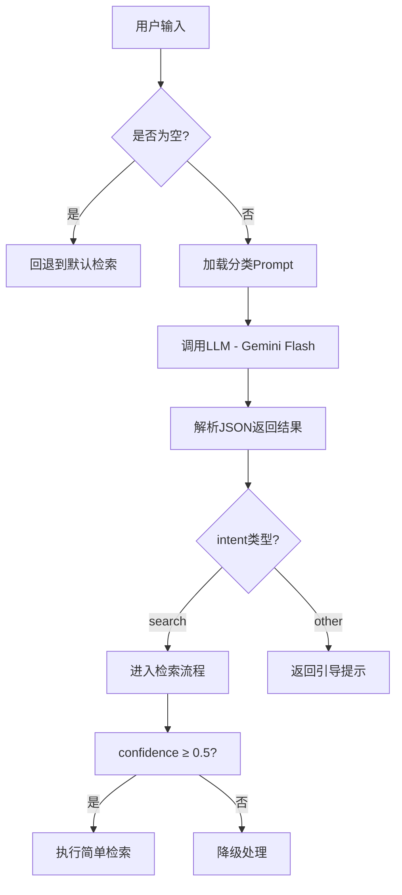
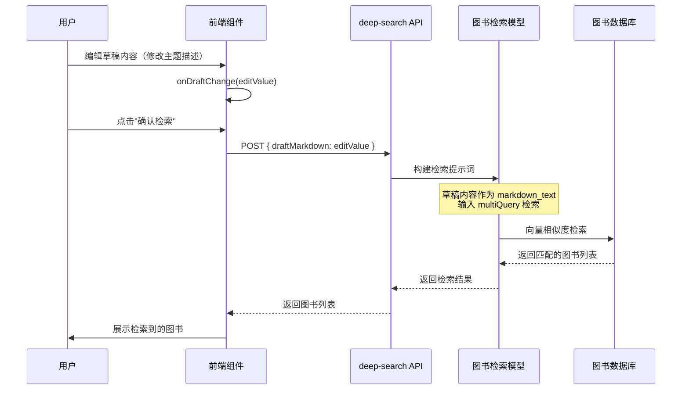

# 第四章节问题-AIBot智搜系统代码实现分析

> 基于实际代码的详细实现分析，用于支撑论文撰写

---

## 1. 意图分类器 (Intent Classifier) 实现

### 1.1 核心代码架构

意图分类器的实现位于 [`src/core/aibot/classifier.ts`](src/core/aibot/classifier.ts:112)，其工作流程如下：

```
用户输入 → LLM调用 → JSON解析 → 意图分类结果
```

### 1.2 判定逻辑与 Prompt 依据

**分类 Prompt 文件**：[`public/prompts/aibot_question_classifier.md`](public/prompts/aibot_question_classifier.md)



### 1.3 Prompt 核心逻辑解析

根据 [`aibot_question_classifier.md`](public/prompts/aibot_question_classifier.md:4) 的定义：

**核心判定规则：**

| 分类 | 判定条件 | 示例 |
|------|---------|------|
| `search` | 1. 显式图书查询（带"书"、"推荐"等词）<br>2. 隐式主题查询（概念、术语、事件、社会现象） | "推荐AI的书"、"大模型技术"、"熵" |
| `other` | 1. 社交寒暄（你好、晚安）<br>2. 乱码<br>3. 与图书无关的指令（天气、写代码、角色扮演） | "你好"、"今天天气怎么样" |

**负约束（禁忌）：**
- ❌ 严禁因输入是"技术话题"或"抽象概念"而归为 `other`
- ❌ 严禁因用户没说"书"字而归为 `other`
- ❌ 严禁因输入简短（仅一个词）而归为 `other`

### 1.4 代码实现细节

```typescript
// src/core/aibot/classifier.ts:112
export async function classifyUserIntent(input: IntentClassifierInput): Promise<IntentClassificationResult> {
    // 使用 Gemini Flash 模型，temperature=0 确保确定性输出
    const llmConfig = resolveLLMConfig(undefined, {
        model: 'gemini-flash-latest',
        temperature: 0
    });
    
    const result = await generateText({
        model,
        system: prompt,  // 加载 aibot_question_classifier.md
        prompt: buildClassifierPrompt(input)
    });
    
    return parseClassifierText(result.text);
}
```

**输出格式：**
```json
{
  "intent": "search",
  "confidence": 0.95,
  "reason": "输入为特定技术概念，意图查找相关主题书籍"
}
```

### 1.5 简单检索 vs 深度检索的区分

实际上，AIBot 通过 **`AIBOT_MODES`** 区分检索模式：

```typescript
// src/core/aibot/constants.ts:10
export const AIBOT_MODES = {
    TEXT: 'text-search',      // 简单检索：直接基于用户输入检索
    DEEP: 'deep',             // 深度检索：多阶段分析后检索
    DOCUMENT: 'document'      // 文档分析：基于上传文档检索
};
```

**区分逻辑：**
- **简单检索**：`mode === 'text-search'` → 直接调用 `textSearch`
- **深度检索**：`mode === 'deep'` → 调用 `multiQuery`（基于草稿的向量检索）

---

## 2. 二次检索 (Iterative Search) 的反馈回路

### 2.1 深度检索的迭代流程

AIBot 的"深度检索"并非简单的二次检索，而是一个**六阶段知识活化流程**：


### 2.2 关键词生成阶段的智能扩展

**Prompt 文件**：[`public/prompts/keyword_generation.md`](public/prompts/keyword_generation.md)

关键词生成器（DeepSearch Oracle）采用**认知语义学**方法论，将用户输入转化为多维度英文检索词：

```typescript
// src/core/aibot/prompts/keyword_generation.md:23
## Keyword Dimensions (关键词维度 - 必须覆盖)

1. **The Core (核心直击)**: 最准确的直译或标准定义
2. **The Academic (学术/理论)**: 论文、期刊中的正式术语
3. **The Niche (细分/行话)**: 极客、专家的精准词汇
4. **The Lateral (横向/发散)**: 相关联的思维模型、底层逻辑
5. **The Root (根源/本质)**: 第一性原理
```

**输出示例：**
```json
{
  "analysis": "用户想了解如何学习高效学习，核心是元认知能力",
  "keywords": [
    {"keyword": "Metacognition", "priority": "Root", "reason": "学习能力的本质是认知的认知"},
    {"keyword": "Learning Curve", "priority": "Academic", "reason": "教育心理学的核心概念"},
    {"keyword": "Deliberate Practice", "priority": "Niche", "reason": "专家技能习成的关键技术"}
  ]
}
```

### 2.3 交叉分析与草稿生成

**Prompt 文件**：[`public/prompts/article_cross_analysis.md`](public/prompts/article_cross_analysis.md)

"深度阅读策展编辑部"团队对多篇文章进行**四大价值维度**分析：

| 维度 | 风格 | 典型母题 |
|------|------|---------|
| 🌿 愉悦身心 | 优美、细腻、治愈 | "城市散步与心理疗愈" |
| 🌍 开阔眼界 | 叙事、人文、包容 | "异乡人的文化融入" |
| 💡 激发思维 | 深刻、犀利、严谨 | "算法如何重塑公共舆论" |
| 🔭 了解新知 | 清晰、结构化、启发 | "mRNA疫苗工作原理" |

**关键洞察**：草稿中的**向量检索文本**会根据维度调整语体风格，确保与目标图书类型匹配。

### 2.4 反馈回路的技术实现

```
第一轮检索 → 分析结果 → 交叉分析 → 草稿 → 第二轮向量检索图书
              ↑                                    |
              └────────────────────────────────────┘
                    用户编辑修改草稿内容
```

**代码路径**：[`app/api/local-aibot/deep-search-analysis/route.ts`](app/api/local-aibot/deep-search-analysis/route.ts:212)

```typescript
// 第三步：交叉分析（流式输出草稿）
const crossAnalysisStream = await streamText({
    model,
    system: crossPrompt,
    prompt: `# 用户原始输入\n${userInput}\n\n# 检索关键词\n${keywords}\n\n# 文章分析结果\n${combinedAnalyses}`
});

// 流式累积草稿内容
let draftMarkdown = '';
for await (const chunk of crossAnalysisStream.textStream) {
    draftMarkdown += chunk;
}
```

**反馈机制**：
1. 第一轮：基于关键词的网络搜索 → 获取文章摘要
2. 分析：LLM 提取每篇文章的主题聚焦点和价值维度
3. 交叉分析：识别跨文章的共同母题，生成结构化草稿
4. 第二轮：基于草稿的向量检索 → 精准匹配馆藏图书

---

## 3. 人在环交互 (HITL) 的技术锚点

### 3.1 草稿确认界面的可编辑内容

**组件**：[`components/aibot/DraftConfirmationDisplay.tsx`](components/aibot/DraftConfirmationDisplay.tsx:16)

用户在"检索草稿"阶段可以修改以下内容：

| 可编辑项 | 技术实现 | 作用 |
|---------|---------|------|
| **草稿内容全文** | `<textarea>` 纯文本编辑 | 修改检索语义、调整主题聚焦 |
| **检索关键词** | 不可直接编辑，但可通过修改草稿间接影响 | 影响向量检索的语义空间 |
| **源数据查看** | 可折叠的搜索结果展示 | 验证信息来源质量 |

### 3.2 编辑器功能特性

```typescript
// components/aibot/DraftConfirmationDisplay.tsx:200
{isEditing ? (
    <textarea
        value={editValue}
        onChange={(e) => setEditValue(e.target.value)}
        className="w-full h-64 rounded-lg bg-[#1B1B1B] border border-[#343434] 
                   text-sm text-[#E8E6DC] p-3 focus:outline-none 
                   focus:border-[#C9A063] font-info-content resize-none"
        placeholder="检索草稿将在此显示..."
    />
) : (
    // 预览模式
    <div className="prose prose-invert prose-sm max-w-none">
        <ReactMarkdown components={messageMarkdownComponents}>
            {cleanedDraft}
        </ReactMarkdown>
    </div>
)}
```

### 3.3 用户修改如何反作用于 AI 最终生成

**流程**：`用户编辑草稿` → `确认检索` → `更新draftMarkdown` → `构建新的工作流上下文`



**关键代码**：[`src/core/aibot/researchWorkflow.ts`](src/core/aibot/researchWorkflow.ts:132)

```typescript
// 根据模式选择不同的检索策略
const retrieval =
    input.mode === AIBOT_MODES.TEXT
        ? await textSearch({ query: userInput, top_k: DEFAULT_TOP_K })
        : await multiQuery({
            markdown_text: draftMarkdown,  // ← 用户编辑的草稿
            per_query_top_k: DEFAULT_MULTI_QUERY_TOP_K,
            final_top_k: DEFAULT_TOP_K
        });
```

### 3.4 用户可干预的决策点

| 决策点 | 干预方式 | 影响范围 |
|-------|---------|---------|
| **草稿主题** | 直接编辑草稿 Markdown | 改变检索语义空间，影响图书匹配结果 |
| **母题描述** | 修改交叉分析摘要 | 影响向量检索的相似度计算 |
| **关键词覆盖** | 隐式影响（通过修改草稿） | 调整检索的侧重点 |
| **源数据筛选** | 查看后决定是否重新生成 | 保证信息来源质量 |

### 3.5 人在环交互的价值

1. **语义校准**：用户可以修正 LLM 对主题的理解偏差
2. **维度调整**：选择更符合期望的价值维度（愉悦身心/开阔眼界/激发思维/了解新知）
3. **质量控制**：查看源数据后，可选择"重新生成"获取更好的分析结果

---

## 4. 总结：三重技术锚点的协同机制

```
┌─────────────────────────────────────────────────────────────────┐
│                    AIBot 智搜系统 - 三重锚点                      │
├─────────────────────────────────────────────────────────────────┤
│                                                                 │
│  锚点1: 意图分类器                                                │
│  ├── 作用：区分"简单检索"与"深度检索"需求                          │
│  ├── 依据：Prompt Engineer 的分类规则（显式/隐式需求）              │
│  └── 输出：intent + confidence + reason                          │
│                                                                 │
│  锚点2: 深度检索反馈回路                                          │
│  ├── 第一轮：关键词生成 → 网络搜索 → 文章分析                       │
│  ├── 交叉分析：多维价值评估 + 母题识别                             │
│  ├── 第二轮：基于草稿的向量检索（multiQuery）                      │
│  └── 特点：语义空间从"关键词"升级为"结构化主题描述"                │
│                                                                 │
│  锚点3: 人在环交互                                                │
│  ├── 可编辑：草稿全文（纯文本 Markdown）                           │
│  ├── 可查看：源数据、关键词、进度日志                              │
│  └── 反作用：编辑后的草稿作为检索语义输入，影响最终图书匹配         │
│                                                                 │
└─────────────────────────────────────────────────────────────────┘
```

---

**分析时间**：2025-12-22  
**代码分析范围**：[`src/core/aibot/`](src/core/aibot)、[`app/api/local-aibot/`](app/api/local-aibot)、[`components/aibot/`](components/aibot)