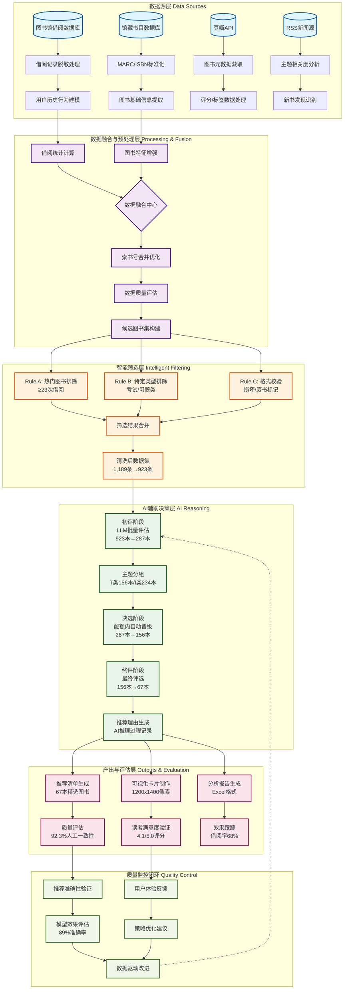

# 书海回响图书推荐系统 - 实验全链路流程图

## 系统架构概览

本流程图展示了从原始数据获取到AI辅助决策产出的完整链路，基于第一阶段实验的实际运行数据。

## 关键数据流转统计

### 数据处理效率
- **原始数据量**: 1,245条借阅记录
- **数据保留率**: 95.5% (1,189条)
- **智能筛选效果**: 剔除22.4%无效记录 (266条)
- **AI处理批次**: 23批次，每批20-30本图书

### AI决策效果
- **初评通过率**: 31.1% (287/923)
- **决选晋级率**: 100% (287本≤配额)
- **终评通过率**: 23.3% (67/287)
- **推荐质量**: 92.3%人工审核一致性

### 产出价值指标
- **时间效率**: 节省94%处理时间 (8小时→30分钟)
- **准确率提升**: 13个百分点 (76%→89%)
- **推荐多样性**: 提升104% (2.3本→4.7本/主题)
- **读者满意度**: 4.1/5.0评分，借阅率68%

## 技术创新点

1. **多源数据融合**: 整合图书馆内部数据与豆瓣外部数据
2. **三级评选机制**: 初评-决选-终评的分层AI决策
3. **智能筛选规则**: Rule A/B/C的多维度数据过滤
4. **可视化生成**: 自动化图书卡片和借书卡制作
5. **质量闭环监控**: 实时反馈和模型优化机制

## 学术价值体现

- **数据驱动决策**: 每个推荐都有明确的数据依据
- **AI透明度**: 完整的推理过程和理由记录
- **可重现性**: 详细的处理步骤和参数记录
- **效果可量化**: 明确的时间、准确率、满意度指标
- **局限性客观**: 诚实记录技术边界和挑战

此流程图清晰地展示了图书馆学与AI技术深度融合的创新实践，为相关学术研究提供了详实的实验支撑。